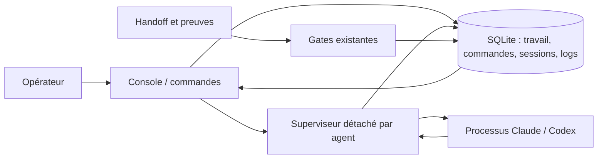

# Cockpit : lancer, observer et piloter les agents

Le compagnon peut désormais lancer de vrais processus Claude Code/Codex CLI sous
Linux. La console est un affichage interactif ; un superviseur détaché suit chaque
processus. Fermer la console ne coupe pas les agents. `resume` reste une commande de
lecture et de reprise documentaire : elle ne lance aucun modèle.

## Démarrage dans Wattson

Depuis `/home/fpizzi/wattson_devcontainer/flaskProject` :

```sh
./tools/swarm-companion/swarm providers init
./tools/swarm-companion/swarm work list
./tools/swarm-companion/swarm console IDENTIFIANT_DU_TRAVAIL
```

`providers init` crée `.swarm/providers.json` à partir des exécutables trouvés dans
PATH. Il refuse d'écraser un fichier existant. Aucun modèle n'est appelé par cette
commande. Les chemins et arguments sont configurables dans ce fichier local.
Les fournisseurs absents de PATH n'y sont pas ajoutés.

Adaptateurs initiaux vérifiés sur l'aide des CLI installées le 11 septembre 2026 :

- Claude : `claude -p --output-format stream-json --verbose` ; prompt sur stdin.
- Codex : `codex exec --json --sandbox workspace-write -` ; prompt sur stdin.

Les permissions et l'authentification restent celles du fournisseur. Aucun flag
qui supprime les contrôles de permissions n'est ajouté. Une permission qui ne peut
pas être traitée en mode non interactif peut faire échouer l'agent : examiner les
journaux et la configuration locale du fournisseur. Le cockpit ne contourne pas
ce refus. Une configuration fournisseur est du code de confiance : ne pas adopter
un fichier provenant d'un dépôt tiers sans le revoir.

Les noms des variables d'environnement supplémentaires à transmettre s'inscrivent
dans `env_allow`, par exemple `ANTHROPIC_API_KEY` ou `OPENAI_API_KEY` **si votre
installation les utilise**. Leurs valeurs ne vont pas dans la configuration ni
les journaux du superviseur. HOME, PATH et les variables usuelles de configuration,
certificats et proxy sont hérités. Les sorties du fournisseur peuvent contenir des
données sensibles ; la capture complète est désactivée par défaut.

## Utiliser la console

La console s'actualise chaque seconde. La ligne du bas accepte ces commandes,
validées par Entrée. `help` rappelle les commandes. Ctrl-C ou `q` ferme l'affichage.

| Commande | Effet |
|---|---|
| `new audit | Auditer les fichiers | Rapport avec preuves | chemins confinés ; droits vérifiés` | Crée une tâche avec critères |
| `assign audit codex` | Attribue un responsable à la tâche |
| `priority audit 9` | Remonte sa priorité dans l'affichage ; 0 à 9 |
| `capture on` | Active la capture des sorties pour les prochains lancements |
| `start audit codex` | Lance Codex sur cette tâche dans la racine du projet |
| `start audit claude copies/audit` | Lance Claude dans ce sous-répertoire existant |
| `select agent-IDENTIFIANT` | Affiche activité et derniers journaux |
| `filter audit` | Filtre par texte ; `filter` réinitialise |
| `status running` | Filtre l'état observé ; `status` réinitialise |
| `freeze` | Fige/reprend le défilement de l'affichage |
| `pause` / `unpause` | Interdit/réautorise les nouveaux départs du travail |
| `stop agent-IDENTIFIANT` | Demande l'arrêt ; attendre sa confirmation |
| `note agent-IDENTIFIANT Vérifier le cas limite` | Conserve une consigne pour la reprise |
| `retry agent-IDENTIFIANT Consigne complémentaire` | Crée une nouvelle tentative avec le contexte précédent et ses notes récentes |
| `reconcile agent-IDENTIFIANT` | Réconcilie une session perdue quand l'absence de processus peut être démontrée |
| `submit audit docs/handoff-audit.md` | Soumet le livrable existant après examen humain ; n'accepte pas la tâche |
| `ready audit` | Rouvre une tâche sans agent actif avant un nouveau départ |

Un agent doit être terminé avant `retry`. Lancer plusieurs agents exige des
répertoires de travail distincts **et non imbriqués** dans le même projet. Le
cockpit refuse deux agents sur une même tâche ou sur des espaces qui se recouvrent.
Il ne fabrique pas les copies/worktrees et ne fusionne pas leur code. Préparer des
copies dédiées lorsqu'un travail nécessite de la concurrence. Les règles projet
et le guide de terrain doivent être présents/pertinents dans ces copies.

Les priorités ordonnent l'affichage. Il n'existe pas encore d'ordonnanceur qui
prélève automatiquement les tâches. Les rôles planner/subplanner/worker et la
parenté sont disponibles dans le contrat JSON ; les rôles sont aussi proposés
dans les formulaires terminal et web. Ils sont transmis au prompt,
ils ne constituent pas une barrière de permissions ni une récursion automatique.

## Ce que signifie l'état affiché

- `queued/unconfirmed` : intention enregistrée ; processus non confirmé.
- `starting`, `running` : superviseur actif, avec signal daté et PID observés.
- `stopping` : arrêt demandé, pas encore confirmé.
- `completed`, `failed`, `interrupted` : le superviseur a constaté la fin.
- `unknown/no-heartbeat` : plus de signal depuis 10 secondes. Ce n'est pas une
  preuve d'arrêt ; le verrou du workspace est conservé.
- `unknown/other-host` : historique actif provenant d'un autre hôte/redémarrage/espace de PID ;
  vérification nécessaire avant de libérer le travail.

L'activité indique la tâche et le type du dernier événement fournisseur reconnu,
pas une reconstruction de son raisonnement. Les jetons déclarés sont conservés
quand le format est reconnu ; le coût facturé reste indisponible.

Après un arrêt demandé, le superviseur envoie SIGTERM au groupe de processus,
puis SIGKILL après trois secondes si nécessaire. Le budget de temps vaut 30 minutes
par défaut ; le JSON permet de le régler de 1 seconde à 24 heures. Ce budget
n'est pas un plafond financier. Les modifications déjà réalisées restent sur disque.

Après la fin d'un processus, la tâche est **soumise à examen**, jamais acceptée.
Un code de sortie nul ne suffit pas : le conducteur relaie le handoff seulement
si la tentative s'est terminée normalement et qu'elle a produit **un seul**
rapport lisible et non vide, `docs/<tâche>.md` ou `docs/<tâche>-*handoff*.md`,
modifié après son départ. La tâche passe alors en `submitted` et le journal de
la tentative nomme le fichier relayé. Sans rapport, avec un rapport vide,
plusieurs rapports candidats, un rapport antérieur à la tentative, ou après un
échec ou une interruption, la tâche reste **bloquée avec son motif** et le
refus est journalisé. `submit` reste disponible pour soumettre un handoff à la
main. L'acceptation passe toujours par les gates existantes et leurs preuves
courantes. Aucun bouton ne force SHIP.
Si une écriture métier rencontre une révision concurrente, le journal demande une
réconciliation ; `reconcile` peut terminer cette mise à jour après relecture.

## Graphe du travail

Le mode Conduite affiche le plan sous forme de graphe : un nœud par tâche, une
arête par dépendance, orientés de gauche à droite. Un nœud porte l'état de la
tâche et, pour chaque tentative vivante, le fournisseur, l'action courante en
français, les appels d'outils, le coût estimé et l'âge du dernier résultat.

« Signal perdu » et « terminé » restent distincts : un nœud « en cours » ne
prouve pas qu'un processus tourne encore. Au-delà du délai de surveillance, le
nœud le dit en clair.

Un nœud s'atteint au clavier et ouvre les actions de sa tâche. La liste sous le
graphe porte la même information en texte. La disposition vient de dagre,
embarqué dans le binaire : le graphe fonctionne sur un poste sans réseau.

## Deux niveaux d'interface

Le cockpit ouvre en **mode Conduite** : un seul écran — barre de conduite,
« À traiter », plan avec l'action courante de chaque agent. Les journaux bruts,
l'administration des fournisseurs, l'OODA, la hiérarchie et l'assistant sont
rangés, pas retirés.

« Passer en mode expert » rend toutes les vues ; la bascule est conservée d'une
session à l'autre et peut être imposée par l'URL (`?mode=expert`, `?mode=conduite`).

En terminal, la commande `mode` fait la même bascule : écran de conduite compact
ou tableau de bord complet. `--plain`, `NO_COLOR` et `TERM=dumb` restent
respectés dans les deux cas.

## Niveaux d'autonomie et départs automatiques

Chaque travail porte un niveau, réglé localement comme la suspension des départs.
Le niveau décide de ce que le moteur fait sans demander, jamais de ce qu'il
accepte : aucun niveau n'accepte une tâche, n'accorde une dérogation ni ne fait
passer une gate.

| Niveau | Départs | Relais du handoff | Gate et acceptation |
|---|---|---|---|
| `manuel` | humain | humain | humain |
| `assiste` | humain | automatique si preuve lisible | humain |
| `autonome` (défaut) | automatiques dans les créneaux | automatique | humain |

```sh
./tools/swarm-companion/swarm autonomy TRAVAIL            # lire le réglage courant
./tools/swarm-companion/swarm autonomy TRAVAIL assiste    # changer de niveau
./tools/swarm-companion/swarm autonomy TRAVAIL autonome 3 # niveau et créneaux
./tools/swarm-companion/swarm dispatch TRAVAIL            # ordonnancer maintenant
```

Le premier lancement humain enregistre un **profil de lancement** — fournisseur,
rôle, espace de travail, consigne, limites — sur la tâche et sur le travail.
L'ordonnanceur rejoue ce profil : le formulaire n'est plus à remplir tâche après
tâche. Le profil d'une tâche prime sur celui du travail.

Une tâche part automatiquement si, dans cet ordre : le niveau est `autonome`, les
départs ne sont pas suspendus, un créneau est libre, ses dépendances sont
acceptées et fraîches, un profil existe, elle n'a pas épuisé ses deux tentatives
automatiques, et son espace de travail n'est pas déjà occupé. Deux départs
simultanés supposent deux espaces de travail distincts.

Ne repartent jamais d'elles-mêmes : une tâche dont le handoff a été refusé, une
tâche arrêtée à la demande de l'opérateur, une tâche après deux tentatives
automatiques infructueuses. Chaque refus d'ordonnancement est journalisé dans le
travail avec son motif.

## Ce qui réclame un humain

Le cockpit distingue ce qui s'affiche de ce qui se décide. Une information
visible n'est pas une demande ; seules ces catégories réclament un opérateur,
et chacune n'apparaît qu'une fois par sujet :

| Catégorie | Déclencheur |
|---|---|
| Rapport à examiner | une tâche est soumise |
| Gate à revalider | gate échouée, refusée, ou preuves périmées |
| Handoff non relayé | tentative terminée dont le rapport manque, est vide, périmé ou ambigu |
| Tentative infructueuse | échec ou interruption, avec le nombre de tentatives |
| Garde-fou déclenché | tentative arrêtée par une limite d'exécution |
| Signal perdu | tentative déclarée vivante sans signal depuis le délai de surveillance |
| Budget estimé | seuil atteint ou enveloppe épuisée ; estimation, jamais une dépense facturée |

Si la tâche porte déjà la demande, la tentative qui l'a produite n'en ajoute pas
une seconde. Une tentative vivante n'est pas une décision. Une tâche acceptée et
fraîche n'interrompt personne. Un acquittement n'accepte pas la tâche et
n'arrête aucun processus.

## Automatiser les mêmes actions

```sh
./tools/swarm-companion/swarm work show IDENTIFIANT_DU_TRAVAIL
./tools/swarm-companion/swarm agent start IDENTIFIANT_DU_TRAVAIL --input lancement.json
./tools/swarm-companion/swarm agent list IDENTIFIANT_DU_TRAVAIL
./tools/swarm-companion/swarm agent show IDENTIFIANT_AGENT
./tools/swarm-companion/swarm agent stop IDENTIFIANT_AGENT
./tools/swarm-companion/swarm agent logs IDENTIFIANT_AGENT
./tools/swarm-companion/swarm control IDENTIFIANT_DU_TRAVAIL --input commande.json
```

`lancement.json`, avec la **révision courante lue** et un nouvel `event_id` :

```json
{
  "schema_version": 1,
  "event_id": "agent-audit-001",
  "expected_revision": 2,
  "task_id": "audit",
  "provider": "codex",
  "workspace": ".",
  "role": "worker",
  "instruction": "Commencer par les tests de chemins, produire un handoff factuel.",
  "timeout_seconds": 1800,
  "capture_output": false
}
```

Réessayer exactement ce JSON conserve la même session et ne redémarre pas le
processus. Une nouvelle tentative a un nouvel identifiant. `previous` peut désigner
une session terminée du même travail et de la même tâche ; `parent` un agent du
même travail. `commande.json` utilise par exemple :

```json
{"command": "priority audit 9"}
```

Le canal `control` s'adresse à un opérateur local. Les actions sont persistées ;
`agent start` possède une clé d'idempotence et une révision, alors que les commandes
courtes de la console opèrent sur l'état courant. Une note n'est **pas envoyée à la
conversation d'un modèle déjà lancé**. Pour une nouvelle consigne d'exécution,
arrêter puis relancer explicitement : la reprise inclut la tâche, le checkpoint,
la référence précédente et les notes récentes. La restauration native d'une session
Claude/Codex n'est pas encore intégrée.

## Persistance, journaux et portabilité

SQLite demeure la source unique : sessions, tentatives, signaux, intentions d'arrêt,
contrôles et journaux y sont enregistrés. Les heartbeats ne changent pas la révision
métier du travail. Le stockage courant utilise la version 3, avec sauvegarde
avant migration ; requêtes et archives restent en version 1. Un ancien binaire
ne lit pas nécessairement la base migrée. Utiliser un stockage local, pas une base partagée entre hôtes via CIFS/NFS.

Les sorties capturées sont plafonnées à 1 Mio ou 1 000 lignes par session ; chaque ligne est
limitée à environ 2 Kio et les 2 000 dernières entrées par session sont conservées.
Les sorties sont regroupées au maximum une seconde en mémoire avant écriture
transactionnelle ; un crash brutal peut perdre ce dernier intervalle. Les commandes
et changements de cycle de vie sont persistés immédiatement.
Les contrôles terminal et caractères directionnels sont retirés. Ce nettoyage
n'est **pas** une anonymisation ni une détection exhaustive des secrets.

`agent logs ID` renvoie les 200 dernières entrées. `agent logs ID -1` commence au
premier événement conservé ; fournir ensuite le dernier `seq` pour parcourir
les fenêtres suivantes, sans rescanner tout l'historique. `--output nouveau.jsonl`
exporte la fenêtre demandée sans écraser un fichier existant.

`export` inclut un historique borné du cockpit (200 dernières sessions, 200 lignes
par session, 500 contrôles). `import` le conserve dans le manifeste de reprise sans
l'injecter dans les sessions actives. Consultation :

```sh
./tools/swarm-companion/swarm agent history IDENTIFIANT_DU_TRAVAIL_IMPORTE
```

Le superviseur de processus et le terminal interactif sont implémentés pour Linux.
Le binaire peut être déplacé vers un autre projet Linux avec sa configuration de
fournisseurs ; réinstaller les CLI sur l'hôte cible. La web locale protégée
est disponible ; aucune écoute distante n'est autorisée.

## Vérification reproductible

```sh
cd tools/swarm-companion
go test -race ./...
go vet ./...
go build -o /tmp/swarm-cockpit .
python3 tests/cockpit_smoke.py --binary /tmp/swarm-cockpit --report /tmp/cockpit-smoke.json
```

La recette utilise de vrais processus détachés et un pseudo-terminal, avec un
fournisseur **fictif et explicitement identifié**. Elle ne consomme aucun modèle.
L'authentification, les permissions effectives et le cycle complet des fournisseurs
réels restent à vérifier dans votre environnement lors du premier lancement.



### Console : sélectionner une tâche puis agir

`swarm console` ouvre directement l’accueil plein écran « VOS TRAVAUX ».
Choisir un travail avec ↑/↓ puis Entrée : noms, objectifs, prochaine action et
compteurs des tâches sont visibles, sans saisir de numéro ou d’identifiant.
Sélectionner ensuite la tâche avec ↑/↓,
puis **Entrée** (ou `?`) pour ouvrir son dialogue d’actions. Aucun identifiant
agent n’est à recopier : le dialogue retrouve la dernière tentative de cette tâche.
Depuis le panneau agents, il utilise l’agent sélectionné explicitement.

Actions : **Lancer**, **Relancer**, **Arrêter**, **Journaux**, **Détail complet**,
**Réconcilier**, **Fermer**. Les actions impossibles expliquent pourquoi : par
exemple un agent actif doit être arrêté avant une relance. Arrêter demande une
confirmation ; Échap annule sans effet. La fin effective est suivie séparément.

Pour lancer : choisir le fournisseur avec ←/→, dont `skynet-glm` s’il est configuré ;
Tab passe au champ suivant. Le répertoire du projet est renseigné automatiquement.
Une consigne est préremplie et modifiable (Ctrl-U pour effacer). Seul Entrée sur
**Confirmer le lancement** crée un processus. Les noms de fournisseur et limites
viennent de la configuration, pas d’une liste Claude/Codex inscrite dans l’interface.

Pour relancer : fournisseur et espace sont repris de la tentative ; modifier la
consigne si nécessaire, puis Tab vers **Confirmer le lancement** et Entrée.
Le lien vers la tentative précédente et les notes de reprise sont conservés.
Le détail complet est défilable avec ↑/↓. Journaux sélectionne automatiquement
l’agent de la tâche. Tab change de panneau ; q puis Entrée ferme la console.

Minimum : 64 colonnes × 20 lignes. `--plain` reste le dialogue texte de secours ;
`TERM=dumb` le sélectionne aussi. Le mode texte conserve les commandes avancées.
Sans terminal, console avec identifiant produit un instantané JSON.

Après remplacement du binaire, fermer et rouvrir la console. Une console déjà
en mémoire n’est pas mise à jour. Les versions à partir de ce correctif affichent
un avertissement et refusent un nouveau lancement quand leur exécutable a été
remplacé. Une ancienne version peut afficher `json: unknown field "limits"` :
quitter cette console puis relancer le wrapper, sans supprimer le champ de sécurité.

Recette : `tests/console_dialog_smoke.py` utilise un PTY 80×24 et des fournisseurs
factices, y compris un fournisseur nommé skynet-glm avec limits. Elle effectue
lancement, annulation d’arrêt, arrêt, relance et remplacement du binaire sans
saisir d’identifiant agent ni de chemin de workspace. Ce test ne contacte pas GLM.

### Directives et conditions de sortie des tentatives

Chaque nouveau prompt précise la racine, le workspace, les critères et les pièces
utiles. Il demande des recherches ciblées avec `rg`, interdit les balayages du
poste comme `find /`, impose des commandes bornées et un handoff conservé tôt.
Après deux corrections sans progrès démontré : OODA, blocage explicite et retour
au conducteur. Ces consignes ne sont pas un sandbox : elles ne peuvent empêcher
à elles seules un premier appel inadapté.

Le superviseur applique aussi des seuils, même avec `capture_output: false` :

| Condition observable | Défaut |
|---|---:|
| Durée totale de tentative, déjà existante | 1 800 s |
| Aucune sortie fournisseur reçue | 180 s |
| Outil identifié commencé sans résultat | 300 s |
| Appels d’outils reconnus par tentative | 100 |
| Appels identiques consécutifs (nom + entrée structurée) | 4 |
| Résultats d’outils en erreur consécutifs | 3 |

À la limite : SIGTERM, puis SIGKILL au groupe après trois secondes si nécessaire ;
statut `interrupted` seulement une fois la fin du processus constatée. La tâche
reste bloquée pour examen ; le motif est journalisé. Aucun retry automatique.
La limite de durée totale reste l’ultime borne même si le fournisseur émet du bruit.
Un processus en attente noyau non interruptible ou un stockage indisponible peut
retarder la confirmation d’arrêt : ne pas libérer son workspace sans vérification.

Les seuils sont configurables par fournisseur dans `.swarm/providers.json` :

```json
"limits": {
  "silence_seconds": 180,
  "tool_seconds": 300,
  "max_tool_calls": 100,
  "max_repeated_calls": 4,
  "max_consecutive_errors": 3
}
```

Ce bloc s’ajoute à l’objet du fournisseur, à côté de command/args/env_allow.
Zéro ou champ absent signifie défaut ; les valeurs négatives et excessives sont
refusées. Limites figées dans chaque tentative et consultables avec `agent show`.
Les superviseurs déjà lancés ne sont pas mis à jour en remplaçant le binaire.

Le décompte comprend les événements Claude `tool_use`/`tool_result` et les événements
Codex `command_execution`/`mcp_tool_call` started/completed avec leurs identifiants.
Les répétitions d’un même identifiant sont ignorées. Les autres événements ou formats
non reconnus ne permettent pas d’appliquer les compteurs d’outils ; silence et durée
restent disponibles. Les lignes JSON dépassant la borne de décodage ne sont pas
analysées. Une sortie ou un heartbeat n’est pas une preuve de progrès métier.
Les limites détectent des comportements observables ; elles ne jugent pas la qualité
du travail. Le polling légitime peut atteindre la limite de répétition : le borner
ou choisir explicitement un seuil adapté, puis conserver cette décision.

### Lisibilité et palettes

La touche `t` bascule entre clair et sombre depuis l’accueil ou le tableau de bord.
La palette initiale utilise SWARM_THEME=light/dark si défini, puis COLORFGBG quand
il annonce un fond clair ; sinon elle utilise la palette sombre. NO_COLOR désactive
les couleurs ; TERM=dumb et --plain conservent le mode texte de secours.
Les couleurs accompagnent toujours les libellés et le marqueur de sélection.
À moins de 110 colonnes, les panneaux tâches et agents s’affichent alternativement
sur toute la largeur (Tab pour changer). Au-delà, ils sont côte à côte.
Les informations détaillées restent dans le dialogue de tâche et son détail défilable.

### Activité observable et arrêt (correctif du 11 septembre)

Sélectionner une tâche suffit à afficher sa dernière tentative : fournisseur,
état, appels et résultats d’outils observés, dernier outil et date du dernier
résultat. Après arrêt, le panneau affiche le motif de fin et la prochaine action ;
Entrée ouvre les commandes de reprise. Les compteurs sont persistés dans l’agent.
Ils mesurent une activité technique, pas un pourcentage de réalisation : le
livrable et sa gate restent nécessaires pour valider la tâche.

Le décodage accepte désormais des événements JSON jusqu’à 1 Mio, indépendamment
de la capture des journaux. Un événement trop grand ou JSON illisible rend la
surveillance explicitement incomplète : le chronométrage par outil est suspendu
pour cette tentative, car un résultat peut avoir été perdu. La durée totale,
le silence et les budgets observables restent bornés. Le parseur reprend à la
ligne suivante ; les journaux ne deviennent pas illimités.

Une console déjà ouverte doit être quittée puis relancée après installation.
Les anciennes tentatives gardent leur état historique ; corriger le moteur ne
les relance pas automatiquement et ne valide pas leur travail.

### Journal opérationnel sans capture brute

Les nouvelles tentatives enregistrent des événements horodatés « Outil lancé »
et « Résultat d’outil reçu », même quand la capture des sorties est désactivée.
Ces messages contiennent le nom de l’outil et les compteurs, pas ses arguments,
le contenu lu ou les échanges privés du modèle. La rétention habituelle des
journaux s’applique. Les sorties brutes restent une option distincte.

Le panneau SUIVI EN DIRECT indique le temps écoulé depuis le heartbeat, la durée
et le dernier résultat, puis EN COURS lorsqu’un outil est en attente de résultat,
ou EN ATTENTE de la prochaine sortie fournisseur. Un heartbeat confirme le suivi
du processus, pas une avancée métier. L’affichage figé est signalé explicitement.

Rouvrir uniquement la console suffit pour voir ces indicateurs sur les agents
déjà actifs. Le nouveau journal par événement concerne les superviseurs lancés
avec cette version ; aucun historique n’est reconstruit artificiellement et
aucun agent actif n’est arrêté pour appliquer cette amélioration.

### Comprendre l’action et consulter les détails

La touche `d` ouvre directement les détails de la tâche sélectionnée. Flèches :
défilement ; Entrée : actions ; Échap : retour. La tentative et son historique
sont rechargés à chaque rafraîchissement, même quand la fenêtre reste ouverte.

Les nouvelles tentatives persistées par cette version décrivent les opérations :
lecture/écriture/modification de fichier, recherche ou commande. Une description
fournie par le modèle est préfixée « Annonce de l’agent » ; elle ne constitue pas
une preuve de résultat. La commande ou le chemin est borné, nettoyé des caractères
de contrôle et masqué lorsqu’un marqueur sensible courant est repéré. Cette
protection heuristique n’est pas une garantie de détection de tout secret :
ne jamais transmettre de secrets en clair dans les descriptions ou commandes.
Aucun corps de résultat d’outil ni raisonnement privé n’est copié dans ce suivi.
Le journal conserve les actions et cibles opérationnelles ainsi que la réception
des résultats. Leur contenu brut reste gouverné par l’option de capture séparée.

Les anciennes tentatives n’ont pas ces métadonnées. Afficher « explication non
fournie par cette tentative » plutôt que reconstituer ou inventer une explication.

### Blocage visible dès l’accueil

L’accueil indique lorsqu’aucune tâche n’est en cours et présente le motif de la
première tâche bloquée du travail sélectionné. Ouvrir un travail ne lance pas
un agent. La fenêtre d’actions d’une tentative terminée affiche son motif et le
budget d’outils consommé avant les commandes. Le détail commence aussi par le
motif de fin. La limite de 100 appels reste inchangée ; une reprise est explicite.

### Revue et acceptation depuis la fenêtre de tâche

Entrée ouvre les actions. Les raccourcis de cette fenêtre sont :

- `l` : lire le rapport dans une fenêtre défilable (←→ change de rapport détecté) ;
- `s` : soumettre un rapport pour revue, avec choix des fichiers détectés dans docs/ ;
- `v` : consulter les contrôles de gate, leurs preuves et les motifs de blocage ;
- `a` : demander l’acceptation, avec confirmation explicite ;
- `r` : ouvrir une reprise de tentative (ne vaut pas revue).

Pour une tâche soumise, l’ouverture se positionne sur la revue des gates, pas sur
un nouveau lancement. Soumettre conserve l’état « À vérifier ». Accepter exige
une gate delivery valide, des preuves courantes et des dépendances acceptées.
Ces contrôles sont refaits à la confirmation. Une gate absente, échouée ou périmée
n’est pas contournable par ce bouton. Le conducteur reste responsable d’enregistrer
l’évaluation des preuves ; le bouton ne fabrique pas une gate verte.

La recherche de rapports est bornée à docs/, sur le préfixe de tâche, sans suivre
les répertoires symboliques. Un chemin local peut être saisi, y compris avec
espaces. Lecture jusqu’à 256 Kio avec annonce si tronquée ; caractères de contrôle
neutralisés. Aucun rapport ni contenu de preuve n’est exécuté.

La largeur Unicode utilise la segmentation de graphèmes d’uniseg v0.4.7
(https://github.com/rivo/uniseg). Les séquences clavier CSI/SS3 sont consommées,
le collage encadré reste du texte et SIGWINCH redessine sans quitter la console.
Les caractères trop larges pour une colonne utilitaire d’une seule cellule sont
signalés par une ellipse ; les fenêtres normales ont une largeur supérieure.

### Acceptation et dérogation manuelle

Sélectionner une tâche avec les flèches, puis **Entrée** :
- **a** ouvre l'acceptation normale ; **Entrée** confirme le choix présélectionné.
  Un refus reste affiché dans la fenêtre avec sa raison. Annuler affiche un retour explicite.
- **f** ouvre **Forcer par dérogation**, également accessible depuis l'acceptation.
  Saisir un motif (au moins 10 caractères), **Entrée** pour sélectionner la confirmation,
  puis **Entrée** pour l'enregistrer. **Échap** annule sans mutation.
- **v** expose les gates et la décision manuelle persistée.

La dérogation produit le statut distinct `waived` (« Dérogation »), avec motif,
UID local, horodatage, état précédent et révision dans SQLite et l'événement
`task.override`. Ce n'est pas une authentification individuelle au-delà du compte
système exécutant la console. Les scores et preuves restent inchangés.
Les dépendances doivent être acceptées par revue ou dérogation. L'agent doit être
arrêté et l'état réconcilié avant la décision. Une dérogation ouvre la suite du
workflow, mais ne lance aucun agent automatiquement.
Rouvrir avec `ready IDENTIFIANT` retire la décision courante ; l'historique subsiste.
Après remplacement du binaire, fermer puis rouvrir la console pour disposer de ces actions.

### Confirmer un lancement et comprendre un refus

Le formulaire Lancer sélectionne directement **Confirmer le lancement**.
Entrée tente le lancement ; Tab permet de modifier fournisseur, espace et consigne.
Un refus ouvre une fenêtre **LANCEMENT REFUSÉ** avec sa cause et est conservé
dans `cockpit_events` sous `launch.refused`. Entrée revient au formulaire,
**v** ouvre les gates de la dépendance bloquante lorsqu'elle est identifiée,
**o** propose une réouverture explicite de la tâche sélectionnée.
L'action **Rouvrir cette tâche** existe aussi dans le menu des tâches. Elle retire
la validation courante après confirmation et ne lance aucun fournisseur.

### Terminer la revue entièrement dans la console

Depuis les actions de la tâche :
1. **l** : lire le rapport existant ; Échap revient au tableau.
2. **s** : sélectionner le rapport détecté, puis soumettre.
3. **g** : sélectionner un fichier `TASK.evidence.json` détecté sous `docs/`.
   Entrée passe au bouton Examiner ; Entrée affiche le verdict prévisionnel.
   Confirmer enregistre la gate et revérifie les preuves et la révision.
4. Depuis les actions, **v** expose les preuves, puis **a** ouvre l'acceptation.

La console ne fabrique ni rapport ni document de preuve. Ils sont produits et
revus avant leur chargement. Une gate refusée reste refusée ; la dérogation **f**
constitue une décision différente. Aucun identifiant d'agent ni commande API
n'est nécessaire pour ce parcours. **q** ferme directement le tableau ;
**Échap** ferme une fenêtre avant de quitter.

Les mutations structurées de tâches partagent `executeRequest` entre CLI et
terminal ; verrous d'agent actif et conflits sont vérifiés dans la transaction.
Les réponses JSON conservent `error` et ajoutent `failure.code/message/retryable`.
Les mutations versionnées utilisent event_id ; l'ancien champ texte de
`control` reste une interface opérateur sans clé d'idempotence fournie par le client.

Toute migration d'une base existante version 1 vers 2 crée d'abord une sauvegarde
SQLite cohérente `.swarm/state-pre-v2-*.db`, permissions 0600.

## Cockpit terminal et web du 12 septembre 2026

Depuis `flaskProject`, `../wattson.sh swarm` ouvre le sélecteur de travaux au
clavier. `../wattson.sh swarm web` affiche un lien de session à ouvrir dans le
navigateur local. Le serveur initialise les fournisseurs détectés si le fichier
n'existe pas ; une configuration existante n'est jamais remplacée.
Le serveur écoute uniquement sur loopback, port éphémère par défaut. Le lien de
session est nécessaire ; cookie HttpOnly/SameSite, contrôle Host/Origin et jeton
CSRF protègent les commandes. API locale versionnée sous `/api/v1`. Les événements
SSE rejouent les révisions métier après le curseur ; les signaux et journaux ont
leur propre actualisation. Fermer un client ou le serveur web ne coupe pas les agents.

**Parcours utilisateur** : choisir une tâche → Piloter → fournisseur, rôle,
espace existant et consigne → Confirmer. Annuler ne lance rien. Une erreur reste
visible dans la modale. Après la fin : lire le rapport → soumettre → examiner la
gate → confirmer son enregistrement → accepter après revue. Une dérogation exige
un motif d'au moins dix caractères ; elle reste `waived`, sans fabriquer de PASS.

Dans les actions du terminal : `h` hiérarchie, `i` décisions, `j` recherche de
journaux, `u` reprise, `e` OODA, `p` attribution, `b` budget. La web propose ces vues
dans sa navigation. L'acquittement d'une décision conserve auteur/date/résolution,
sans accepter la tâche ni arrêter un processus. Une nouvelle période de silence
après reprise du signal génère une nouvelle décision.

La reprise conserve une dernière visite par hôte/UID, les changements, blocages,
résultat et prochaine action. `export/import` restaure décisions et visites sans
réactiver de processus. Les paramètres fournisseurs et budgétaires restent locaux.
La recherche de journaux est littérale, paginée par curseur et bornée ; le début
non conservé est signalé. Pause/direct concerne l'affichage. L'export terminal
contient au maximum 200 lignes correspondantes ; la web exporte la page affichée.

**Budget** : plafond USD et estimation USD par départ, source et date explicites.
Réservation atomique avec l'intention de départ ; refus si le prochain départ
excède le plafond. Alerte à 80 %. Les agents actifs continuent. Zéro désactive le
contrôle. Une tentative ayant démarré impute l'estimation à sa fin ; les jetons
fournisseur sont conservés séparément avec la portée « dernier événement », jamais
présentés comme un cumul garanti. Coût facturé indisponible ; aucun calcul durée/coût.

**Retour arrière** : préserver le binaire et une sauvegarde SQLite compatibles.
Le schéma courant est 3. Avant migration 2→3, `state-pre-v3-*.db` est créé par
`VACUUM INTO`, en 0600. Suspendre les départs, confirmer la fin des agents et fermer
les clients avant restauration. Conserver aussi une sauvegarde cohérente de l'état
le plus récent pour réconcilier ses écritures. Vérifier l'ancien couple binaire/base
dans un dossier séparé ; ne pas écraser silencieusement les écritures postérieures.
