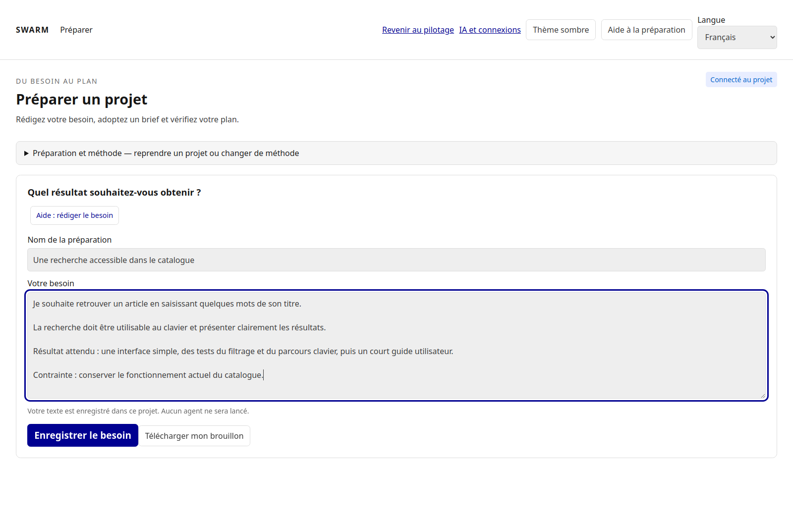
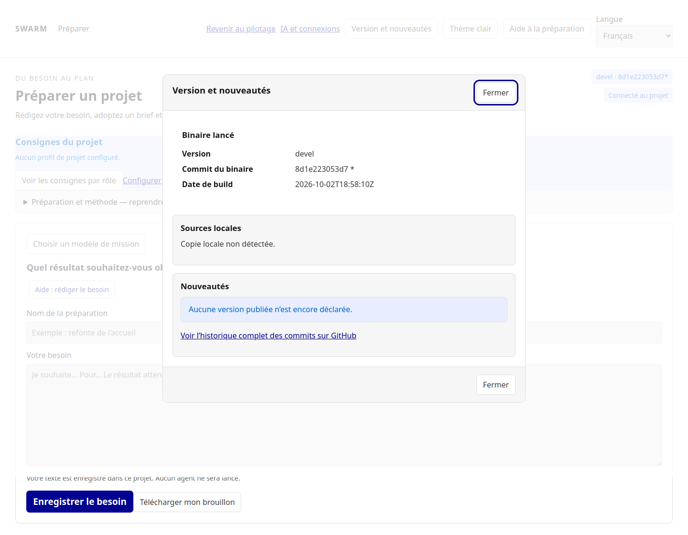
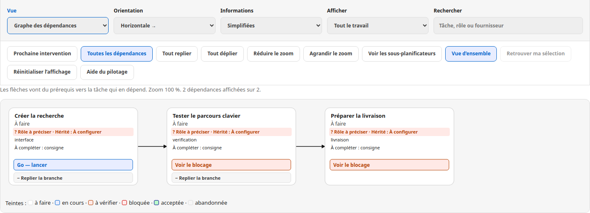
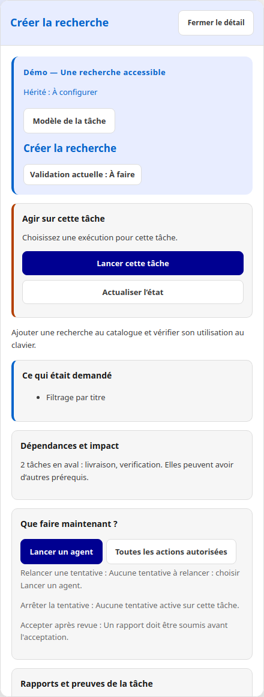
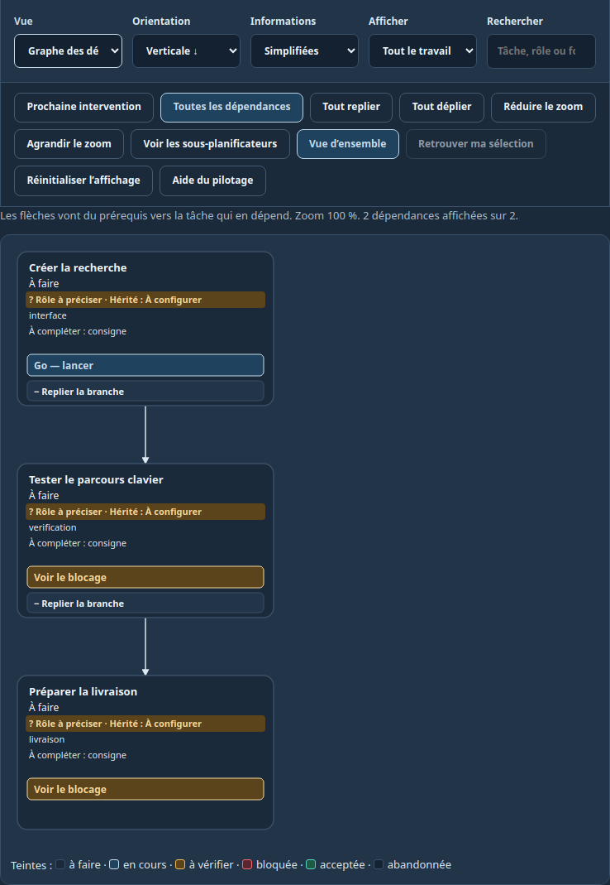
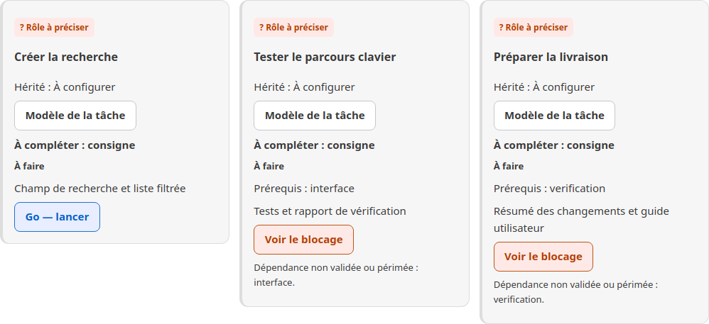

# Utiliser Swarm, du besoin au résultat

Ce guide décrit le parcours web et ses équivalents en ligne de commande.
Vous pouvez préparer et piloter une mission depuis Swarm sans passer par une
conversation externe avec Codex. Les programmes agents doivent cependant être
installés et authentifiés dans l’environnement où Swarm les exécute.

Les captures illustrent des données de démonstration, sans agents réels en cours.

Pour une copie déjà préparée ou une livraison incomplète : [reprise et contrôles du moteur](docs/ENGINE-RECOVERY.md).

## Choisir la langue

Le sélecteur **Langue** propose Français et English dans le cockpit, la préparation
et la session d’agent. Le choix est mémorisé dans le navigateur. `?lang=en` ou
`?lang=fr` permet un choix explicite dans le lien. Le changement recharge la vue :
enregistrez les brouillons avant de basculer. Une préparation avec saisie ou
opération en attente refuse cette navigation pour préserver votre travail.

Dans le CLI : `swarm --lang en …`, ou `SWARM_LANG=en swarm …`.
L’option explicite prime sur la variable ; le français reste la valeur par défaut.
Les commandes, codes et clés JSON restent identiques. Les titres, rapports et
sorties des agents conservent leur langue d’origine.

[Read the English user guide](docs/en/USER-GUIDE.md).

En cas de refus du fournisseur : [comprendre et traiter une attente de quota IA](docs/PROVIDER-QUOTAS.md).

Pour les garanties et leurs limites : [contrat du moteur et design Cursor](docs/architecture/CURSOR-ENGINE-CONTRACT.md).

## Le parcours en un coup d’œil

| Vous voulez… | Ouvrez… | Vérifiez avant de continuer |
|---|---|---|
| Choisir l’IA | IA et connexions | Le modèle, son accès et l’environnement d’exécution |
| Expliquer le besoin | Préparer avec l’IA | Objectif, contraintes et critères concrets |
| Démarrer | Pilotage, puis Lancer la mission | Rôles, dossier, limites et autorisation |
| Comprendre l’attente | La tâche, puis son diagnostic | Cause, personne ou agent qui doit agir, prochaine action |
| Voir les sorties | Voir l’agent travailler, si une tentative existe | Heure du signal et résultat réellement reçu |
| Confirmer la fin | Résultats et validations | Critères, contrôles et revue ; pas seulement la fin du processus |



Les écrans ci-dessous ont été recapturés le 29 septembre 2026 sur une instance isolée. La mission manuelle présente trois tâches **à préparer** ; les alertes de rôles manquants sont réelles. Elle ne démontre pas une exécution autonome.

## Sommaire

1. [Ouvrir Swarm](#1-ouvrir-swarm)
2. [Connecter les IA](#2-connecter-les-ia)
3. [Préparer une mission](#3-préparer-une-mission)
4. [Vérifier l’équipe et lancer](#4-vérifier-léquipe-et-lancer)
5. [Suivre le travail](#5-suivre-le-travail)
6. [Comprendre les états et valider](#6-comprendre-les-états-et-valider)
7. [Résoudre un blocage](#7-résoudre-un-blocage)
8. [Modifier une mission](#8-modifier-une-mission)
9. [Pause, arrêt et nettoyage](#9-pause-arrêt-et-nettoyage)
10. [Utiliser le terminal](#10-utiliser-le-terminal)
11. [Limites et données](#11-limites-et-données)

## 1. Ouvrir Swarm

Suivez d’abord le [guide d’installation](INSTALL.md), Docker ou natif.
Choisissez le **dossier du projet à faire examiner ou modifier**, qui peut être
différent du dépôt du logiciel Swarm. Ce dossier contient son propre état `.swarm/`.

En natif, depuis le dépôt Swarm compilé :

```sh
./bin/swarm --root /chemin/du/projet init
./bin/swarm --root /chemin/du/projet providers init
./bin/swarm --root /chemin/du/projet web 127.0.0.1:18787
```

Ouvrez le **lien de session affiché dans le terminal**. En Docker, retrouvez-le
avec `docker compose --env-file deploy/install.env logs --tail 20 swarm`.
Ce lien donne accès au cockpit : ne le mettez pas dans vos captures publiques.
Le sélecteur permet de consulter plusieurs missions dans le même onglet.

Si le navigateur est sur un autre ordinateur, `127.0.0.1` désigne cet ordinateur,
pas le serveur : utilisez le [tunnel décrit dans l’installation](INSTALL.md#réseau-et-accès-au-navigateur).

### Lire la version et les nouveautés

Le bouton **Version et nouveautés** se trouve dans le rail du cockpit et dans
l’en-tête de la préparation. La fenêtre distingue le binaire effectivement lancé
des sources locales, puis affiche les releases embarquées et leurs commits. Tant
qu’aucune release vérifiée n’est déclarée, elle affiche un historique vide sans
fabriquer de version. `devel`, `unknown` et `null` sont donc des états explicites,
pas des échecs masqués ni des numéros de release.

```sh
swarm version
swarm --version
swarm --json version
```

Ces commandes fonctionnent sans base de projet. Pour comparer avec le web,
exécutez-les sur le même binaire que le serveur. Après recompilation ou mise à
jour, redémarrez le serveur avant de conclure à un écart. Échap ferme la fenêtre
et rend le focus au bouton qui l’a ouverte.



[Captures bilingues et états de chargement/indisponibilité](docs/screenshots/version-history/manifest.json).

## 2. Connecter les IA

Ouvrez **IA et connexions**. Deux sortes de connexions ont des usages différents :

| Connexion | Utilité | Ce qu’il faut fournir |
|---|---|---|
| API compatible `/chat/completions` | Préparer, planifier, examiner un rapport | Adresse, identifiant exact du modèle, clé si nécessaire |
| Programme agent avec outils | Lire et modifier les fichiers, exécuter des commandes | Programme installé, authentification et configuration du fournisseur |

Swarm ne contient ni Claude Code, ni Codex, ni Skynet, ni les poids des modèles.
Dans Docker, un programme installé sur votre ordinateur n’est pas automatiquement
installé dans le conteneur. Voir [Configurer les IA dans Docker](INSTALL.md#2-configurer-les-ia-dans-docker).

### Ajouter une API

1. Choisissez **Ajouter une IA**.
2. Renseignez un identifiant local, un nom lisible, l’adresse de base du service
   et l’identifiant exact du modèle disponible chez ce fournisseur.
3. Utilisez **Tester la connexion**. Ce test envoie une courte question ; il peut
   être facturé. Il n’envoie aucun document de mission.
4. Enregistrez : le test seul ne sauvegarde pas la connexion.
5. Retrouvez-la sous le nom `api-<identifiant>` dans les choix de préparation
   et de planification.

Une réponse au test prouve la connexion texte, pas la capacité à modifier des
fichiers ni à respecter tous les formats structurés demandés au responsable.
Une API texte seule ne peut pas être l’exécutant d’une mission de code.


### Choisir les modèles

Les niveaux utilisent la politique enregistrée du fournisseur. Vérifiez le modèle
résolu avant le départ ; Swarm ne choisit pas librement un modèle plus puissant.
Une connexion API personnalisée utilise son modèle enregistré pour les trois
niveaux. Elle ne représente donc pas trois modèles différents.

Lors de la création des missions, choisissez séparément **IA du responsable et
du vérificateur** et **Agent avec outils pour les exécutants**. Le même programme
peut servir aux deux si ses capacités le permettent.

## 3. Préparer une mission

Depuis le cockpit, choisissez **Préparer un projet**.
Décrivez le résultat attendu, le dossier concerné, les limites et la façon de
vérifier la réussite. Exemple à adapter :

> Ajouter une recherche dans la liste des documents. Conserver les filtres
> existants et les deux thèmes. Vérifier les recherches sans résultat et les
> caractères accentués. Livrer le code, les tests et un rapport des résultats.

1. Choisissez le fournisseur et le niveau de préparation.
2. Échangez avec l’IA, puis **relisez et adoptez le brief**.
3. Demandez un plan et répondez aux décisions encore ouvertes.
4. Avec **Modifier les missions**, précisez chaque titre, périmètre, livrable,
   critère de réussite et dépendance.
5. Utilisez **Vérifier le plan** et corrigez les problèmes signalés.
6. Choisissez **Relire l’équipe proposée**, puis vérifiez le responsable, les
   exécutants, la revue, les IA, l’espace de travail, les limites et le mode de
   validation. Exécutez le prévol, puis donnez l’autorisation unique récapitulative.

La vérification du plan contrôle sa cohérence ; elle ne prouve pas que le travail
est réalisé. Aucun travail ni agent n’est créé avant l’autorisation. Après celle-ci,
seules les missions éligibles peuvent partir ; dépendances, budget, pause et espace
occupé restent contrôlés.


### Choisir qui valide

- **Moi — revue humaine** : vous examinez les résultats et les acceptez.
  L’équipe peut avancer automatiquement jusqu’à cette étape.
- **Le moteur — contrôles autorisés** : vous autorisez à l’avance les commandes
  exactes qui démontrent les critères. Une couverture manquante ou un contrôle
  échoué empêche l’acceptation automatique.

Le vérificateur IA des nouvelles préparations examine le rapport dans une
session distincte. Son avis ne remplace ni les contrôles exigés ni l’acceptation
humaine choisie. Pour un premier essai dont les critères sont qualitatifs,
la revue humaine rend explicite ce que vous devez encore examiner.

## 4. Vérifier l’équipe et lancer

Avant d’autoriser le démarrage, vérifiez ces responsabilités :

| Rôle | Responsabilité | Comment le lire |
|---|---|---|
| Responsable / orchestrateur | Organiser, recevoir les retours et décider de la suite | Carte de responsabilité, décisions et état de son périmètre |
| Responsable de branche | Organiser une partie déléguée, si elle existe | Responsabilité rattachée à son périmètre |
| Exécutant | Réaliser une tâche et produire son livrable | Carte de tâche, tentative et session |
| Vérificateur indépendant | Examiner les critères et le rapport | Carte de vérification et avis liés à la tentative |
| Contrôles du moteur | Exécuter les vérifications autorisées | Résultats de contrôles et décision de validation |

Une carte de responsable visible ne signifie pas qu’un appel IA tourne en
permanence. Une tâche intitulée « revue » n’est pas, à elle seule, un vérificateur
configuré. Les anciennes missions peuvent avoir une organisation incomplète :
lisez les rôles manquants au lieu de supposer qu’ils sont créés automatiquement.

Après **Relire et autoriser le démarrage**, ouvrez le pilotage et utilisez
**Lancer la mission**. Relisez le fournisseur, le dossier, les créneaux et les
limites avant confirmation. L’autorisation du plan et le lancement sont deux étapes.

Le nombre de créneaux fixe un maximum de tentatives simultanées. Des dépendances
non validées ou un dossier déjà occupé peuvent réduire le parallélisme réel.
**Lancer tout** démarre les tâches prêtes à cet instant ; pour un enchaînement
durable, utilisez la mission et vérifiez que son conducteur est observé.

### Lire le résumé avant de confirmer

L’aperçu de lancement présente la configuration commune et celle de chaque départ
possible : rôle, fournisseur, niveau demandé, modèle résolu par la configuration,
profil du projet et skills sélectionnés. Les profils propres aux tâches restent
prioritaires. Le même résumé est disponible avec `swarm mission preview`.

Le **modèle rapporté par le fournisseur** reste **inconnu avant l’exécution**.
Un modèle configuré n’est pas une preuve du modèle réellement utilisé. Un programme
sans politique de modèles affiche aussi un modèle résolu **inconnu**. Le périmètre,
les budgets, les reprises et les validations restent visibles avant confirmation.

## 5. Suivre le travail

Commencez par le résumé du **Pilotage des agents** : ce qui se passe, la prochaine
action et qui doit agir. Consultez ensuite le graphe ou la liste.

- Les flèches de dépendance vont du prérequis vers la tâche qui en dépend.
  Elles tiennent compte du verdict du moteur et de la fraîcheur des preuves.
- Les liens de responsabilité relient les rôles à leurs périmètres. Ne déduisez
  pas le sens d’un lien de sa seule couleur ou de son seul style : lisez sa légende.
- **Horizontale / Verticale** change l’orientation, **Simplifiées / Détaillées**
  change les informations visibles. Aucun de ces réglages ne réordonne le travail.
- **+ / −** replie ou déplie une branche. Cela ne supprime aucune tâche.
- Les filtres et **Vue d’ensemble** aident à retrouver une branche hors écran.
- Un clic ouvre les détails. **Voir l’agent travailler** ouvre sa session ;
  un double-clic sur une tâche ouvre sa session lorsqu’elle existe.



Dans la session, lisez l’heure, le type d’événement et le message. Les sorties
reçues décrivent l’activité observable : elles ne donnent pas accès au raisonnement
interne de l’IA. La capture détaillée est facultative ; sans elle, tout le texte
brut du fournisseur n’est pas nécessairement conservé.



**Ces captures utilisent des données de démonstration**, sans agents réels en
cours. Les fournisseurs, missions et états de votre installation seront différents.

### Adapter l’affichage



Utilisez **Vue d’ensemble** pour retrouver les flèches après un zoom. Le repli masque une branche ; il ne change ni les dépendances ni l’ordre d’exécution.

<details>
<summary>Voir les livrables en liste détaillée</summary>



</details>

## 6. Comprendre les états et valider

| Indication | Signification | Suite |
|---|---|---|
| À faire | La tâche n’a pas encore commencé | Lire ses conditions de départ |
| En cours | Une tentative est en cours dans le suivi | Vérifier aussi le processus et son dernier signal |
| À vérifier | Un résultat a été soumis | Lire rapport, avis et contrôles |
| Bloquée | Un obstacle empêche la suite | Ouvrir le motif et la reprise proposée |
| Terminée et validée | Le résultat a été accepté | Les dépendances peuvent être satisfaites si les preuves restent actuelles |
| Acceptée — à revalider | Les preuves d’une acceptation ont changé | Refaire les vérifications concernées |
| Dérogation / Abandonnée | Décision explicite, différente d’une réussite | Lire sa justification |

**Un processus “Terminé” n’est pas une tâche “Terminée et validée”.** De même,
un résultat récent n’est pas une preuve que le processus travaille encore.
Swarm distingue exécution, activité reçue et validation.

En revue humaine, ouvrez le résultat à examiner, lisez le rapport et les critères,
puis utilisez les actions de revue et d’acceptation proposées dans la fenêtre.
Une “gate” désigne un contrôle de passage : si elle refuse la livraison, consultez
les preuves manquantes ou périmées. Acquitter une notification signifie seulement
que vous l’avez lue.

En validation automatique, le moteur attend les conditions enregistrées ;
ne relancez pas un agent uniquement parce qu’une revue est encore en attente.
La mission hiérarchique n’est achevée que lorsque les résultats sont traités
et que les responsables ont clos leurs périmètres.

## 7. Résoudre un blocage

Pour une acceptation périmée dont les preuves liées ont réellement changé, **Revalider les preuves** ouvre une confirmation de nouvelle vérification du résultat existant. Le moteur conserve la tentative et les appels consommés, archive l’ancien avis et exige de nouveaux contrôles puis une acceptation. Cette reprise utilise le budget restant du vérificateur ; elle ne relance pas le producteur. Un fichier absent ou une acceptation encore fraîche ne suffit pas à autoriser cette reprise.

Un échec du planificateur concerne ses nouvelles décisions. Les tâches déjà prêtes, en cours, à examiner ou à reprendre conservent leur état et leur action autorisée dans le bandeau. Le diagnostic du planificateur reste consultable dans les décisions ; il ne prouve pas que tous les agents sont arrêtés.

Ouvrez la tâche signalée et son diagnostic. **Expliquer avec l’IA** peut aider à
comprendre le contexte et proposer une action. Examinez l’effet de cette action
avant de l’appliquer ; un conseil n’est pas une validation.

| Message ou symptôme | Vérification et action utile |
|---|---|
| Fournisseur absent | Installer et authentifier l’agent dans le bon environnement ; contrôler sa déclaration |
| Seulement des exécutants | Vérifier l’organisation et les rôles manquants ; ne pas contourner le refus de lancement |
| Espace occupé | Identifier la tentative qui réserve le dossier ; attendre sa fin ou examiner son arrêt |
| Dépendance non validée ou périmée | Ouvrir le prérequis et traiter sa revue ou ses preuves |
| Tentative terminée sans rapport | Examiner la sortie, le livrable attendu et son emplacement avant reprise |
| Erreurs d’outils répétées | Corriger droits, ressource ou test en échec avant de relancer ; augmenter le plafond ne corrige pas la cause |
| Signal perdu / processus non confirmé | Examiner la session et le poste d’exécution ; éviter de lancer un doublon |
| Conducteur absent | Vérifier que le serveur web du même projet fonctionne ; l’autorisation seule ne fait pas avancer la mission |
| Contexte trop volumineux | Réduire les documents transmis ou repartir d’un brief plus court ; aucun envoi tronqué n’est promis |
| Coût non rapporté | Le fournisseur n’a pas transmis cette mesure ; cela ne signifie pas gratuit |
| Refus après confirmation | Relire l’état : la mission a pu changer entre l’aperçu et l’action |

Corrigez la cause, puis utilisez la reprise proposée. Une répétition identique
sans changement des conditions risque de produire le même échec.

## 8. Modifier une mission

Utilisez **Réviser ce Swarm** pour revenir à sa préparation source.
Modifiez le brouillon, vérifiez le nouveau plan, puis choisissez
**Comparer et appliquer la révision**. Relisez tâches ajoutées, modifications
et résultats à revérifier.

Le brouillon seul ne change pas la mission. Une révision appliquée conserve
l’historique, peut rouvrir des résultats, met la mission en pause et verrouille
les prochains départs. Relisez et autorisez le plan avant de reprendre.
Les tentatives actives ou certaines délégations peuvent empêcher l’application :
le refus doit être résolu avant une nouvelle comparaison.

Pour modifier les flèches, modifiez les **dépendances du plan** et vérifiez-le.
Le déplacement visuel ou l’orientation du graphe ne change pas l’ordonnancement.

## 9. Pause, arrêt et nettoyage

- **Mettre en pause** suspend les prochains départs ; les agents déjà lancés
  continuent. Pour arrêter une tentative, utilisez son action d’arrêt et vérifiez
  ensuite la confirmation de fin du processus.
- Fermer l’onglet ne coupe pas les agents. Arrêter le serveur ne garantit pas
  l’arrêt des processus agents ; arrêter le conteneur interrompt son environnement.
- **Reprendre la mission** réautorise la progression, sous réserve des conditions.

Dans **Gérer les missions**, utilisez recherche et filtres :

| Action | Effet |
|---|---|
| Archiver | Range la mission et produit une archive ZIP ; conserve ses données |
| Restaurer | Réactive une archive ou récupère une mission en corbeille |
| Purger l’historique | Retire les anciens journaux et sorties selon la rétention choisie, sans retirer preuves et reçus |
| Supprimer | Place les données internes en corbeille récupérable ; ne supprime pas les fichiers du projet |

L’aperçu ne modifie rien. Lisez volumes et exclusions avant confirmation.
La suppression demande le nom exact. Une activité en cours peut empêcher
l’opération : arrêtez ou résolvez l’activité concernée, puis demandez un nouvel aperçu.
Consultez l’installation pour les [sauvegardes et mises à jour](INSTALL.md#4-données-arrêt-et-mise-à-jour).

## 10. Utiliser le terminal

Le web et le CLI partagent l’état **seulement s’ils ciblent le même dossier projet**.
Dans les exemples, remplacez les chemins et identifiants ; ne saisissez pas les
mots `IDENTIFIANT` littéralement.

Depuis le dépôt Swarm compilé :

```sh
./bin/swarm --root /chemin/du/projet work list
./bin/swarm --root /chemin/du/projet work show IDENTIFIANT
./bin/swarm --root /chemin/du/projet mission status IDENTIFIANT
./bin/swarm --root /chemin/du/projet planning show IDENTIFIANT
./bin/swarm --root /chemin/du/projet agent list IDENTIFIANT
./bin/swarm --root /chemin/du/projet agent logs IDENTIFIANT_AGENT
./bin/swarm --root /chemin/du/projet console IDENTIFIANT
```

Pause et reprise, uniquement sur la mission que vous avez sélectionnée :

```sh
./bin/swarm --root /chemin/du/projet mission pause IDENTIFIANT
./bin/swarm --root /chemin/du/projet mission resume IDENTIFIANT
```

Dans Docker, remplacez le préfixe par :

```sh
docker compose --env-file deploy/install.env exec swarm swarm --root /workspace work list
```

Pour les scripts, ajoutez `--json` avant la commande. L’aide thématique est
accessible avec `swarm aide pilotage` ou `swarm aide validations` si le binaire
est installé dans votre PATH.

Les créations et révisions CLI utilisent des documents JSON versionnés : voir
[les contrats de préparation](PREPARATION-UX.md#cli--mêmes-mutations-mêmes-garanties)
et la [référence](REFERENCE.md). Les mutations exigent la révision courante et
un identifiant d’opération ; ne remplacez pas aveuglément une révision refusée.
Le terminal n’a pas tous les formulaires web. Le test interactif de connexion API,
notamment, se fait dans le web.

## 11. Limites et données

Les missions, connexions et journaux sont locaux dans `.swarm/`. Les clés API
sont dans un fichier réservé au compte du processus, **sans chiffrement applicatif**.
Ne publiez ni ce dossier ni les liens de session. Les sorties capturées peuvent
contenir du contenu sensible du projet.

Ce dépôt fournit neuf [méthodes de travail](docs/AGENT-METHODS.md). Pour un autre
projet piloté, vérifiez ses ressources de méthode. La préparation standard ne crée pas
implicitement des copies Git isolées : ne confondez pas ce parcours avec le mode
avancé de dépôt Git géré, décrit dans la référence.

Les tests avec des agents simulés ne remplacent pas une recette de votre
fournisseur réel et de votre projet.

Pour approfondir : [préparation](PREPARATION-UX.md), [cockpit technique](COCKPIT.md),
[référence CLI](REFERENCE.md), [installation](INSTALL.md).

## Comprendre et reprendre une mission

Le pilotage commence par un résumé court : ce qui se passe, puis qui agit et
quelle est la prochaine étape. Le bouton principal cible la tâche qui retient
le plus de dépendants avant les tâches simplement à configurer. Un incident de
stockage, une organisation incomplète ou une planification à reprendre reste
prioritaire. Le texte sous le résumé annonce l’effet du bouton : ouvrir un
diagnostic ne relance pas l’agent et ne valide pas son résultat.

Le CLI `swarm mission status IDENTIFIANT` affiche le même résumé, la même action
et son effet. `--json` expose `guidance` et `tasks[].primary_action` pour les
outils qui présentent ce suivi. Les commandes de reprise existantes gardent
leurs confirmations, contrôles et limites.

Pour une nouvelle tentative de la même tâche, Swarm fournit les opérations
récentes, la prochaine action, les critères actuels et les références de revue
liées à la tentative précédente. Les verdicts transmis sont historiques : les
preuves doivent être revérifiées sur le résultat courant. Les rapports bruts,
les résultats des autres tâches et les secrets ne sont pas recopiés dans cette
mémoire. Son contenu reste borné et signale les extraits incomplets.

### Comprendre l’attente, les appels et une reprise

Dans **Conduite**, trois boutons ouvrent des fenêtres de lecture :

- **Depuis votre dernière visite** sépare résultats, blocages et décisions.
  Ces événements décrivent l’historique, pas une validation actuelle. La première
  visite est annoncée ; un extrait limité à 200 événements est signalé.
- **Pourquoi cette tâche attend ?** donne les prérequis non validés ou périmés
  et permet d’ouvrir leur fiche. Une attente sans dépendance affiche le motif du
  moteur, par exemple un espace occupé. Ouvrir la fiche ne relance rien.
- **Où vont les appels et les coûts ?** distingue exécutants par tâche,
  responsables et vérificateur. Les contrôles enregistrés et les reprises
  d’agents sont séparés des appels IA. Les jetons et dollars absents restent
  explicitement non rapportés. Ce tableau ne mesure pas toutes les requêtes
  réseau internes aux fournisseurs. Il est aussi visible dans **Budgets et coûts IA**.

Le **Bilan par tentative**, dans cette même modale et dans `swarm mission spending WORK`,
conserve une ligne par agent et tentative : processus, validation enregistrée de
la tâche, outils, lectures, écritures, opérations non classées, erreurs cumulées,
répétitions et usage/coût fournisseur. Une tâche acceptée peut conserver une
tentative interrompue ; son acceptation enregistrée ne garantit pas la fraîcheur
actuelle des preuves. Une erreur ne disparaît pas du total après un succès.

Les anciennes tentatives sans compteurs détaillés restent **inconnues**, pas zéro.
Une perte de visibilité produit une mesure **partielle**. Les commandes mixtes
ne sont pas automatiquement considérées comme des tests : leur nombre reste
inconnu sans signal fiable. Une répétition compte une même opération avec les
mêmes entrées sous un nouvel identifiant ; un message retransmis n’est pas
un nouvel appel. Un départ enregistré n’est pas un appel au modèle.

Dans le détail d’une tâche, **Avant une relance** présente les éléments
conservés, les vérifications à refaire, les critères inchangés et la correction
attendue. Cet aperçu apparaît aussi dans le formulaire de relance ou d’essai
correctif ; il suit la tentative sélectionnée et la consigne saisie. Il ne
constitue ni une autorisation de départ ni une promesse de succès.

Équivalents CLI, utilisables avec `--lang en` ou `--json` :

```bash
swarm mission changes WORK
swarm mission seen WORK               # marque explicitement la révision comme vue
swarm mission spending WORK
swarm mission recovery WORK TASK      # dernière tentative de cette tâche
swarm mission recovery WORK TASK AGENT
swarm mission status WORK             # inclut les prérequis qui retiennent les tâches
```

Une lecture ne déplace pas le repère de visite. Sur le web, le repère existant
est enregistré en quittant le travail, ou via « Marquer comme vu ». Le CLI
utilise le même compte local et le même repère, avec `mission seen`.

### Redémarrage explicite après épuisement des tentatives

`swarm planning restart-task WORK --input reprise.json` prépare une seule nouvelle
production après décision explicite de l’opérateur. Les anciennes tentatives,
coûts et revues restent conservés ; l’autorisation seule ne lance aucun agent.
Le JSON contient `schema_version`, `event_id`, `expected_revision`, `task_id`,
`attempt_id`, `confirm_recovery: true`, `reason`, `recovery_instruction` et
`expected_candidate`. Pour une mission Git isolée, ce dernier est le candidat
Git courant. Pour une mission dans un dossier partagé, c’est l’empreinte SHA-256
du fichier déclaré comme livrable, examiné avant la demande (48 Ko maximum).
La dernière tentative doit être terminée et aucun agent ni revue ne doit être
actif. Une consigne différente est obligatoire. Les contrôles, la revue
indépendante et la décision d’acceptation doivent ensuite être renouvelés.
Un dépassement historique reste visible : il n’est pas remis à zéro.

### Lire les compteurs et reconnaître la fin

- **Appels d’outils** : actions observées du fournisseur pendant une tentative ; ce n’est pas un nombre de requêtes au modèle.
- **Décisions enregistrées** : décisions de planification conservées par le moteur.
- **Activations de planification** : prises en charge du planificateur, y compris celles effectuées par le superviseur natif. Elles ne prouvent pas autant d’appels IA payants.
- **Retours à traiter** : événements encore sans décision ; un événement reçu ne constitue pas une tâche validée.

Un agent arrêté ou un avis favorable ne suffisent pas. **Terminé et validé**
indique que les preuves actuelles satisfont les contrôles de la tâche. La mission
est clôturée lorsque tous les résultats requis sont validés et que le responsable
racine a clôturé son périmètre. Une preuve modifiée peut rendre la validation périmée.


*Capture réelle du 1er octobre 2026 : résultats validés et responsabilité racine clôturée. « Voir les résultats » conserve l’accès aux livrables et aux avis. Cette recette comprend des décisions humaines ; elle ne prouve pas une autonomie sans intervention.*

Si une reprise autorisée reste arrêtée par une décision opérateur précédente,
l’autorisation seule n’enlève pas cet arrêt : utilisez le lancement explicite
après vérification des conditions. Le [guide moteur](docs/ENGINE-RECOVERY.md)
détaille les refus de révision et les rapports trop grands pour le contexte.

### Refaire une revue après correction des preuves

Une revue refusée conserve son avis et ses appels consommés. Corrigez le livrable déclaré ou le rapport examiné ; modifier un fichier sans lien avec la revue ne suffit pas. Si la tentative de production est terminée et que les preuves liées ont réellement changé, **Reprendre la vérification** permet de soumettre ce même résultat à un nouvel examen, sans relancer la production. Un fichier supprimé ou inaccessible ne permet pas cette reprise. Le budget existant reste applicable ; aucun avis favorable ni aucune acceptation ne sont créés par ce bouton.

Les consignes ajoutées pour lancer une tâche restent propres à cette tâche. Elles ne remplacent pas les consignes communes déjà enregistrées pour la mission ; celles-ci se configurent explicitement dans le profil du travail. Au départ, le moteur assemble les consignes communes et celles de la tâche dans le message transmis à l’agent. Il évite de recopier deux fois une même consigne commune. Une consigne locale ne devient pas automatiquement une règle des autres tâches.

### Modèle demandé et modèle rapporté

Le détail d’une tentative affiche séparément le modèle demandé par la configuration et celui déclaré par le fournisseur. L’observation conserve sa source et sa date dans le CLI JSON `agent show` (`reported_model`). Sans événement fournisseur structuré, la valeur reste inconnue, même après exécution. Une déclaration fournisseur n’est pas une preuve indépendante du modèle physique exécuté. Les anciennes tentatives ne sont pas rétroactivement renseignées.

### Préparer une reprise ciblée

Dans la tâche, « Avant une relance » compare les preuves liées au dernier avis et affiche les changements depuis le refus. Les preuves inchangées peuvent servir d’entrées ; elles ne constituent pas une validation. Les preuves modifiées ou inconnues et les critères restants doivent être vérifiés. Le même aperçu est disponible avec `swarm mission recovery TRAVAIL TACHE`. Cet aperçu n’exécute aucune action et ne relève aucun plafond.

### Sortie des contrôles transmise à la revue

Dans « Configurer les validations », chaque contrôle peut autoriser le partage de sa sortie avec le vérificateur. Ce choix est désactivé par défaut ; activez-le seulement pour une commande dont la sortie peut être partagée. Le moteur transmet au maximum 8 Kio, indique la taille totale et signale une sortie tronquée. Une observation partielle ne vaut pas journal complet. Les sorties restent des données à examiner, jamais des instructions pour le vérificateur.

Le CLI utilise la même politique : `review_output: true` dans le contrôle JSON de `swarm validation preview` puis `apply`. Toute modification invalide le reçu précédent : les contrôles doivent être rejoués avant la revue, sans nouvelle tentative de production ni remise à zéro du budget.

### Ce que fait la revue indépendante

Le vérificateur utilise une session distincte pour examiner les critères, le rapport, les contrôles réellement exécutés et les pièces jointes. En mode sans outils, il ne rejoue pas les tests : il examine leur couverture et la cohérence des preuves fournies. Les observations du producteur ou du superviseur gardent leur attribution. Une ancienne limite de recette peut être complétée par des observations ultérieures datées ; elle n’est pas effacée. Un code de sortie 0 ne suffit pas si le contrôle ne couvre pas le critère. Une preuve manquante reste « inconnue » avec une explication précise. L’avis favorable et l’acceptation de la tâche sont deux étapes différentes.
