# Installer Swarm

[English installation guide](docs/en/INSTALL.md).

Swarm propose deux installations **sous Linux** : Docker pour un environnement dédié, ou un binaire natif pour utiliser les outils déjà installés sur votre machine. Le script ne demande pas `sudo`, ne modifie pas votre profil shell et n’installe pas Docker à votre place.

Après installation, suivre le [guide utilisateur](GUIDE-UTILISATEUR.md) pour connecter une IA, préparer une mission et lire ses résultats.

## 1. Installation Docker

Prérequis : Git, Bash, Docker Engine démarré et accessible à votre utilisateur, Docker Compose v2 avec `up --wait`. Les téléchargements des images et dépendances nécessitent Internet. Vérifiez :

```sh
docker version
docker compose version
```

Si nécessaire, suivez les instructions officielles pour [Docker Engine](https://docs.docker.com/engine/install/) et le [plugin Compose](https://docs.docker.com/compose/install/linux/).

```sh
git clone https://github.com/mo0ogly/swarm.git
cd swarm

# Remplacez ce chemin par votre projet existant, ou créez un projet d’essai.
mkdir -p "$HOME/projets/mon-projet"
./install.sh --project "$HOME/projets/mon-projet"
```

Le script construit l’image, initialise le projet si nécessaire et démarre le cockpit. Il affiche ensuite **le lien de session à ouvrir dans votre navigateur**. Ce lien donne accès à votre cockpit : ne le publiez pas.

Pour retrouver ce lien :

```sh
docker compose --env-file deploy/install.env logs --tail 20 swarm
```

### Ce qui est installé

- Un binaire Swarm compilé depuis votre copie du dépôt, avec les ressources web embarquées.
- Un environnement contenant Node.js 22, Python 3, Git, curl et les certificats TLS.
- Un conteneur exécuté avec votre UID/GID, pour conserver la propriété des fichiers.
- Le projet monté en écriture dans **`/workspace`**.
- Un dossier personnel persistant dans **`/home/swarm`** pour les outils et authentifications des agents.

**L’image de base ne contient aucun fournisseur d’agent préinstallé ni aucune clé IA.** Elle permet de préparer le cockpit et d’ajouter une connexion API. Un agent disposant d’outils reste nécessaire pour réaliser des modifications de code.

### Options

```sh
# Choisir un autre port et un stockage séparé pour les agents.
./install.sh --project "$HOME/projets/mon-projet" \
  --port 18788 --agent-home "$HOME/.local/share/swarm/agents-demo"

# Construire et préparer la configuration sans démarrer.
./install.sh --project "$HOME/projets/mon-projet" --no-start

docker compose --env-file deploy/install.env up -d --wait
```

Le fichier local `deploy/install.env` contient les chemins, le port et les UID/GID. Il est exclu de Git et créé avec des permissions privées. Le script refuse de réinstaller lorsque le service Compose est déjà actif : arrêtez d’abord proprement les missions.

### Réseau et accès au navigateur

Swarm conserve une écoute **sur `127.0.0.1` uniquement**. Compose utilise donc `network_mode: host`, sans publication `ports:`. Cette configuration partage le réseau de l’hôte tout en conservant la séparation des fichiers et processus du conteneur. Voir [la documentation Docker du réseau hôte](https://docs.docker.com/engine/network/drivers/host/).

Le parcours décrit et testé ici vise **Docker Engine sur Linux avec un moteur local**. Docker Desktop, les moteurs Docker distants et Windows ne font pas partie de cette recette. Ne remplacez pas l’écoute par `0.0.0.0` : le serveur la refuse.

Sur une machine distante, ouvrez un tunnel depuis votre poste :

```sh
ssh -L 18787:127.0.0.1:18787 utilisateur@serveur
```

Puis ouvrez le lien de session avec `127.0.0.1:18787` dans votre navigateur local. Si ce port local est déjà occupé, adaptez les deux côtés du tunnel et le port Swarm pour conserver un accès cohérent avec l’adresse du serveur.

## 2. Configurer les IA dans Docker

### Connexions API

Dans **IA et connexions**, ajoutez le nom, l’adresse du service, l’identifiant du modèle et, si nécessaire, une clé. Testez la connexion avant de l’utiliser.

Le protocole attendu est compatible avec `POST /chat/completions`. Une connexion API peut servir à préparer, planifier ou examiner un rapport. Elle ne donne pas automatiquement des outils d’accès aux fichiers.

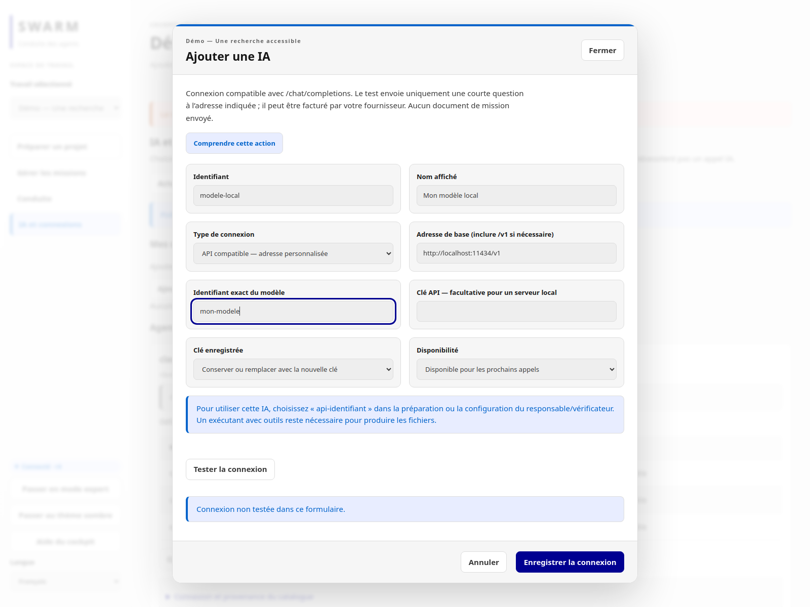

*Capture réelle du formulaire rempli (fournisseur local d’exemple, champ de clé vide) : ni testé ni enregistré, « Connexion non testée dans ce formulaire » est affiché. Aucune clé n’apparaît. Cliquez **Tester la connexion** puis **Enregistrer la connexion** ; l’enregistrement ne prouve pas que le service répond.*

Avec le réseau hôte Linux, une API locale peut être joignable par exemple à `http://127.0.0.1:11434/v1`, si vous avez effectivement lancé un service compatible à cette adresse.

### Agents capables de modifier le projet

Le dépôt GitHub contient les adaptateurs de Swarm, pas les programmes Claude Code, Codex ou Skynet, ni les poids des modèles. La commande `skynet_harness` est reconnue par le routage des modèles lorsqu’elle est installée et déclarée comme fournisseur ; cette reconnaissance ne constitue pas une installation ni une recette de bout en bout.

Les commandes installées sur l’hôte ne deviennent pas automatiquement disponibles dans le conteneur. Installez les agents **dans le conteneur**, selon la documentation de leur éditeur, puis authentifiez-les dans cet environnement.

Ouvrir un terminal dans le service :

```sh
docker compose --env-file deploy/install.env exec swarm bash
```

Pour un agent distribué par npm, le modèle de commande est `npm install -g NOM_DU_PAQUET@VERSION` : remplacez ces paramètres par le paquet officiel et la version que vous avez choisis. Le préfixe npm `/home/swarm/.local` est persistant et son dossier `bin` figure dans le PATH.

Les composants système supplémentaires doivent être ajoutés dans une image dérivée. Ils ne persistent pas après recréation s’ils sont installés seulement dans la couche d’un conteneur.

Swarm découvre les CLI connues présentes au **premier** `providers init`. Si vous ajoutez un fournisseur après le premier lancement, conservez le fichier existant et ajoutez ou adaptez sa définition dans `/workspace/.swarm/providers.json`. `providers init` ne l’écrase pas. Consultez le [contrat des fournisseurs](REFERENCE.md) pour les arguments et la transmission des variables d’environnement.

Vérifier la configuration depuis le dépôt, sur l’hôte :

```sh
docker compose --env-file deploy/install.env exec swarm \
  swarm --root /workspace providers show
```

Dans les profils de tâches, utilisez les chemins **visibles dans le conteneur**, notamment `/workspace`. Les chemins absolus d’une ancienne installation native ne sont pas automatiquement réécrits.

Le conteneur ne monte ni le socket Docker, ni les clés SSH, ni le dossier personnel complet de l’hôte. Les accès Git privés et les outils supplémentaires se configurent selon vos besoins. N’utilisez pas `--privileged` pour contourner un refus de sandbox : vérifiez les exigences du fournisseur ou utilisez l’installation native. Les mécanismes de sandbox des agents n’ont pas tous été validés dans cette image.

## 3. Utiliser le CLI dans Docker

Le serveur et le CLI lisent la même base du projet :

```sh
docker compose --env-file deploy/install.env exec swarm \
  swarm --root /workspace work list

docker compose --env-file deploy/install.env exec swarm \
  swarm --root /workspace --json work list
```

Si le serveur est arrêté, exécutez une commande ponctuelle :

```sh
docker compose --env-file deploy/install.env run --rm --no-deps swarm work list
```

## 4. Données, arrêt et mise à jour

| Données | Emplacement sur l’hôte | Emplacement dans Docker |
| --- | --- | --- |
| Missions, historique, SQLite, configuration et clés API | `PROJET/.swarm/` | `/workspace/.swarm/` |
| Fichiers du projet | Votre dossier projet | `/workspace/` |
| Outils et authentifications des agents | `~/.local/share/swarm/agents` par défaut | `/home/swarm/` |
| Configuration de l’installation | `deploy/install.env` | Utilisée par Compose |

Les clés API sont stockées dans `.swarm/ai-connections.json`, avec des permissions `0600`, sans chiffrement au repos. Ne versionnez ni les clés ni les données de mission.

**Avant d’arrêter ou de recréer le conteneur, mettez les missions en pause puis arrêtez leurs agents depuis Swarm.** Fermer le navigateur ne coupe pas les agents. En revanche, arrêter le conteneur termine aussi ses processus agents : la phrase du serveur sur la persistance des agents concerne le processus web, pas la destruction de son conteneur.

```sh
# Après arrêt des missions et agents :
docker compose --env-file deploy/install.env stop

# Puis supprimer seulement le conteneur, sans supprimer les dossiers montés :
docker compose --env-file deploy/install.env down
```

Pour une sauvegarde cohérente, arrêtez les agents et le conteneur, puis sauvegardez le projet avec son dossier `.swarm/` et le dossier personnel des agents. Ces sauvegardes contiennent potentiellement des secrets. Une simple copie du seul fichier SQLite pendant son utilisation n’est pas la procédure proposée.

Mise à jour depuis le dépôt, après sauvegarde :

```sh
git pull --ff-only
docker compose --env-file deploy/install.env build
docker compose --env-file deploy/install.env up -d --wait
docker compose --env-file deploy/install.env logs --tail 20 swarm
```

Ne faites pas fonctionner deux serveurs Swarm sur la même base de mission. Un retour à un ancien binaire peut aussi nécessiter de restaurer une sauvegarde compatible avec son schéma.

## 5. Installation native

Prérequis : Linux, Git, Bash, Go 1.24+ et un accès réseau pour les dépendances Go. Node.js n’est pas nécessaire pour compiler le binaire avec les ressources web déjà présentes.

```sh
git clone https://github.com/mo0ogly/swarm.git
cd swarm
./install.sh --mode native --project "$HOME/projets/mon-projet"
"$HOME/.local/bin/swarm" --root "$HOME/projets/mon-projet" providers init
"$HOME/.local/bin/swarm" --root "$HOME/projets/mon-projet" web 127.0.0.1:18787
```

Le dossier projet doit déjà exister. Si `providers.json` existe déjà, ne relancez pas son initialisation : inspectez et adaptez le fichier existant. Les agents utilisent leurs installations et authentifications locales.

Pour choisir un autre emplacement du binaire :

```sh
./install.sh --mode native --bin-dir "$HOME/outils/bin"
```

Le script compile dans un fichier temporaire du dossier cible, puis remplace le binaire lorsque la compilation a réussi. Il ne démarre aucun serveur en mode natif. Arrêtez votre serveur avant de mettre à jour le binaire qu’il utilise.

## Dépannage

| Symptôme | Vérification |
| --- | --- |
| Docker inaccessible | `docker info` et permissions de votre utilisateur |
| Port déjà occupé | Choisir `--port 18788` ou arrêter l’autre service après avoir vérifié son rôle |
| Aucun lien de session | `docker compose --env-file deploy/install.env ps` puis `logs --tail 30 swarm` |
| Permission refusée sur le projet | UID/GID dans `deploy/install.env`, droits des dossiers sur l’hôte |
| Fournisseur absent | Installation dans le conteneur, PATH et `.swarm/providers.json` |
| Agent installé mais appel refusé | Authentification, variables autorisées et capacités de sandbox |
| Ancienne mission avec chemins invalides | Adapter les profils vers `/workspace` sans lancer deux serveurs sur la même base |
| Méthode de préparation indisponible | Vérifier la racine utilisée par Swarm et les ressources de méthode de ce projet ; voir le [guide des méthodes](docs/AGENT-METHODS.md). Installer le binaire seul ne copie pas ces ressources dans un autre projet. |

Le Dockerfile compile les sources présentes localement. Il n’existe pas ici de promesse d’image publique préconstruite ni de compatibilité universelle avec les fournisseurs.

## Recette de l’installateur

Dans une copie du dépôt sans `deploy/install.env`, `make test-install` exécute une recette isolée. Elle compile le binaire natif, construit l’image, ouvre une session web, crée une mission depuis le CLI et vérifie sa conservation après recréation du conteneur. Elle contrôle aussi la propriété des fichiers et le refus de réinstaller un service actif. Aucun modèle IA n’est appelé.

Le test nécessite un moteur Docker local ayant accès aux mêmes chemins que le shell, ainsi que Go et Python 3. Il crée puis retire uniquement son projet, son conteneur et sa configuration temporaires. Les images construites restent disponibles dans Docker. Il ne vérifie pas les authentifications ni les sandboxes de tous les fournisseurs.

### SQLite : initialisation et migration

Aucune base n’est livrée dans Git ou l’image Docker. `swarm init` crée
`PROJET/.swarm/state.db` avec des permissions `0600`. Le serveur applique les
migrations prévues au démarrage ; les commandes de consultation refusent de
migrer implicitement une ancienne base. Pour une utilisation CLI sans serveur,
après arrêt des anciens processus et sauvegarde :

```sh
docker compose --env-file deploy/install.env run --rm --no-deps swarm init
# Installation native :
swarm --root /chemin/projet init
```

Ne modifiez jamais `PRAGMA user_version` pour forcer une ouverture. Sauvegardez
l’ensemble de `.swarm/`, pas uniquement `state.db` : les rapports, copies de
travail et configurations sont aussi nécessaires. Les sauvegardes automatiques
de certaines migrations ne remplacent pas cette sauvegarde complète.

### Sauvegarde et retour arrière vérifiables

Effectuez la sauvegarde avec les missions et agents arrêtés, puis arrêtez le
serveur ou le conteneur. L’export d’une mission ne remplace pas la sauvegarde complète :
il ne contient ni toute la configuration, ni les authentifications, ni l’ensemble
des espaces de travail. L’exemple natif suivant conserve tout `.swarm/` sans lire
une base SQLite en cours d’utilisation :

```sh
install -d -m 700 /srv/sauvegardes/swarm-avant-mise-a-jour
tar -C /chemin/du/projet -cpf \
  /srv/sauvegardes/swarm-avant-mise-a-jour/projet-swarm.tar .swarm
tar -C "$HOME/.local/share/swarm" -cpf \
  /srv/sauvegardes/swarm-avant-mise-a-jour/agents.tar agents
sha256sum /srv/sauvegardes/swarm-avant-mise-a-jour/*.tar > \
  /srv/sauvegardes/swarm-avant-mise-a-jour/SHA256SUMS
```

Adaptez le second chemin à `SWARM_AGENT_HOME` dans `deploy/install.env`. Vérifiez
les archives avec `sha256sum -c`, conservez-les hors du projet, puis mettez à jour.
Après l’installation du nouveau binaire, et toujours sans ancien serveur actif :

```sh
swarm --root /chemin/du/projet init
swarm --root /chemin/du/projet --json work list
swarm --root /chemin/du/projet --json automation list
swarm --root /chemin/du/projet --json version
```

Une migration v26 vers v27 crée aussi une copie privée
`.swarm/state-pre-v27-*.db`. Cette copie automatique ne couvre pas les autres
fichiers et ne remplace donc pas l’archive complète ci-dessus. Une commande de
consultation refuse une ancienne base avec `storage_upgrade_required` au lieu de
la migrer silencieusement.

Pour un retour arrière, arrêtez le nouveau serveur et tous ses agents. Gardez
l’état ayant échoué sous un autre nom, restaurez **ensemble** l’archive complète,
le dossier des agents et le binaire correspondant à cette sauvegarde, puis
contrôlez les empreintes avant le redémarrage. Ne changez jamais
`PRAGMA user_version` et ne lancez pas un ancien binaire sur une base déjà migrée.

### Archives de mission compatibles

Ces commandes utilisent le format d’archive public ; elles ne remplacent pas la
sauvegarde précédente :

```sh
swarm --root /chemin/du/projet export ID_MISSION --output mission.zip
swarm --root /autre/projet import --input mission.zip
swarm --root /autre/projet --json automation list
```

L’import refuse d’écraser une mission existante et conserve les pièces dans
`.swarm/imports/`. Les programmes importés restent désactivés : examinez leur
cible, leur horaire, leurs limites et leur fournisseur avant une activation
explicite. Les formats d’archive 1 (mission sans état d’automatisation) et 2
(automatisation incluse) sont acceptés par ce candidat ; une archive inconnue,
altérée ou contenant un chemin non sûr est refusée.

### Captures du candidat documenté

Les captures D01 du graphe, des conflits/journaux et des programmes sont
[répertoriées avec leurs empreintes dans le dossier D02](docs/D02-dossier.md#captures-réutilisées).
Elles couvrent français/anglais et thèmes État/sombre sur le candidat du
6 octobre 2026. D02 les réutilise par empreinte : il ne prétend pas avoir rejoué
le navigateur ni qualifié un fournisseur réel.

## Première mission : du besoin au lancement

1. Ouvrez le lien affiché au démarrage du serveur, puis **Préparer un projet**.
2. Enregistrez votre besoin. Choisissez une IA configurée dans **IA et connexions**.
3. Relisez et validez le brief proposé, puis demandez le plan. Répondez aux décisions ouvertes avant de vérifier le plan.
4. Relisez l’équipe : responsable, exécutants et vérificateur indépendant. Vérifiez le dossier du projet, les modèles et les limites.
5. Choisissez qui accepte les résultats. La revue humaine demande une acceptation après examen ; la validation automatique exige des commandes qui prouvent réellement chaque critère.
6. Exécutez la vérification avant lancement et autorisez l’équipe. Dans le pilotage, cliquez **Lancer la mission**, relisez le récapitulatif puis confirmez.
7. Vérifiez qu’une tentative est active. « Missions enregistrées » signifie que les tâches existent, pas qu’un agent travaille.


Capture réelle du parcours français : mission Administration lancée depuis les écrans, le 29 septembre 2026. Le lancement ne prouve pas la réussite des huit tâches ; les résultats restent à examiner.

### Quatre états à ne pas confondre

| État | Ce que vous voyez | Ce que cela prouve | Capture |
| --- | --- | --- | --- |
| Formulaire rempli | Valeurs saisies, aperçu « valeurs actuelles » avant confirmation | Rien n’est écrit : la révision n’a pas changé | `admin-fr-etat.png`, `admin-fr-sombre.png` |
| Configuration enregistrée | Révision 1 dans la portée et dans l’historique, auteur et motif | Les valeurs seront utilisées par les **prochains départs** | `admin-saved-fr-etat.png`, `admin-saved-fr-sombre.png` |
| Lancement effectif | Tâche en cours, tentative active dans le pilotage | Un agent a démarré ; ni résultat, ni acceptation | `mission-lancee-fr.png` |
| Mission clôturée | Tous les résultats validés sur leurs preuves et responsabilité racine clôturée | Les résultats requis ont été acceptés ; ce n’est pas la seule fin des processus | [Capture du 1er octobre](docs/screenshots/mission-complete-fr.png) |

**Point de vigilance :** le parcours actuel comporte une autorisation de l’équipe, puis un lancement dans le pilotage. Si aucune tâche ne démarre, consultez le motif affiché avant toute nouvelle tentative.


## Configurer les limites avant de lancer les agents

Ouvrez **Administration** dans le cockpit (passez en mode expert si cette rubrique est masquée), puis choisissez la portée : projet, mission, rôle ou tâche. Les valeurs héritées et les valeurs propres à la portée sont distinctes ; **0 signifie hérité**, pas « illimité ».

1. Sélectionnez **Configurer cette portée** ou **Modifier cette portée**.
2. Renseignez les délais en secondes, le nombre d’appels et les limites de répétition/erreurs. Donnez le motif du changement.
3. Examinez l’effet proposé, puis confirmez l’enregistrement. Un formulaire rempli n’est pas une configuration enregistrée.
4. Vérifiez la nouvelle révision dans l’historique. **Revenir à cette révision** crée une nouvelle entrée de configuration ; cela ne supprime pas les opérations déjà consommées.
5. Consultez les limites effectives pour la tâche concernée avant son prochain départ. Une tentative déjà démarrée conserve les paramètres qui lui ont été attribués.

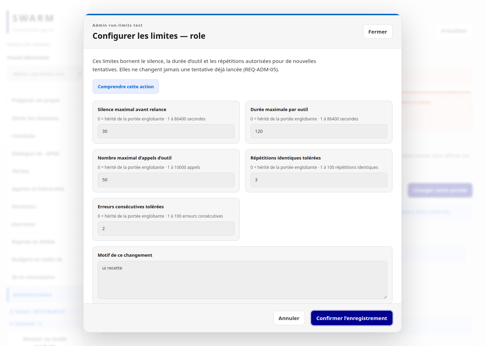

*Capture réelle d’une recette locale isolée : formulaire rempli avant confirmation, pas preuve d’enregistrement ni de lancement.*

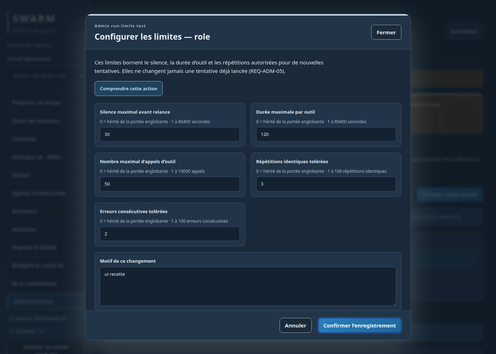

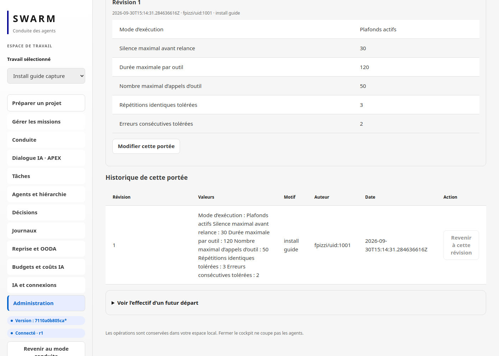

*Capture réelle, racine temporaire isolée, 30 septembre 2026 : après confirmation, la révision 1 est lue par le CLI (`run-limits show`) et apparaît dans l’historique. C’est une configuration enregistrée, pas un lancement. Le badge de version du serveur est visible dans la colonne de gauche.*

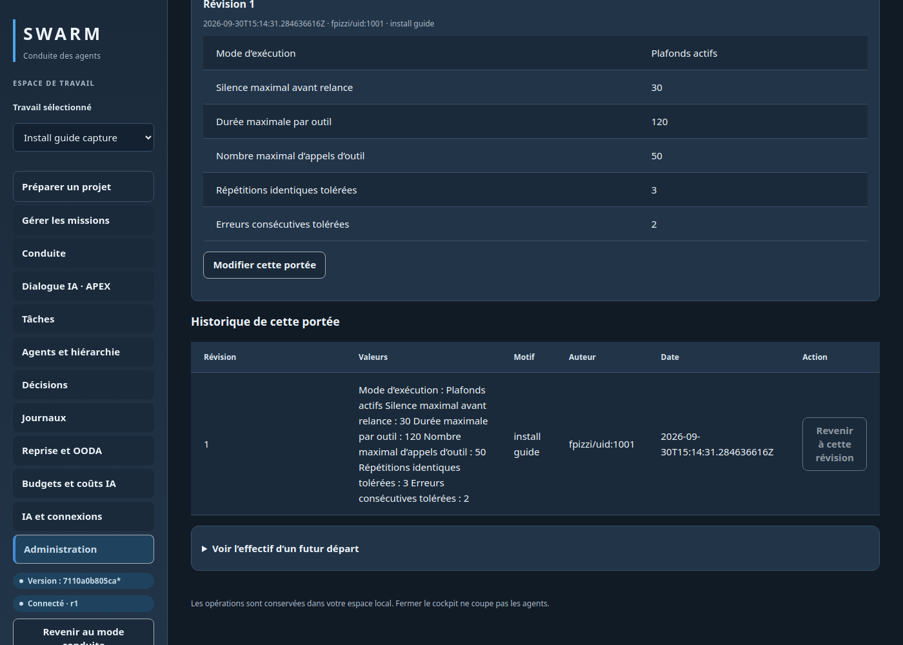

Le **mode observation**, lorsqu’il est explicitement autorisé pour une mission, conserve les compteurs mais retire les coupures d’exécution couvertes par ce mode. Il ne supprime ni les quotas du fournisseur, ni la revue, ni les conditions d’acceptation. Il n’est pas un moyen de contourner une erreur fournisseur 429. La rubrique **Budgets et coûts IA** distingue les coûts rapportés des coûts inconnus ; un coût inconnu ne vaut pas zéro.

### Retrouver les mêmes réglages dans le CLI

Exemples de lecture seule, à adapter à votre dossier et aux identifiants affichés par Swarm :

```sh
swarm --root /chemin/du/projet run-limits show project - -
swarm --root /chemin/du/projet run-limits history project - -
swarm --root /chemin/du/projet run-limits effective ID_MISSION worker ID_TACHE
```

Le tiret représente une valeur vide. Les commandes `apply` et `rollback` utilisent un fichier JSON, une révision attendue et un identifiant d’événement ; voir le [guide d’utilisation](GUIDE-UTILISATEUR.md) pour le parcours général. Le CLI et le web appliquent les mêmes règles du moteur.

## Version du serveur et liens vers une mission supprimée

Contrôlez d’abord le binaire, sans initialiser de projet ni ouvrir SQLite :

```sh
swarm version
swarm --version
swarm --json version
```

Les deux commandes texte sont des alias. Le JSON stable place l’identité sous
`binary` : `version`, SHA complet `commit`, état `modified`, `build_date` UTC et
`provenance`. `devel` est la valeur honnête en l’absence de tag de release vérifié ;
`unknown` en texte et `null` en JSON signalent une donnée indisponible. Ils ne
doivent pas être remplacés par une release supposée.

`make build`, `./install.sh --mode native` et le Dockerfile appellent tous
`build.sh`. Pour contrôler chaque chemin après construction :

```sh
make build
./bin/swarm --json version

./install.sh --mode native --bin-dir "$HOME/.local/bin"
"$HOME/.local/bin/swarm" --json version

./install.sh --project "$HOME/projets/mon-projet" --no-start
docker compose --env-file deploy/install.env run --rm --no-deps swarm --json version
```

Une release explicite exige une version SemVer, un SHA de 40 caractères, un état
modifié connu et une date UTC ; `SOURCE_DATE_EPOCH` permet un build reproductible.
Le build Docker accepte les arguments `SWARM_VERSION`, `SWARM_COMMIT`,
`SWARM_MODIFIED` et `SWARM_BUILD_DATE`. N’annoncez pas une release avant que son
tag et ses métadonnées aient été contrôlés.

Le bouton **Version et nouveautés** existe dans le cockpit et la préparation. La
fenêtre distingue le **binaire lancé** des **sources locales** : un `*` sur le
résumé décrit le binaire modifié au build, tandis que l’état sale du checkout est
une donnée source séparée. La comparaison ne fait aucune requête réseau. La liste
embarquée est actuellement vide faute de release déclarée et l’interface le dit
explicitement ; le lien GitHub donne accès à l’historique complet des commits.
Échap ferme la fenêtre et rend le focus au bouton.

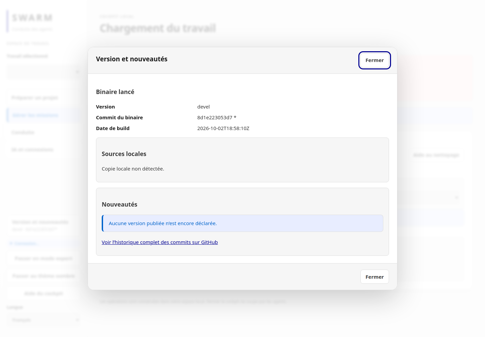

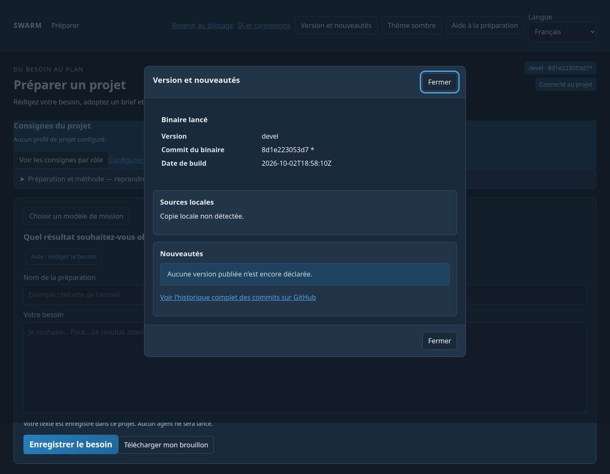

Les [empreintes des dix captures](docs/screenshots/version-history/manifest.json)
couvrent cockpit/préparation, FR/EN, État/sombre, chargement et indisponibilité.
Ce sont des captures d’un parcours local isolé, pas la preuve d’une mission réelle.

Après `make build`, une installation ou une reconstruction Docker, redémarrez le
serveur/conteneur et relisez `version`. Un `git pull` ou une compilation ne change
pas le binaire d’un processus déjà lancé.

Un lien vers une mission supprimée affiche un message clair et l’action **Choisir
une mission**, qui ouvre la gestion des missions.

## Lire le récapitulatif et partager un diagnostic

Avant autorisation, le récapitulatif montre le responsable, les exécutants, le vérificateur et leurs modèles résolus. Les plafonds du plan et des rôles de planification/revue sont affichés séparément des réglages d’exécution de l’Administration. Les prérequis manquants expliquent ce qu’il faut compléter.

**Vérifier avant le lancement** ne démarre aucun agent. Après le contrôle, **Voir le détail des vérifications** ouvre les informations techniques ; Échap ou **Fermer les détails** revient au formulaire. Seule l’autorisation suivante permet les départs éligibles.

Dans le diagnostic d’une tentative arrêtée, **Copier le diagnostic** prépare une synthèse avec la cause, l’identifiant de tentative, la version et l’action disponible. Les traces techniques et le lien de session sont exclus du texte préparé. Si le navigateur refuse le presse-papiers, un message le signale : sélectionnez alors le texte affiché. Relisez toujours ce que vous partagez.

### Si une tâche ne progresse pas

| Situation visible | Prochaine action |
| --- | --- |
| Fournisseur indisponible ou quota 429 | Attendre l’échéance annoncée ou configurer un autre fournisseur autorisé ; une hausse des limites Swarm ne restaure pas le quota. |
| Rapport présent mais tâche non validée | Examiner les critères, contrôles et avis ; la présence d’un fichier ne vaut pas acceptation. |
| Conditions modifiées après vérification | Refaire la vérification sur les nouveaux paramètres avant autorisation. |
| Agent actif sans résultat final | Ouvrir sa session et consulter son activité ; ne pas confondre activité, résultat et validation. |

Les captures d’Administration proviennent de `tests/run_limits_admin_ui.cjs` ; celles du récapitulatif et du diagnostic sont reproductibles avec `tools/verification/t7_prelaunch.py`. Elles démontrent des parcours locaux contrôlés, pas la réussite autonome d’un fournisseur réel.


### Captures du récapitulatif et du diagnostic

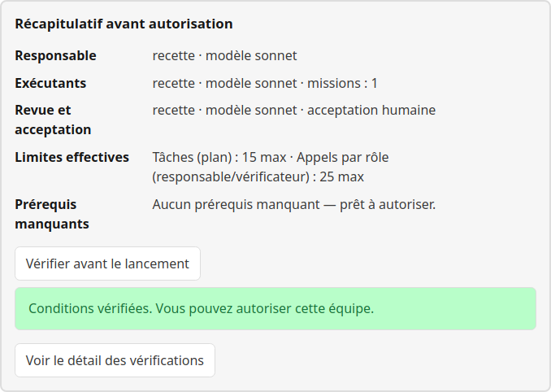

*Recette locale isolée : fournisseur de test, conditions vérifiées. Aucun agent n’a été lancé par cette vérification.*

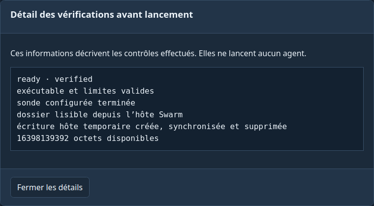

*Informations techniques à ouvrir au besoin ; la fermeture revient au récapitulatif.*

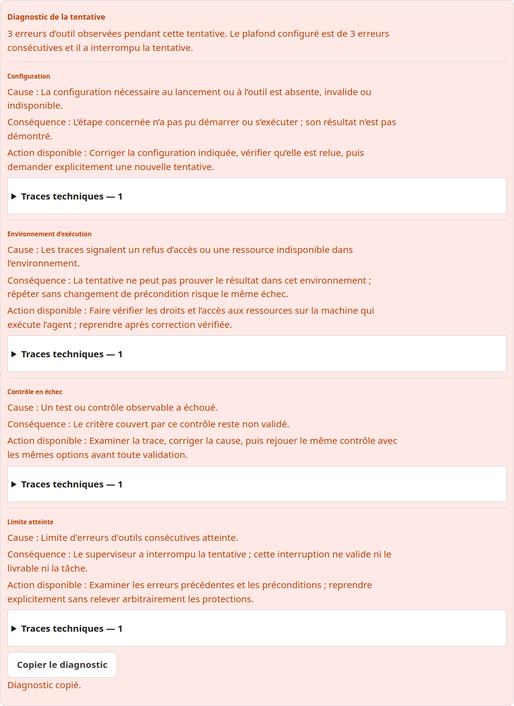

*Erreurs provoquées par la recette pour démontrer le diagnostic. Le message « Diagnostic copié » provient d’un presse-papiers simulé dans ce test, pas d’un essai de partage externe.*

## Erreurs rencontrées et résolution

Observations réelles du 29 septembre 2026 (mission Administration pilotée depuis les écrans). Détail : [RETEX](docs/RETEX-ADMIN-PREPARATION.md).

| Erreur ou friction | Résolution |
| --- | --- |
| L’autorisation de l’équipe ne démarre pas les agents | Cliquez ensuite **Lancer la mission** dans le pilotage ; vérifiez qu’une tentative est active. |
| La validation automatique refuse le plan | Elle exige une commande de contrôle par critère, y compris documentaire : ajoutez de vraies commandes ou choisissez la revue humaine. Aucun contrôle factice. |
| Une tâche déclare des exigences « non définies » | Le contexte transmis était incomplet : révisez le plan pour inclure les définitions, puis reprenez. Les tentatives consommées restent comptées. |
| Revue indépendante interrompue (citation introuvable) | Ce n’est pas une validation. Relancer la revue depuis le cockpit sur le même rapport ; ne pas forcer l’acceptation. |
| Responsable sans réponse finale après son délai | Consulter l’activité de la session ; la reprise n’augmente pas silencieusement les limites. |
| Le bouton « Soumettre le rapport » bloquait la revue | Défaut du moteur corrigé ; la réparation passe par le même bouton, sans modifier la base à la main. |

Ne modifiez jamais directement `.swarm/state.db` pour contourner une erreur.

## Choisir une méthode après installation

Dans **Préparer avec l’IA**, choisissez une méthode avec son nom d’usage :

- **Analyse et planification** : clarifier le besoin et proposer un plan.
- **Parcours guidé — préparer une évolution** : cadrer le changement, ses critères et ses tâches.
- **Examiner et améliorer — préparer l’examen** : définir les risques et les contrôles.
- **Diagnostiquer et corriger un problème** : préparer le diagnostic à partir des faits connus.

La préparation ne réalise aucune correction et ne lance aucun agent. Les méthodes
**Construire la spécification** et **Examiner la spécification** couvrent la
rédaction du besoin et la recherche des omissions dans les sessions natives ;
elles ne sont pas deux boutons supplémentaires de ce menu.

Vérifiez le catalogue de votre projet depuis le même emplacement qu’au lancement :

```sh
swarm --root /chemin/du/projet --json prepare methods
```

Chaque méthode expose sa disponibilité. Le binaire contient le cadrage des rôles
pour l’exécution ; les méthodes de **préparation** sont lues dans le projet piloté.
En Docker, cette racine est `/workspace`. Ne confondez pas un fournisseur installé,
une méthode disponible et un plan autorisé. Voir le [catalogue des méthodes](docs/AGENT-METHODS.md).

## Reconnaître le résultat après le lancement

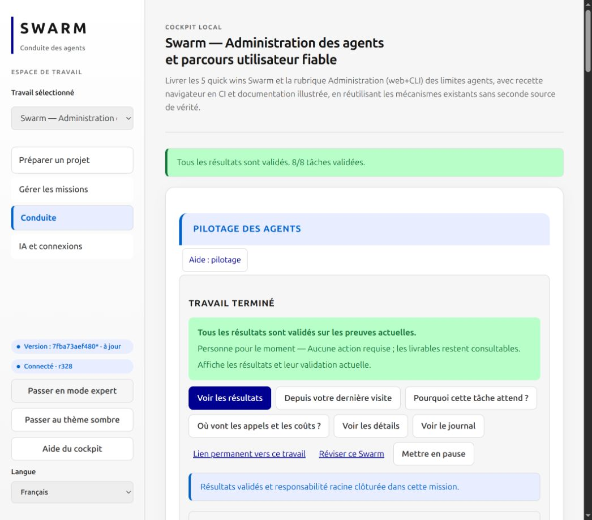

*Capture du 1er octobre 2026, après clôture de la mission Administration avec
interventions humaines. Elle complète la capture historique de lancement du
29 septembre ; elle ne constitue pas une nouvelle recette Docker.*

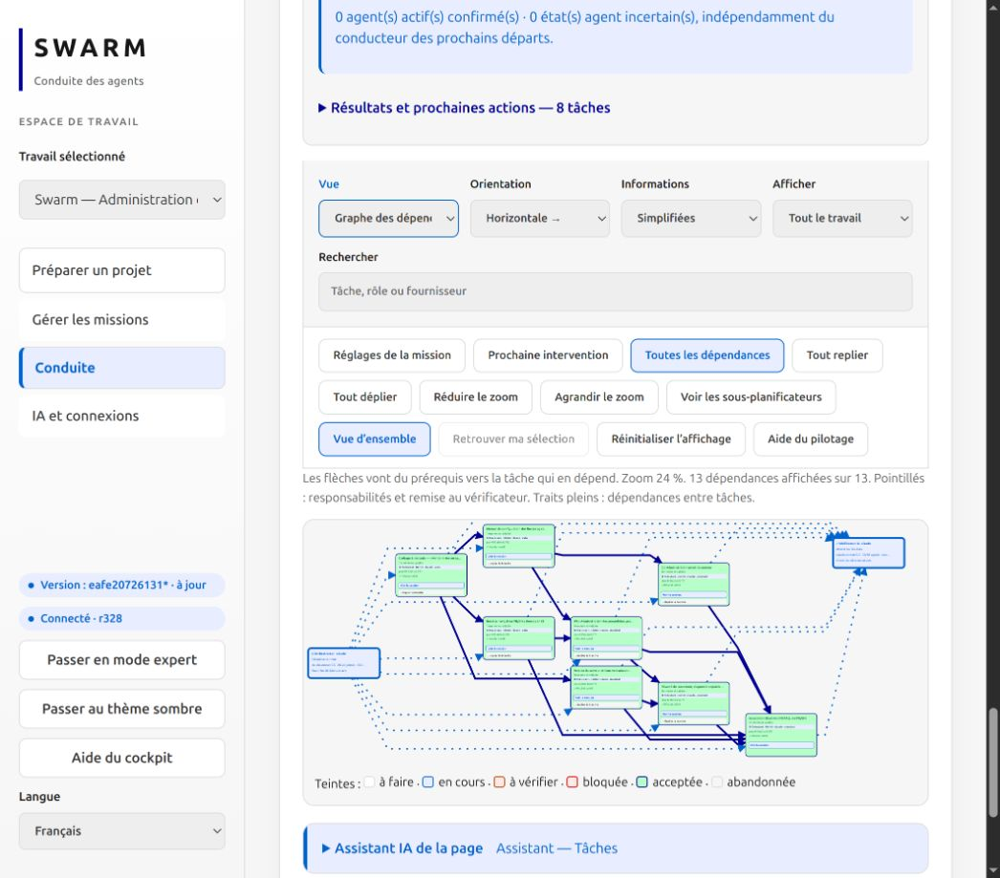

*Orchestrateur à gauche, tâches au centre et vérificateur à droite. Les traits
pleins représentent les dépendances ; les pointillés représentent les
responsabilités et les remises au vérificateur. La vue d’ensemble réduit le zoom.*

Les captures des formulaires d’Administration datées du 30 septembre restent des
recettes isolées : elles prouvent les états indiqués dans leurs légendes. Les
nouvelles captures de clôture montrent une autre étape du même parcours ; elles
ne transforment pas ces tests isolés en preuve de succès de tous les fournisseurs.

Pour une reprise ou un conflit de révision, consultez les [conditions du moteur](docs/ENGINE-RECOVERY.md).

## Consignes du projet cible

Après installation, configurez les règles transmises aux agents depuis la racine du projet cible : [profil par rôle](docs/PROJECT-PROFILE.md). Cette configuration ne lance aucune mission.

## Cache Go des agents — correctif en cours de livraison

Un agent peut lire le cache Go global sans pouvoir y écrire dans son bac à sable.
Une erreur `read-only file system` visant ce cache ne signifie donc pas que le
code ou un test a échoué : la compilation peut ne pas avoir commencé.

Le moteur corrigé prépare un cache réutilisable dans
`<espace-de-travail>/.swarm/cache/go-build`, vérifie son écriture avant de lancer
l'exécutant et transmet `GOCACHE` au fournisseur. Pour Codex, il transmet aussi
ce réglage explicitement à l'environnement des commandes. Le journal de l'agent
indique le chemin effectivement préparé. Cela couvre l'exécution, le terminal
et le dialogue ; les planificateurs et vérificateurs ne reçoivent pas ce réglage.

Le cache global reste intact. Les répertoires redirigés par un lien symbolique
ou remplacés par un fichier sont refusés. Le cache local est conservé entre les
tentatives : il faut prévoir de l'espace disque, sans purge automatique.

Ce correctif ne donne aucun droit supplémentaire au bac à sable et ne résout
pas un refus de socket, de réseau ou d'accès au démon Docker. Après mise à jour,
redémarrez le serveur Swarm puis vérifiez le journal d'une nouvelle tentative
et `go env GOCACHE` dans son environnement. Un `git pull` ou une compilation
seuls ne mettent pas à jour un serveur déjà lancé.

Au 2 octobre 2026, la suite Go complète et les tests ciblés avec détection des
courses passent sur la copie du correctif. Le serveur de la mission utilise maintenant ce correctif. Un agent Codex réel
a confirmé le chemin via `go env GOCACHE` et compilé le candidat sans réglage
manuellement ajouté. Le correctif n’est pas encore publié.

### Captures du candidat D02

La recette fraîche du 6 octobre lie le candidat produit aux captures [graphe clair](docs/screenshots/graph-delivery-d02/fr-etat-graph.png), [graphe sombre](docs/screenshots/graph-delivery-d02/fr-sombre-graph.png), [programmes clairs](docs/screenshots/graph-delivery-d02/fr-etat-programs.png) et [programmes sombres](docs/screenshots/graph-delivery-d02/fr-sombre-programs.png). Il s’agit de parcours isolés sans fournisseur réel, après contrôle de migration et de rollback. Voir le [dossier D02](docs/D02-dossier.md#captures-d02-fraîches--6-octobre-2026).
