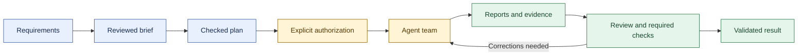

# Swarm

### Give an AI team an objective. See who does what. Verify what it delivers.

[Français](README.md) · [User guide](docs/en/USER-GUIDE.md) · [Installation](docs/en/INSTALL.md)

Swarm is a local cockpit and CLI for organizing software work across AI agents.
It makes responsibilities, dependencies, attempts, evidence and blockers visible,
so that several agents can collaborate without treating every completed process
as a successful result.

## What it does

- Prepare requirements with AI, approve a brief and review a structured plan.
- Assign a planner, workers and an independent report reviewer.
- Follow dependencies in a graph with arrows, branch folding and horizontal or
  vertical layouts; switch to a detailed agent list when useful.
- Inspect agent sessions, received messages, tool activity and reported usage.
- Chain authorized tasks while enforcing dependencies, workspace reservations,
  budgets and validation policies.
- Revise missions with a comparison and history rather than overwriting ongoing work.
- Archive, restore, purge old logs or move mission data to recoverable trash.

## From requirements to results



## Responsibilities

The **planner** organizes work and handles agent handoffs. A **branch planner**
can own a delegated scope. **Workers** implement tasks and provide deliverables.
An **independent AI reviewer** examines reports in a separate session. Its opinion
does not replace required deterministic checks or chosen human acceptance.

This organization draws on the planning/worker separation discussed in
[Cursor's self-driving codebases research](https://cursor.com/blog/self-driving-codebases).
Swarm's independent reviewer is an additional design choice, not a claim that it
reproduces every part of Cursor's final architecture.

## See the interface

These screenshots use simulated demonstration data, with no real agents running.
They illustrate the French interface; choose English from the language selector.


## Install

Linux with local Docker Engine and Compose v2:

```sh
git clone https://github.com/mo0ogly/swarm.git
cd swarm
mkdir -p "$HOME/projects/my-project"
./install.sh --project "$HOME/projects/my-project"
```

Open the session link printed by the installer. Select **English** in the cockpit.
For native installation, configuration, authentication and remote access, see
[Install Swarm](docs/en/INSTALL.md).

**Swarm does not bundle agent programs or model weights.** Install and authenticate
Claude Code, Codex, Skynet or your chosen compatible agent separately. A text API
connection can plan and review; it cannot by itself edit project files.

## CLI

Web and CLI share project state when they use the same `--root`.

```sh
swarm --lang en --root /path/to/project work list
swarm --lang en --root /path/to/project mission status WORK_ID
swarm --lang en help management
```

`SWARM_LANG=en` sets the CLI default. JSON keys, commands and stored user content
retain their original identifiers and language. French remains available.

## Limits that matter

A finished agent is not necessarily a validated task. Workspace reservations may
serialize tasks even with several available slots. Standard preparation does not
automatically create parallel Git copies. Unreported cost remains unknown.
Closing the cockpit does not stop agents. An installed binary and simulated-agent
tests do not qualify a real provider's authentication, permissions or results.

Data is local under the controlled project's `.swarm/`. Keep this directory,
authentication and session links private. APEX, KS and PDCA require their method
resources in the controlled project; not all are distributed in this repository.

## Documentation and development

- [English user guide](docs/en/USER-GUIDE.md)
- [English installation guide](docs/en/INSTALL.md)
- [English interface validation](docs/en/I18N-VALIDATION.md)
- [Technical reference](docs/en/REFERENCE.md)
- [Preparation and revision contracts](docs/en/PREPARATION-UX.md)

```sh
make build test smoke
make frontend
make test-install
make test-process
```

## License

Swarm uses [PolyForm Noncommercial 1.0.0](LICENSE). Source is available for
noncommercial use under that license; commercial use requires separate permission.
This is **not an OSI-approved open-source license**. Previous Apache-licensed
versions and third-party components retain their respective rights and notices:
see [licensing details](docs/LICENSING.md) and [third-party notices](THIRD_PARTY_NOTICES.md).
