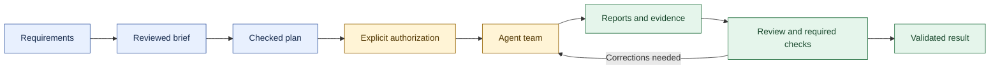

# Swarm

### Give an AI team an objective. See who does what. Verify what it delivers.

[Français](README.md) · [User guide](docs/en/USER-GUIDE.md) · [Installation](docs/en/INSTALL.md)

Swarm is a local cockpit and CLI for organizing software work across AI agents.
It makes responsibilities, dependencies, attempts, evidence and blockers visible,
so that several agents can collaborate without treating every completed process
as a successful result.

## First run

1. Follow [installation](docs/en/INSTALL.md) and open the session link printed by the server.
2. Open **AI and connections** to configure providers available in your environment.
3. Prepare your objective, constraints and acceptance criteria; review the proposed plan.
4. Check roles, workspaces and limits before authorizing and launching the mission.
5. Follow tasks and examine their evidence. A finished process is not yet a validated result.

See the [illustrated user guide](docs/en/USER-GUIDE.md). Swarm is experimental; read the [qualification evidence and limitations](docs/COMMUNITY-QUALIFICATION.md).

Start with **Choose a mission template** in preparation: [Guided workflow catalogue shared by web and CLI](docs/en/PREPARATION-TEMPLATES.md).

## What it does

- Prepare requirements with AI, approve a brief and review a structured plan.
- Assign a planner, workers and an independent report reviewer.
- Follow dependencies in a graph with arrows, branch folding and horizontal or
  vertical layouts; switch to a detailed agent list when useful.
- Inspect agent sessions, received messages, tool activity and reported usage.
- Chain authorized tasks while enforcing dependencies, workspace reservations,
  budgets and validation policies.
- Revise missions with a comparison and history rather than overwriting ongoing work.
- Archive, restore, purge old logs or move mission data to recoverable trash.

## From requirements to results


```mermaid
flowchart LR
  A[Requirements] --> B[Reviewed brief]
  B --> C[Checked plan]
  C --> D[Explicit authorization]
  D --> E[Agent team]
  E --> F[Reports and evidence]
  F --> G[Review and required checks]
  G --> H[Validated result]
  G -->|Corrections needed| E
  classDef prepare fill:#e8f0fe,stroke:#3457a0,color:#172b4d
  classDef execute fill:#fff4d6,stroke:#946200,color:#503600
  classDef verify fill:#e5f5eb,stroke:#267243,color:#17472b
  class A,B,C prepare
  class D,E execute
  class F,G,H verify
```

## Responsibilities

The **planner** organizes work and handles agent handoffs. A **branch planner**
can own a delegated scope. **Workers** implement tasks and provide deliverables.
An **independent AI reviewer** examines reports in a separate session. Its opinion
does not replace required deterministic checks or chosen human acceptance.

This organization draws on the planning/worker separation discussed in
[Cursor's self-driving codebases research](https://cursor.com/blog/self-driving-codebases).
Swarm's independent reviewer is an additional design choice, not a claim that it
reproduces every part of Cursor's final architecture.

## See the interface

Actual application captures from **October 1, 2026**, showing an eight-task mission closed with human decisions. This is not evidence of unattended autonomy. User-authored task names retain their original French language.

### Understand the current state

The summary states what is happening, who acts and what comes next. All eight results here are validated against current evidence, with deliverables and reviews still accessible.


### See the team and dependencies

The orchestrator is on the left, workers in the middle and the independent reviewer on the right. **Solid arrows** connect prerequisites to dependent tasks; **dotted arrows** show responsibilities and reviewer handoffs.


[Open the graph at full size](docs/screenshots/en/mission-graph-current-en.png)

Horizontal and vertical layouts, detail levels, filters and branch folding change the view without removing tasks. “Why is this task waiting?” explains prerequisites; “Where do calls and costs go?” separates observed consumption.

Preparation turns needs into criteria, tasks and dependencies. Adopting a plan does not launch agents: check roles, connections, workspaces and limits before authorizing execution. See the [illustrated user guide](docs/en/USER-GUIDE.md) and [installation screenshots](docs/en/INSTALL.md).

## Install

Linux with local Docker Engine and Compose v2:

```sh
git clone https://github.com/mo0ogly/swarm.git
cd swarm
mkdir -p "$HOME/projects/my-project"
./install.sh --project "$HOME/projects/my-project"
```

Open the session link printed by the installer. Select **English** in the cockpit.
For native installation, configuration, authentication and remote access, see
[Install Swarm](docs/en/INSTALL.md).

**Swarm does not bundle agent programs or model weights.** Install and authenticate
Claude Code, Codex, Skynet or your chosen compatible agent separately. A text API
connection can plan and review; it cannot by itself edit project files.

## CLI

Web and CLI share project state when they use the same `--root`.

```sh
swarm --lang en --root /path/to/project work list
swarm --lang en --root /path/to/project mission status WORK_ID
swarm --lang en help management
```

`SWARM_LANG=en` sets the CLI default. JSON keys, commands and stored user content
retain their original identifiers and language. French remains available.

## Limits that matter

A finished agent is not necessarily a validated task. Workspace reservations may
serialize tasks even with several available slots. Standard preparation does not
automatically create parallel Git copies. Unreported cost remains unknown.
Closing the cockpit does not stop agents. An installed binary and simulated-agent
tests do not qualify a real provider's authentication, permissions or results.

Data is local under the controlled project's `.swarm/`. Keep this directory,
authentication and session links private. This repository supplies nine
[working methods](docs/en/AGENT-METHODS.md), including planning, system examination and improvement,
debugging, review and lessons learned. When controlling another project, check
which method resources are available in that project.

## Documentation and development

- [English user guide](docs/en/USER-GUIDE.md)
- [English installation guide](docs/en/INSTALL.md)
- [Authorize recovery and supply candidate sources to the reviewer](docs/en/ATTEMPT-RECOVERY.md)
- [Storage diagnosis and exhausted attempts](docs/en/RUNTIME-RECOVERY.md)
- [Methods: requirements, specifications, planning, audit, diagnosis and verification](docs/en/AGENT-METHODS.md)
- [Agent reports, evidence delivery and linked decisions](docs/en/AGENT-COMMUNICATION.md)
- [English interface validation](docs/en/I18N-VALIDATION.md)
- [Technical reference](docs/en/REFERENCE.md)
- [Preparation and revision contracts](docs/en/PREPARATION-UX.md)

```sh
make build test smoke
make frontend
make test-install
make test-process
```

## License

Swarm uses [PolyForm Noncommercial 1.0.0](LICENSE). Source is available for
noncommercial use under that license; commercial use requires separate permission.
This is **not an OSI-approved open-source license**. Previous Apache-licensed
versions and third-party components retain their respective rights and notices:
see [licensing details](docs/LICENSING.md) and [third-party notices](THIRD_PARTY_NOTICES.md).

## Contributing and reporting issues

See [CONTRIBUTING.md](CONTRIBUTING.md) for checks and pull requests, and
[SECURITY.md](SECURITY.md) for sensitive reports.

### Recognize a closed mission

The cockpit distinguishes a finished agent from a validated result. A closed
mission reports every result validated against current evidence and a closed
root responsibility. Deliverables, reviews and costs remain accessible.


*Actual 8/8 recipe with human interventions. The user-authored title remains in French. See the [user guide](docs/en/USER-GUIDE.md#read-counters-and-recognize-completion) and [engine recovery](docs/en/ENGINE-RECOVERY.md).*

## Working methods

Methods provide a shared approach with criteria and evidence; executable engine rules remain authoritative.

| Need | Method |
| --- | --- |
| Turn a need into a verified change | Guided change workflow |
| Examine a system and address authorized findings | Examine and improve |
| Define expected outcomes and acceptance criteria | Build the specification |
| Find omissions and contradictions before execution | Examine the specification |
| Find actionable implementation defects | Review the code |
| Reproduce a problem and identify its cause | Diagnose and fix |
| Recheck the affected flow after a correction | Verify the fix |
| Recover a blocked plan while retaining history | Replan |
| Explain outcomes and prioritize improvements | Lessons learned |

The specification methods cover both requirements writing and plan examination. See the [method guide](docs/en/AGENT-METHODS.md) for actual preparation choices and native-session commands; not every method is a web button.
