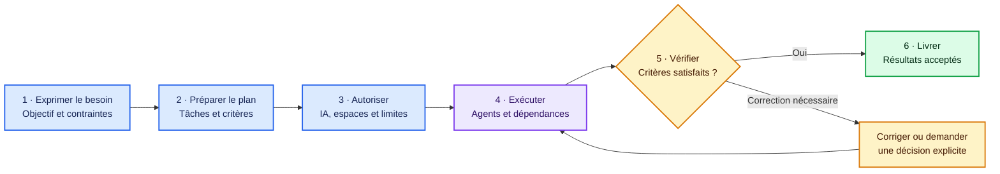
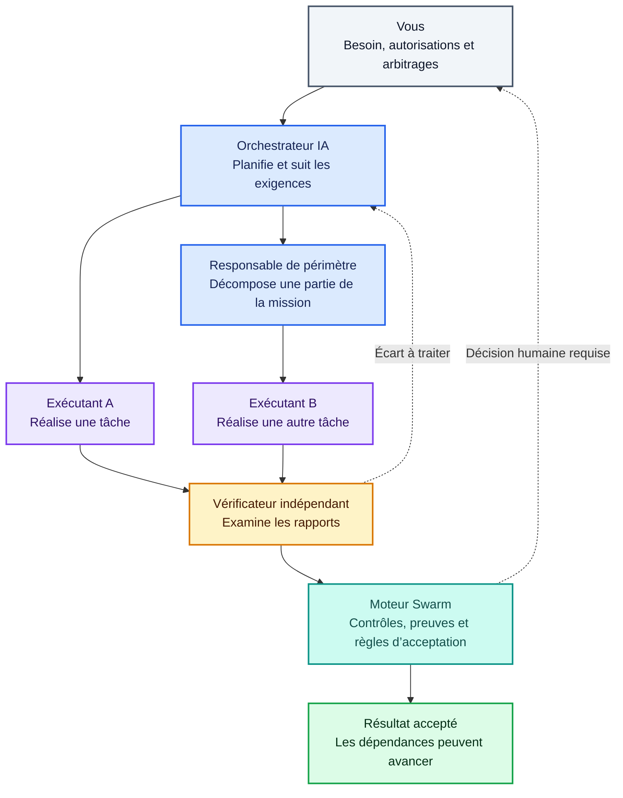
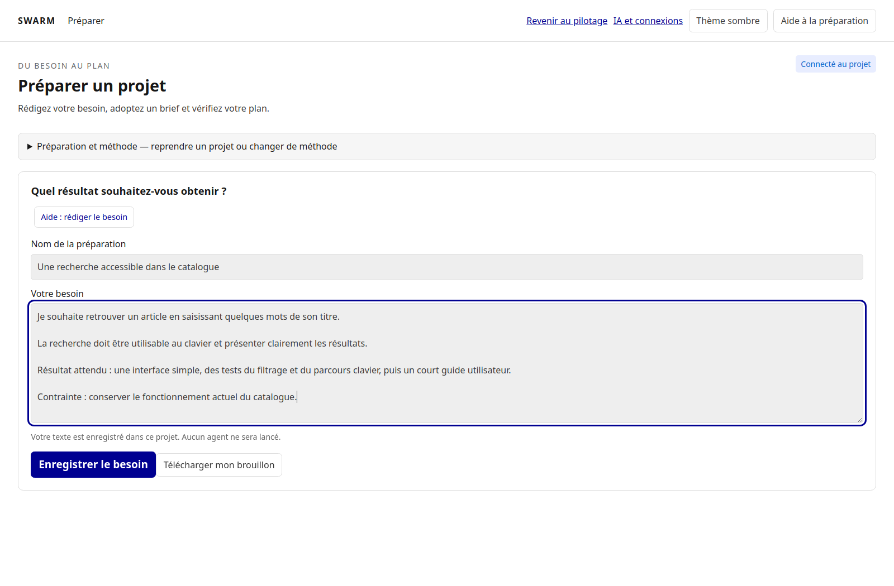
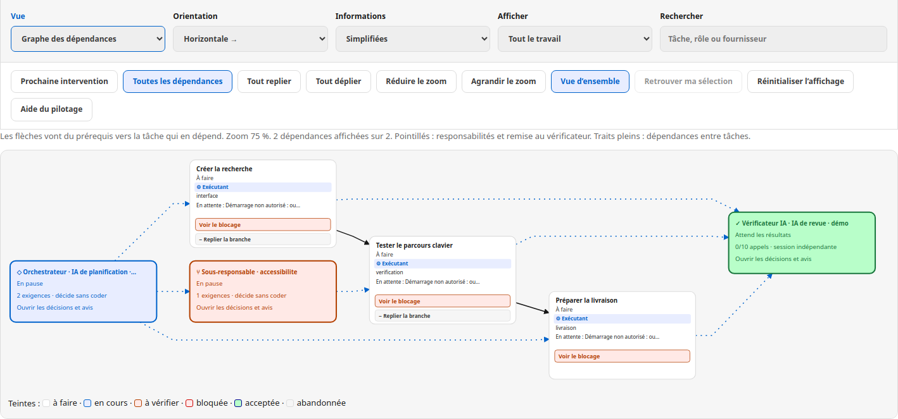
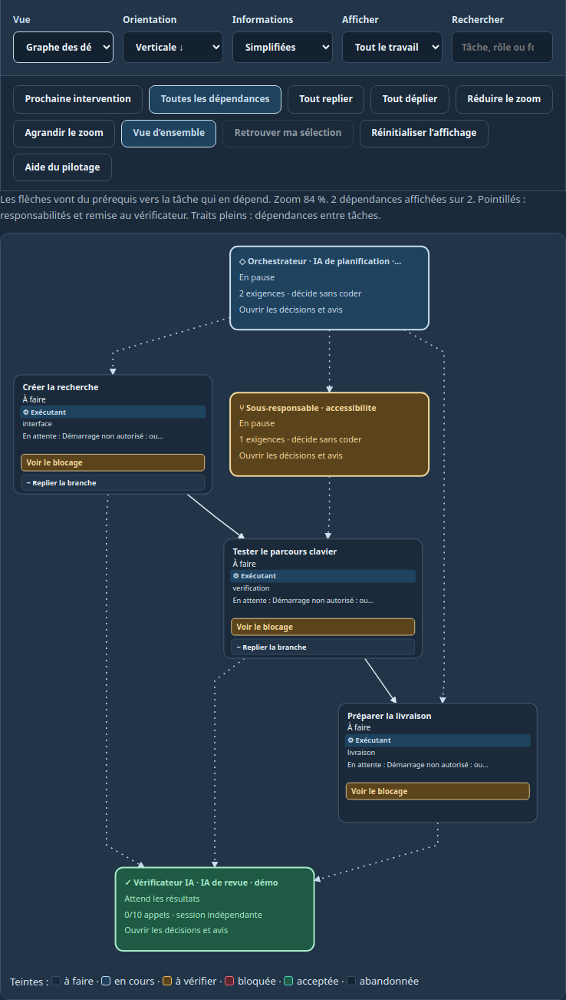
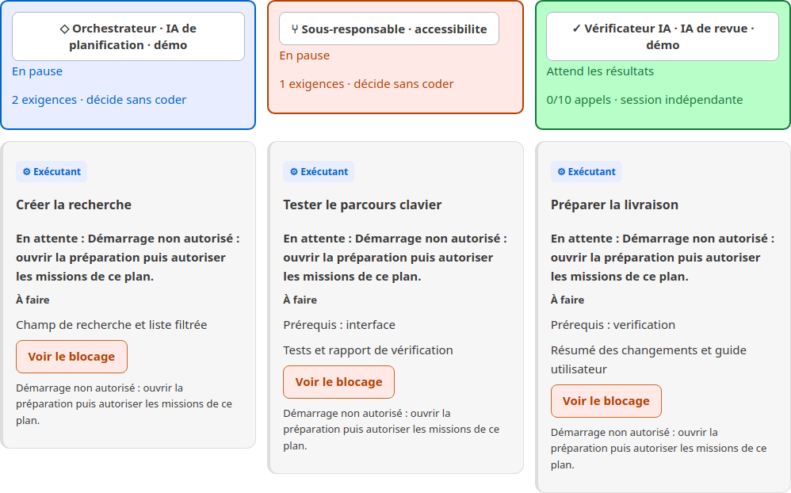
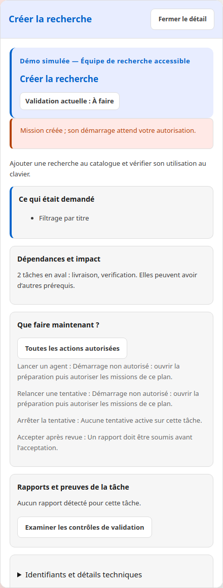
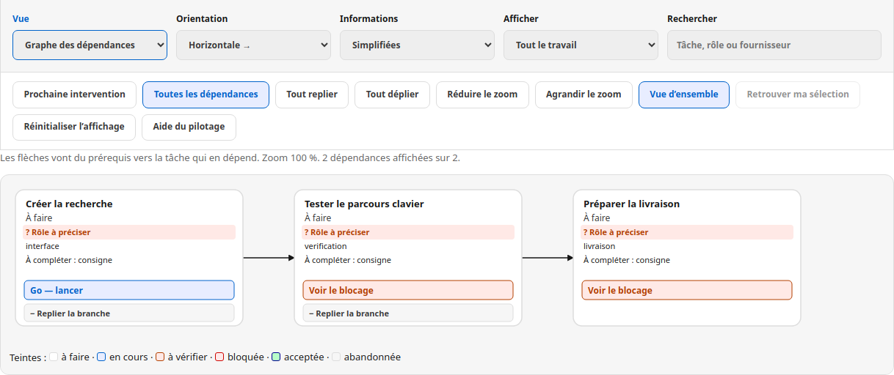
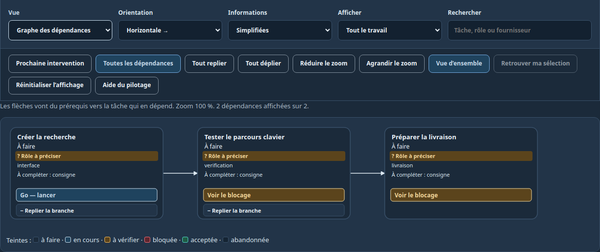
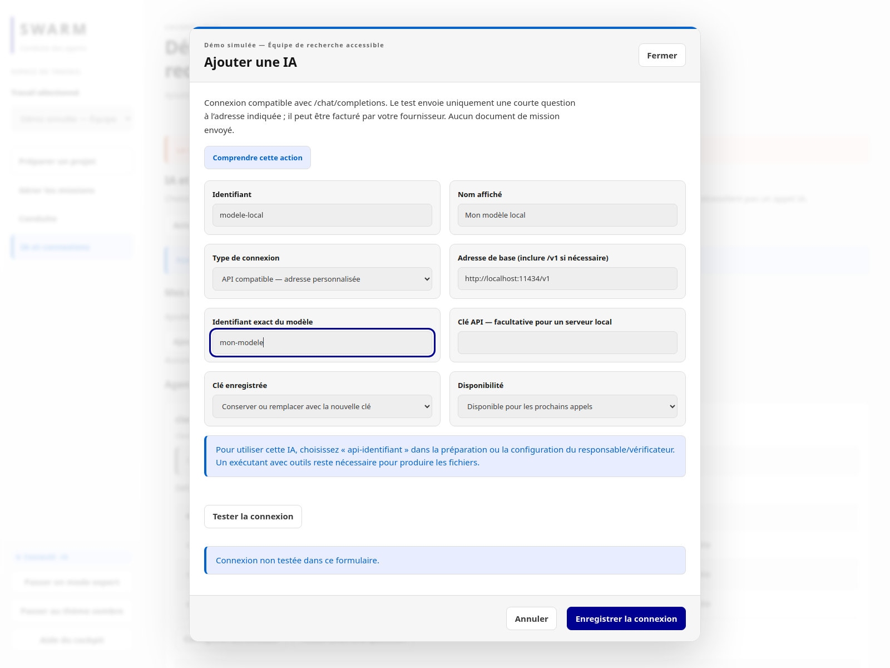

# Swarm

[English](README.en.md) · Français

### Donner un objectif à une équipe d’agents IA. Comprendre qui fait quoi. Vérifier ce qui est livré.

Swarm est un outil local de coordination d’agents de développement, avec une **interface web en français** et une **interface en ligne de commande**. Il relie la préparation du besoin, la répartition des tâches, l’exécution et l’examen des résultats dans une mission persistante.

**Pourquoi Swarm ?** Quand plusieurs agents travaillent sur un projet, quelqu’un doit encore transmettre les consignes, gérer les dépendances, retrouver les rapports et décider si le résultat est réellement utilisable. Swarm organise ces passages de relais pour réduire cette coordination manuelle et rendre les blocages visibles.

[Commencer](#démarrer-en-local) · [Captures](#voir-le-parcours) · [Organisation des agents](#qui-fait-quoi) · [Documentation](#documentation) · [Licence](#licence)

## Ce que vous pouvez faire

| Votre besoin | Ce que propose Swarm | Pourquoi c’est utile |
| --- | --- | --- |
| Transformer une idée en travail réalisable | Rédiger le besoin, dialoguer avec une IA, adopter un brief et vérifier un plan | Définir le résultat attendu avant de lancer les agents |
| Répartir une mission | Responsables de périmètre, tâches et dépendances explicites | Savoir qui porte chaque partie du travail |
| Faire avancer plusieurs tâches | Départs autorisés, suivi des espaces de travail et reprise des tâches devenues prêtes | Éviter de relancer chaque étape à la main |
| Comprendre ce qui se passe | Graphe avec flèches, rôles, états, journal de l’agent et rapports | Retrouver l’action en cours et la cause d’un arrêt |
| Contrôler la livraison | Revue indépendante, contrôles configurés et suivi de la fraîcheur des preuves | Distinguer un agent qui a fini d’un résultat réellement accepté |
| Reprendre plus tard | État local persistant, historique et commandes CLI | Conserver le contexte entre deux sessions |
| Choisir ses IA | Fournisseurs d’agents installés et connexions à des modèles API compatibles | Affecter des capacités adaptées à la préparation, à l’exécution et à la revue |

## Du besoin au résultat

Exemple : **« Ajouter une recherche au catalogue, utilisable au clavier. »** Vous précisez les attentes, vérifiez le plan et autorisez l’exécution. Les agents réalisent les tâches ; les étapes dépendantes attendent leurs prérequis. Les résultats sont examinés avant que la mission puisse être considérée comme terminée.



L’enchaînement dépend des autorisations, des prérequis et des preuves disponibles. Une correction n’est pas une boucle infinie : les limites configurées peuvent arrêter la tentative et demander une intervention.

## Qui fait quoi

**Un Swarm organisé ne se résume pas à plusieurs exécutants.** La planification, la réalisation et la vérification sont des responsabilités distinctes.



Ce schéma décrit l’organisation disponible avec planification hiérarchique et revue indépendante configurées. Les missions historiques ou manuelles ne possèdent pas nécessairement tous ces rôles.

- **L’orchestrateur** conserve l’objectif et organise le travail. Des responsables peuvent prendre en charge des sous-périmètres.
- **Les exécutants** utilisent les outils de leur fournisseur pour travailler dans les espaces autorisés.
- **Le vérificateur indépendant** examine les rapports dans une session distincte, sans outils de modification. Son avis ne constitue pas, à lui seul, une preuve que des tests ont été exécutés.
- **Le moteur local** applique les règles de départ, les dépendances, les limites et les conditions d’acceptation configurées. Il est distinct de l’orchestrateur IA.
- **Vous** fixez les limites et intervenez lorsque l’autorisation ou les éléments disponibles ne permettent pas de continuer.

## Voir le parcours

Captures de l’application réelle, avec **données fictives de démonstration**. Elles illustrent l’interface ; aucun agent n’a été lancé pour ces captures.

### 1. Décrire le résultat attendu

Commencez avec vos mots : le besoin, les contraintes et les critères de réussite. La préparation sert à clarifier ce qui sera demandé aux agents.



### 2. Visualiser l’équipe et ses flèches

Cette seconde démonstration utilise une **organisation simulée en pause** : un orchestrateur, un sous-responsable, trois tâches d’exécutants et un vérificateur indépendant. Aucun fournisseur n’est lancé, aucun résultat n’est présenté comme validé.

- **Bleu : orchestrateur**, chargé de coordonner la mission.
- **Orange : sous-responsable**, chargé ici du périmètre accessibilité.
- **Cartes de tâches : exécutants**, chargés de produire les livrables.
- **Vert : vérificateur indépendant**, chargé d’examiner les rapports.
- **Flèches pleines : dépendances entre tâches.**
- **Flèches pointillées : responsabilités et remise au vérificateur.**



[Ouvrir le graphe horizontal en grand](docs/screenshots/agents-horizontal.png)

#### La même organisation en vue verticale

L’orientation peut être adaptée à la forme du plan. Le thème sombre conserve les couleurs des rôles et les deux types de flèches.



[Ouvrir le graphe vertical en grand](docs/screenshots/agents-vertical.png)

#### Retrouver les rôles et les livrables en liste

La vue liste complète le graphe : elle expose les responsabilités, les tâches et leurs livrables sans suivre chaque flèche. Dans cet exemple, les tâches attendent leur autorisation de démarrage.



#### Examiner une tâche sans quitter le pilotage

Le panneau de détail rassemble le résultat attendu, les critères et les actions disponibles. Cette capture montre une tâche avant lancement ; un journal d’exécution nécessite une tentative effectivement démarrée.



### 3. Lire un graphe simple avant de configurer l’équipe

Les flèches relient un prérequis à la tâche qui en dépend. Le graphe peut être orienté, filtré et replié pour retrouver une partie du travail. Cette mission de démonstration est manuelle et ses tâches restent à préparer.



<details>
<summary>Voir le même parcours en thème sombre</summary>



</details>

### 4. Choisir un modèle et sa connexion

Ajoutez une connexion API avec un nom, une adresse et un modèle, puis testez-la explicitement. L’exemple ci-dessous montre un formulaire de démonstration, sans clé ni connexion validée.



## Une autonomie encadrée

Swarm vise à réduire les interventions répétitives en conservant des règles explicites. **Processus terminé, rapport présent et résultat accepté sont trois informations différentes.**

| Situation | Lecture attendue |
| --- | --- |
| Un agent travaille | Une tentative est en cours ; son journal permet de suivre l’activité reçue |
| Un agent s’arrête | Le processus est terminé ou interrompu ; le résultat doit encore être examiné |
| Un rapport est présent | Il existe un livrable à lire ; sa présence ne garantit pas sa complétude |
| Un résultat est accepté | Les conditions d’acceptation applicables ont été satisfaites |
| Une tâche attend | Une dépendance, un espace ou une autre condition empêche son départ |

La mission peut reprendre les tâches devenues prêtes lorsqu’elle est active et autorisée. Elle peut aussi se mettre en attente : droits insuffisants, outil indisponible, contrôle en échec ou décision humaine nécessaire. Swarm ne garantit ni une autonomie sans intervention ni la justesse de toute réponse IA.

## Installation rapide avec Docker

Sur Linux, avec Docker Engine et Docker Compose v2 installés :

```sh
git clone https://github.com/mo0ogly/swarm.git
cd swarm
mkdir -p "$HOME/projets/mon-projet"
./install.sh --project "$HOME/projets/mon-projet"
```

Ouvrez le lien de session affiché. Le projet et les missions persistent sur votre machine. L’image contient Swarm et les outils de base ; les fournisseurs IA s’installent et s’authentifient séparément.

**[Guide d’installation complet](INSTALL.md)** : Docker, agents, CLI, sauvegarde, mise à jour et installation native avec `install.sh --mode native`.

## Démarrer en local

**Périmètre actuellement testé : Linux, Go 1.24 ou plus récent.** Git et Make sont utilisés ci-dessous. Les ressources web sont embarquées dans le binaire ; Node.js n’est pas requis pour simplement le construire et le lancer.

```sh
git clone https://github.com/mo0ogly/swarm.git
cd swarm
make build

# Choisissez le projet sur lequel les agents travailleront.
./bin/swarm --root /chemin/du/projet init
./bin/swarm --root /chemin/du/projet providers init
./bin/swarm --root /chemin/du/projet web 127.0.0.1:18787
```

Ouvrez **le lien de session imprimé dans le terminal**. Il donne accès au cockpit ; conservez-le privé. Depuis le même onglet, sélectionnez une mission ou préparez un nouveau besoin.

1. Ouvrez **IA et connexions** pour vérifier les fournisseurs et les modèles disponibles.
2. Préparez le besoin, adoptez le brief et vérifiez le plan.
3. Choisissez les agents, les espaces de travail et les conditions d’acceptation.
4. Autorisez le lancement, puis suivez le graphe et les résultats à examiner.

Les agents externes doivent être installés et authentifiés séparément. Les méthodes APEX, KS et PDCA nécessitent les ressources correspondantes dans le projet piloté ; elles ne sont pas toutes livrées par ce dépôt. Consultez les [limites de migration](docs/migration/README.md).

### Et en ligne de commande ?

Le CLI travaille sur le même état local que le web. Il permet notamment de retrouver une mission, lire son état et inspecter sa planification.

```sh
./bin/swarm --root /chemin/du/projet work list
./bin/swarm --root /chemin/du/projet work show IDENTIFIANT
./bin/swarm --root /chemin/du/projet planning show IDENTIFIANT
./bin/swarm --root /chemin/du/projet --json work list
```

Les commandes de mutation utilisent des contrats explicites décrits dans la [référence technique](REFERENCE.md). Les parcours web et CLI ne sont pas identiques : par exemple, le test interactif d’une connexion API est disponible dans le web.

## Comment Swarm utilise les modèles

| Capacité | Fournisseur adapté |
| --- | --- |
| Préparer un brief, proposer un plan, examiner un rapport | Agent compatible ou connexion API configurée |
| Lire et modifier des fichiers, lancer des outils | Agent installé disposant de ces outils |
| Appliquer les règles, conserver l’état, vérifier les dépendances | Moteur Swarm local ; ce n’est pas un modèle IA |

Les connexions personnalisées utilisent un service compatible avec **`POST /chat/completions`**. Elles ne donnent pas automatiquement au modèle des outils pour modifier le projet. La compatibilité avec un fournisseur doit être testée ; une adresse et un nom de modèle ne suffisent pas à la garantir.

## Où vont les données ?

Les missions et leur historique sont conservés dans le dossier `.swarm/` du projet, notamment dans une base SQLite. Les fournisseurs externes reçoivent le contexte nécessaire aux appels qui leur sont confiés : **local ne signifie pas que les modèles tournent tous sur votre machine**.

Les clés des connexions API sont enregistrées localement dans `.swarm/ai-connections.json`, avec des permissions de fichier `0600`. Elles ne sont pas chiffrées au repos. Le dossier `.swarm/` et les secrets ne doivent pas être publiés dans Git.

## Documentation

**Commencer ici : [Guide utilisateur — du besoin au résultat](GUIDE-UTILISATEUR.md)**

- [Installation Docker et native](INSTALL.md)
- [Autoriser une reprise et transmettre les sources au vérificateur](docs/ATTEMPT-RECOVERY.md)
- [Méthodes Codex et Claude : APEX, audit PDCA, revue et recette](docs/AGENT-METHODS.md)

- [Référence technique complète et contrats CLI](REFERENCE.md)
- [Cockpit : lancement, pilotage et supervision](COCKPIT.md)
- [Préparation et révision des missions](PREPARATION-UX.md)
- [Workflows et points de reprise](WORKFLOWS.md)
- [Extraction vers le dépôt autonome et limites connues](docs/migration/README.md)
- [Licence et historique de licence](docs/LICENSING.md)

## Développer et vérifier

Node.js 22 et npm sont nécessaires pour les tests frontend et la reconstruction des ressources web.

```sh
PUPPETEER_SKIP_DOWNLOAD=true npm ci
make test
make smoke
make frontend
make build
CHROME_BIN=/usr/bin/google-chrome npm run test:connections

# Captures reproductibles, projet temporaire, aucun appel IA.
CHROME_BIN=/usr/bin/google-chrome node scripts/readme-screenshots.cjs
```

Les captures nécessitent Chrome ou Chromium installé et Python 3 pour le scénario d’organisation simulée. Les tests ciblés ne constituent pas une certification de tous les fournisseurs ni de toutes les situations d’exécution.

## Licence

**Code source disponible pour les usages permis par la [PolyForm Noncommercial 1.0.0](LICENSE).** Cette licence permet des usages non commerciaux, la modification et la redistribution dans les conditions qu’elle définit ; elle prévoit aussi des dispositions pour certaines organisations. Le texte intégral fait foi.

La restriction commerciale signifie que ce projet n’est pas présenté comme « open source » au sens de la [définition de l’Open Source Initiative](https://opensource.org/osd). Pour un usage commercial non couvert, une autorisation distincte des titulaires des droits est nécessaire.

**Les versions déjà publiées sous Apache 2.0 conservent cette licence.** Le changement ne retire pas les droits accordés sur ces versions. Les bibliothèques tierces conservent également leurs propres licences : voir [les notices](THIRD_PARTY_NOTICES.md) et [les précisions de licence](docs/LICENSING.md).
## Communication et méthodes

Voir le [cadrage APEX et PDCA des agents](docs/AGENT-METHODS.md) et le
[circuit des rapports, preuves et décisions](docs/AGENT-COMMUNICATION.md).
