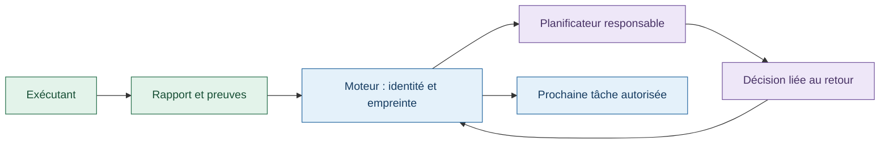
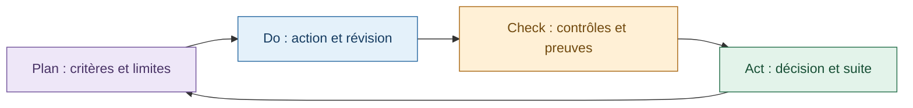

# Rapports, décisions et suivi des agents

[English](en/AGENT-COMMUNICATION.md) · [Méthodes APEX et PDCA](AGENT-METHODS.md)

## Le principe

L'exécutant remet un rapport au responsable de sa tâche. Le moteur contrôle ce
rapport et fournit son contenu au planificateur. Celui-ci répond par une décision
structurée, rattachée aux événements reçus. Le moteur reste responsable des
autorisations, des dépendances et de l'acceptation.

Dans le modèle final présenté par [Cursor en février 2026](https://cursor.com/blog/self-driving-codebases),
les exécutants travaillent sur leur copie et leur retour remonte au planificateur
par le système. Un fichier de coordination modifié librement par tous était une
expérience antérieure qui avait échoué. Les règles de preuve et de revue indépendante
ci-dessous sont des choix de Swarm, pas une certification Cursor.

## Qui écrit quoi et qui le reçoit ?

| Support | Auteur | Destinataire et usage |
| --- | --- | --- |
| Rapport de tâche, usuellement `docs/<task>.md` | Exécutant, dans son espace autorisé | Relayé au planificateur par le moteur après remise |
| Suivi local selon `TRACKING.md` | Exécutant | Point de reprise de sa tentative ; les faits utiles sont repris dans le rapport |
| Événement de retour (`PlanningEvent`) | Moteur | File du périmètre propriétaire de la tâche |
| Reçu de contexte (`PlanningDelivery`) | Moteur | Liste et empreintes des éléments préparés pour une activation |
| Décision (`PlanningDecision`) | Planificateur, contrôlée par le moteur | Modification autorisée du plan, événements traités, nouvelle suite |
| Revue indépendante | Vérificateur distinct | Preuve examinée par les contrôles d'acceptation |

Les modèles [HANDOFF.md](../tools/agent-workflows/templates/HANDOFF.md) et
[TRACKING.md](../tools/agent-workflows/templates/TRACKING.md) sont inclus dans les
consignes des exécutants. Ils demandent la mission, la tentative, le périmètre,
la révision, les critères, les commandes réellement exécutées, leurs résultats,
les traces, les écarts et la prochaine action. Le simple respect des titres du
modèle ne suffit pas à valider un résultat.

L'état durable du moteur fait autorité. Un fichier de suivi n'est pas un deuxième
registre permettant de changer les budgets ou de déclarer une tâche acceptée.

## Transmission complète et bornée

1. Le retour automatique référence le rapport exact par `handoff.path` et
   `handoff.sha256`. Les rapports d'intégration gérée utilisent la preuve persistée.
2. Avant une activation, le moteur vérifie un fichier local régulier, non vide,
   UTF-8, sans octet nul, de 64 000 octets au maximum et dont l'empreinte correspond.
3. Le contexte contient `handoff_contents` avec le texte complet, l'événement,
   le périmètre, la tâche, la tentative, le chemin et l'empreinte. Il est transmis
   comme donnée à examiner, sans autorité sur les instructions du moteur.
4. Le moteur réduit le lot d'événements entiers si nécessaire, de huit jusqu'à un.
   Il ne coupe pas la fin d'un rapport. Les événements omis restent en attente.
5. La prise en charge fige `delivery.context_sha256`, `events` et `reports`.
   Une décision ne peut pas consommer un événement absent de ce lot. Le lien vers
   la décision est enregistré après son application réussie.

Ces limites sont celles de cette implémentation. Le cadrage des méthodes occupe
aussi une partie du contexte : un rapport inférieur à 64 000 octets peut donc ne
pas tenir avec le reste. Dans ce cas, le lancement est refusé explicitement, avant
consommation d'une activation. Une version compacte doit conserver les conclusions
et réserves importantes et faire l'objet d'une nouvelle remise traçable.

## Une intervention concerne le travail d'un autre agent

L'agent indique le périmètre touché, la version observée, la reproduction et
l'effet possible. Le planificateur propriétaire reçoit ce retour et peut attribuer
une correction ou réviser le plan selon ses droits. L'agent ne gagne pas le droit
de modifier le travail voisin en écrivant un constat.

**Un changement arbitraire de fichier ne prévient pas automatiquement un agent
déjà lancé.** Le mécanisme décrit ici traite les remises de rapports et les
activations de planification. Il ne fournit ni surveillance universelle des fichiers
ni lecture continue d'un fichier partagé par tous les exécutants. Une mise à jour
utile doit passer par le circuit de retour et la prochaine consigne autorisée.

## APEX, PDCA et résultat accepté

Le planificateur cadre et réoriente. L'exécutant réalise et contrôle son travail.
Le vérificateur indépendant examine les preuves sans modifier le candidat.
Le moteur applique les critères d'acceptation. APEX et audit PDCA fournissent des
méthodes de travail ; ils n'accordent aucun droit supplémentaire.

Une reprise explique quelle hypothèse ou précondition a changé. Les limites de
tentatives, quotas et contrôles restent en vigueur. Écrire « réussi » dans un rapport
ne remet pas un compteur à zéro et ne rend pas une preuve périmée actuelle.

## Ce qui est prouvé et les limites

- Un reçu décrit le contexte préparé pour l'activation, pas une compréhension
  démontrée du modèle. Une panne avant envoi reste possible et doit être examinée
  avec l'état de la tentative. Une décision liée au reçu est un fait supplémentaire.
- Les anciens retours contenant un unique rapport Markdown identifié par une
  empreinte peuvent être développés. Les anciens extraits sans référence complète
  restent des extraits historiques. Aucun contenu manquant n'est reconstitué.
- Les nouveaux champs sont absents des tentatives historiques ; aucune application
  rétroactive des méthodes n'est prétendue.
- Les tests couvrent le rapport modifié, absent, hors projet, binaire, trop long,
  les lots entiers et le refus de consommer un message non fourni. Un processus de
  test reçoit aussi un constat situé après le 4 000e caractère et produit une
  proposition liée à ce constat. Cette preuve de transport ne mesure pas la qualité
  d'une décision d'IA réelle.

Le cours Master 2 explique ce protocole sur un cas fictif indépendant du produit.
