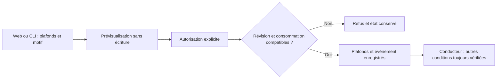

# Budgets et coûts IA

## Régler l’enveloppe d’une mission

Dans **Budgets et coûts IA**, ouvrir **Régler le budget**, saisir le plafond USD,
la réservation estimée par départ, la source et la date de référence.
**Prévisualiser le budget** montre ancien et nouveau plafond et engagements
conservés. **Enregistrer ce budget** applique la modification. Modifier un champ
invalide la prévisualisation. Une page périmée est refusée : fermer le formulaire,
actualiser, puis examiner à nouveau les valeurs.

Un plafond de zéro désactive le contrôle financier estimatif. Une baisse ne tue
pas les agents actifs et n’efface pas les dépenses estimées ni les réservations.
Les futurs départs restent soumis aux autres contrôles du moteur.

## Même contrôle depuis le CLI

```sh
swarm budget show WORK --json
swarm budget preview WORK --input budget.json --json
swarm budget apply WORK --input budget.json --json
```

Exemple de `budget.json` (montants fictifs, à remplacer) :

```json
{
  "schema_version": 1,
  "event_id": "budget-authorization-001",
  "expected_revision": 12,
  "budget": {
    "limit_usd": 10,
    "reserve_per_launch_usd": 2,
    "estimate_source": "Estimation locale documentée",
    "reference_date": "2026-09-23"
  }
}
```

Utiliser la révision renvoyée par `show`. `preview` est une lecture indicative ;
les réservations peuvent évoluer ensuite. `apply` vérifie la révision dans la
transaction qui enregistre le réglage et son événement. Deux autorisations
concurrentes sur la même révision ne peuvent pas se remplacer silencieusement.
Rejouer le même événement avec la même demande ne consomme pas de révision.
L’auteur et la date d’enregistrement sont déterminés par le moteur.

## Ce qui est réellement couvert

L’enveloppe estimative couvre exécution, planification, assistance de page et
préparation. **Les revues indépendantes ont un plafond d’appels séparé ; leurs
coûts monétaires ne sont pas inclus dans cette enveloppe.** Les coûts rapportés
par les fournisseurs sont distincts des estimations ; absence de coût ne veut
pas dire zéro. Ce contrôle n’est pas une garantie de plafond de facturation.

Les défauts pour les nouvelles missions restent à réaliser. Les autorisations
existantes ne changent pas lors de l’installation.

## Catalogue de tarifs par fournisseur et modèle

Ouvrir **Tarifs des modèles** dans **Budgets et coûts IA**. Le catalogue appartient
au projet, pas à une mission. Ajouter fournisseur, modèle, devise (code à trois
lettres), source et date, puis les montants par million de jetons. Aucun tarif
n’est prérempli : vide signifie inconnu, zéro signifie explicitement gratuit.
Entrée hors cache, sortie, cache lu et cache écrit sont des catégories distinctes.

**Créer une nouvelle version** conserve l’ancienne. L’auteur et la date sont
enregistrés par le moteur. Une modification concurrente refuse l’ancien formulaire.
**Estimer avec ce tarif** calcule une simulation en conservant l’identifiant de
version. Si une catégorie utilisée n’a pas de tarif, le montant reste inconnu.
Le calcul n’ajoute pas les jetons en cache à un total d’entrée qui les comprend
déjà : saisir uniquement les jetons hors cache dans « Entrée hors cache ».

```sh
swarm pricing list --json
swarm pricing save --input tarif.json --json
swarm pricing estimate --input volumes.json --json
```

Exemple de tarif (valeurs fictives) :

```json
{"schema_version":1,"expected_digest":"DIGEST_RENVOYE_PAR_LIST","rate":{"provider":"mon-fournisseur","model":"mon-modele","currency":"USD","input_per_million":2,"output_per_million":5,"cache_read_per_million":null,"cache_write_per_million":null,"source":"Estimation locale documentée","reference_date":"2026-09-23"}}
```

Exemple de volumes :

```json
{"rate_version":"VERSION_RENVOYEE_PAR_SAVE","non_cached_input_tokens":1000000,"output_tokens":1000000,"cache_read_tokens":0,"cache_write_tokens":0}
```

Résultat attendu : estimation de 7 USD avec la version, les tarifs et les volumes
utilisés dans la sortie JSON. Une nouvelle version ne change pas cette simulation.
Conserver cette sortie si elle sert de preuve : les simulations ne sont pas
enregistrées comme dépenses de mission. Aucun taux de change n’est appliqué.

**Limites :** ce catalogue ne transforme pas automatiquement les événements des
fournisseurs en coûts historiques et ne change pas la réserve forfaitaire par
départ. Les tarifs doivent être vérifiés par la personne qui les saisit. Les prix
d’abonnement, paliers, durées de cache et remises nécessitent un tarif adapté au
cas étudié ; le calculateur ne les devine pas. Les versions ne sont pas supprimées
par l’interface ; le catalogue refuse d’en ajouter au-delà de 1 000 versions.

## Plafonds de planification et de vérification

Dans **Budgets et coûts IA**, ouvrir **Plafonds de planification et de vérification**.
Le formulaire affiche les consommations, les allocations locales et la dernière
autorisation. Saisir les plafonds et un motif, prévisualiser puis autoriser.
Une modification des champs invalide la prévisualisation. Une révision périmée
est refusée. Aucun compteur consommé, historique, échec ou état de pause n’est effacé.

Ces plafonds sont globaux : 1–200 activations, 1–100 décisions et 1–100 appels du
vérificateur déjà configuré. Un plafond ne peut pas être inférieur au consommé.
Les allocations des sous-planificateurs restent inchangées et continuent de
s’appliquer. Si un planificateur détient une session ou une vérification est en
cours, attendre sa libération ou sa fin avant modification.

```sh
swarm quotas show WORK --json
swarm quotas preview WORK --input quotas.json --json
swarm quotas apply WORK --input quotas.json --json
```

Exemple de `quotas.json` : adapter la révision et les valeurs à `show`.

```json
{"schema_version":1,"event_id":"quota-authorization-001","expected_revision":12,"limits":{"planning_activations":30,"planning_decisions":20,"review_calls":10},"reason":"Autorisation explicite après examen du travail restant"}
```

Sans vérificateur configuré, `review_calls` doit être `null`. Le réglage n’en crée
pas un. L’auteur et la date sont enregistrés par le moteur ; le même événement
rejoué à l’identique est idempotent. Les modifications concurrentes sont refusées.

**Effet :** le réglage ne lance pas directement d’agent. Une mission active peut
utiliser la nouvelle autorisation au prochain passage du conducteur. Un échec ne
se transforme pas en réussite et une pause n’est pas levée. Les tentatives de
production restent réautorisées depuis leur tâche, avec une consigne corrective ;
ce formulaire ne contourne pas cette protection.


