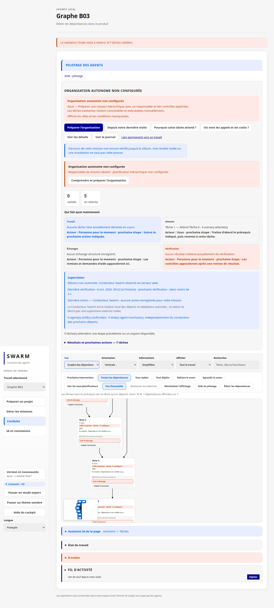
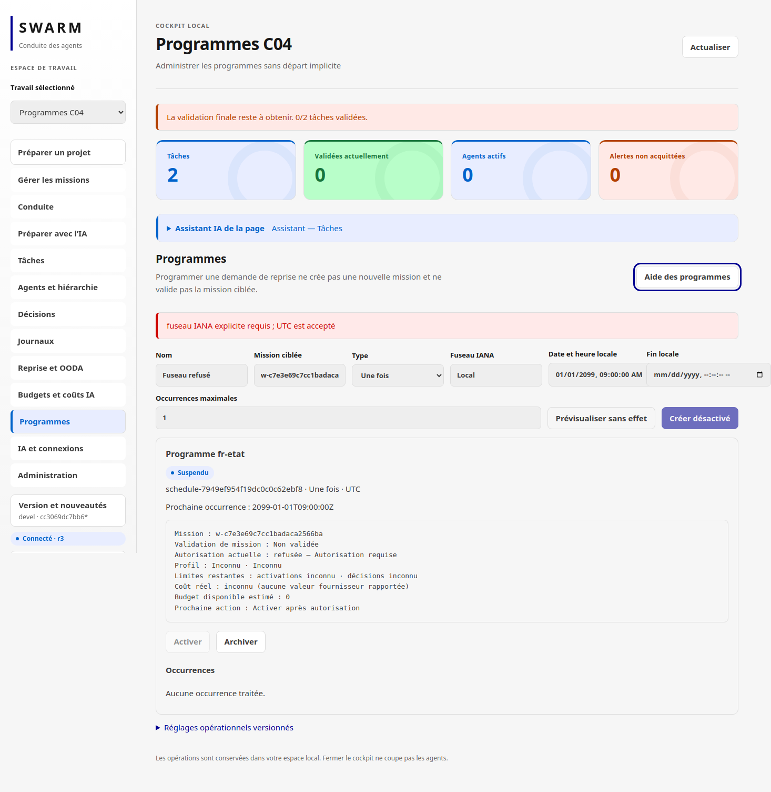
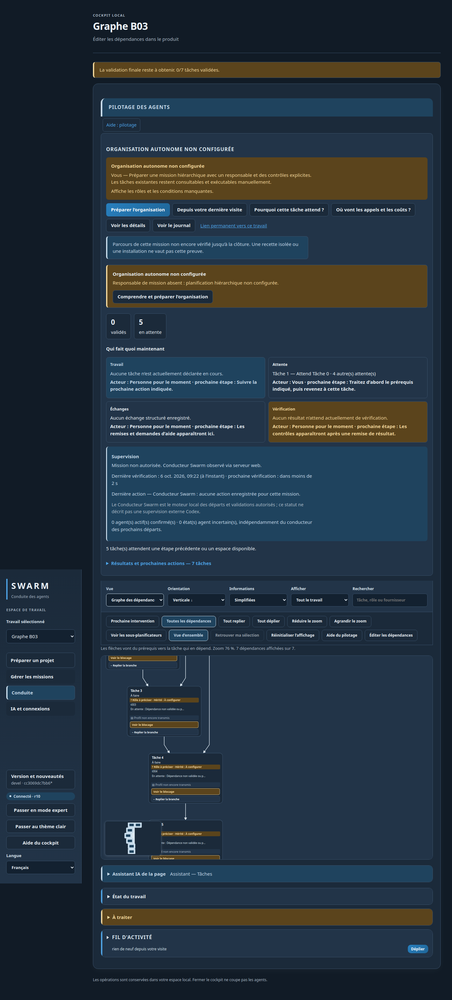
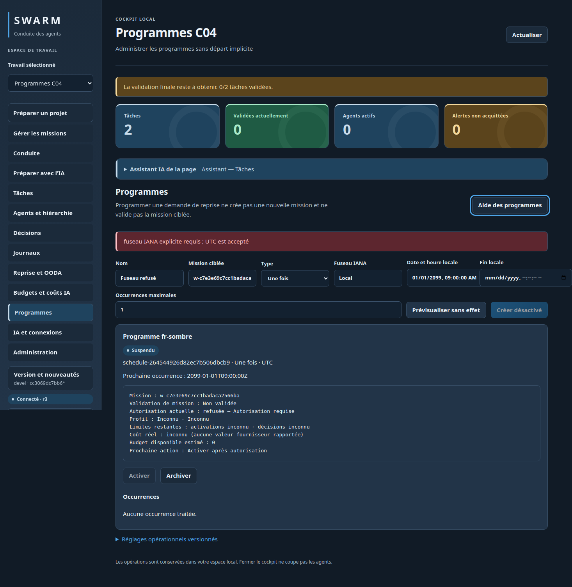
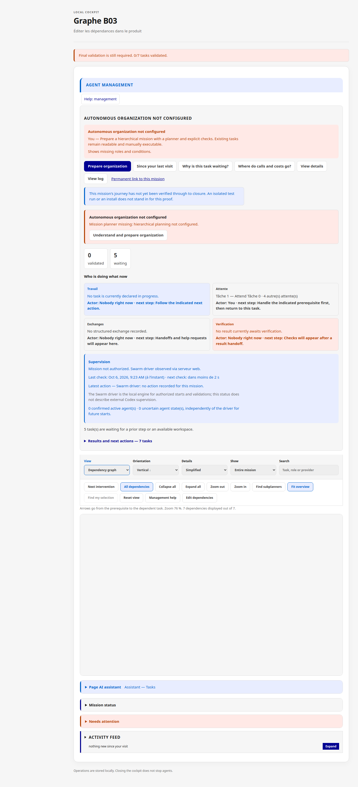
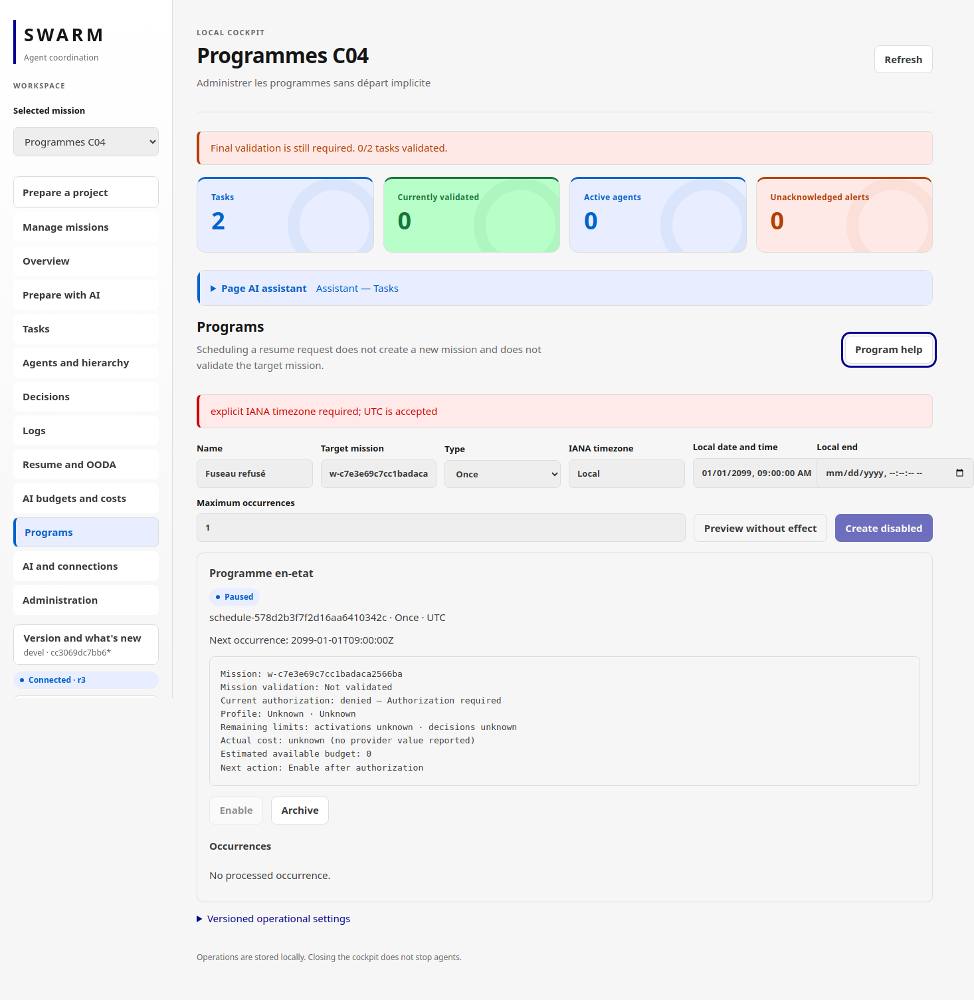
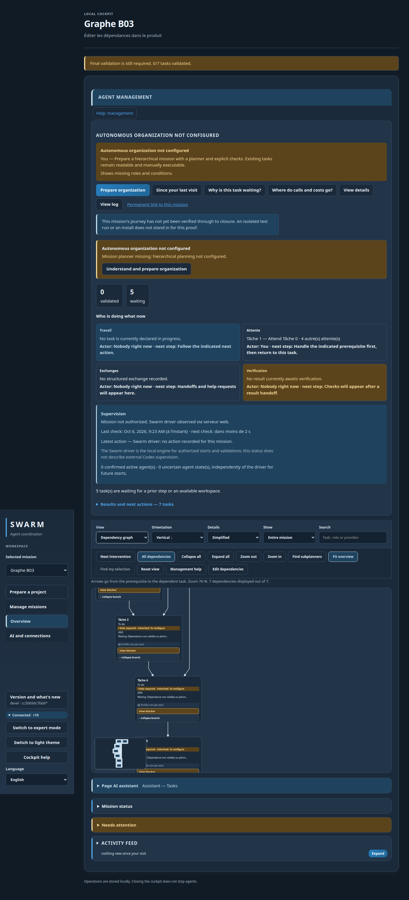
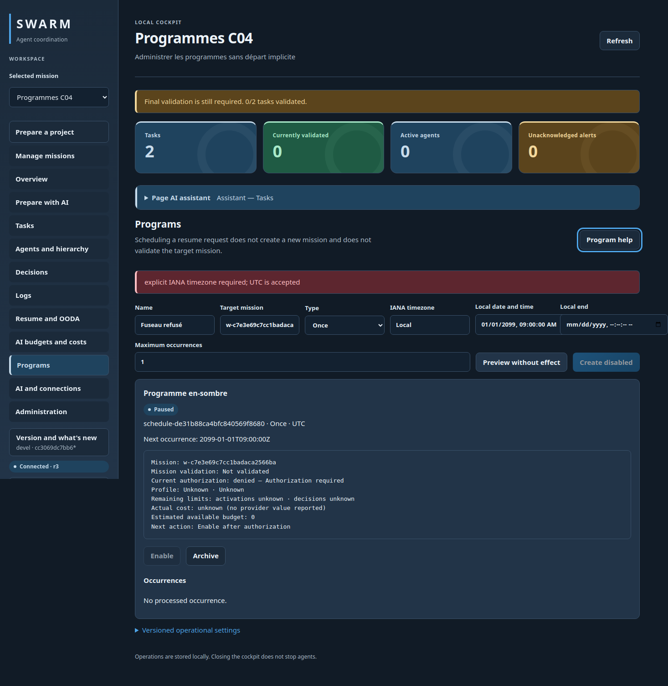

# Dossier D02 — migration et documentation FR/EN

## Portée et candidat

- Exigence : `req-2` / R16, avec parité documentaire R15.
- Candidat : HEAD `cc3069dc7bb61b90168d21f945cb2eb5e27578ed` et diff D02 non commité.
- Racine : `/home/fpizzi/workspace/swarm-action-skills`.
- État traité : racines temporaires uniquement ; aucun SQLite vivant, fournisseur, serveur installé ou rapport A/B/C n’est utilisé comme fixture.
- Livrables D02 : `graph_delivery_migration_test.go`, `tests/graph_delivery_docs.py`, `INSTALL.md`, `docs/en/INSTALL.md`, `docs/D02.md` et ce dossier.

## Raccords publics et assertions

| Surface | Entrée publique ou contrat | Assertion qui échouerait en cas de régression |
| --- | --- | --- |
| Migration | `swarm init`; `openStoreWithMigration(..., migrate=false)` pour les consultations | v26 est refusé en lecture sans migration ; l’initialisation migre vers v27, crée une sauvegarde privée et conserve la mission |
| Archive | `swarm export WORK --output archive.zip`; `swarm import --input archive.zip` | schémas d’archive 1 et 2 importables ; doublon refusé sans écrasement ; pièces isolées sous `.swarm/imports/` |
| Programmes | `swarm automation list`; état exporté/importé | un programme activé à la source est importé en état `disabled`, son identité et sa cible sont conservées |
| Sauvegarde | copie à l’arrêt de `.swarm/` et configuration associée | restauration sur une nouvelle racine conserve mission/configuration et exclut les écritures postérieures au snapshot |
| Rollback | ancien binaire + sauvegarde de schéma correspondante | schéma futur refusé ; aucune modification de `PRAGMA user_version` n’est proposée |
| Documentation | `swarm --help`, aides cycle de vie FR/EN, `init`, `work list`, `lifecycle list`, `automation list` | commandes réellement exécutées avec le binaire fraîchement construit ; lien/commande fictifs volontairement refusés par le harnais |

## Tests ciblés

`graph_delivery_migration_test.go` contient exactement les trois tests attendus par le contrôle D :

1. `TestGraphDeliveryD02Migration` : base v26 isolée, refus de consultation migrante, migration v27, sauvegarde `0600`, tables et mission conservées.
2. `TestGraphDeliveryD02ArchiveCompatibility` : exports réels ZIP schémas 1/2, import sur autres racines, programme désactivé, doublon sans écrasement.
3. `TestGraphDeliveryD02BackupRestoreSafety` : snapshot complet `.swarm/` à l’arrêt, modification postérieure, restauration sur nouvelle racine, configuration conservée, schéma futur refusé.

`tests/graph_delivery_docs.py OUTPUT` construit un binaire isolé, exerce les commandes documentées sur une racine temporaire, vérifie les liens locaux de `INSTALL.md` et `docs/en/INSTALL.md`, leur parité sémantique, les motifs de secrets et les huit captures ci-dessous. Ses contrôles négatifs doivent détecter une commande inconnue et un lien local absent.

Contrôle superviseur prévu, ciblé uniquement :

```sh
python3 docs/plans/graphe-automatisation-20261005/execution/d/verify.py D02
```

Le contrôle inventorie les trois tests, les exécute sous race, lance la recette documentaire, `git diff --check` et revalide les rapports protégés. Son succès éventuel reste une vérification worker/supervision, pas une revue indépendante ni une acceptation moteur.

## Documentation FR/EN

Les deux guides décrivent les mêmes invariants :

- arrêt des missions, agents et serveurs avant copie ou migration ;
- archive complète de `.swarm/` et du dossier agents, avec empreintes ;
- migration explicite par `swarm init`, jamais par une consultation ;
- contrôle post-migration de missions, programmes et version ;
- retour arrière avec le couple binaire/snapshot correspondant ;
- distinction entre export d’une mission et sauvegarde complète ;
- import sans écrasement et programmes importés désactivés ;
- limites Linux, fixtures isolées, absence de qualification d’un fournisseur réel.

Les commandes Docker/natives déjà présentes demeurent les sources d’installation. Aucun paquet, licence ou dépendance n’a été ajouté par D02.

<a id="reused-captures"></a>

## Captures réutilisées

Ces PNG ont été capturés par le parcours produit D01 sur le candidat partagé le 6 octobre 2026, puis copiés dans `docs/screenshots/graph-delivery-d01/`. D02 ne rejoue pas le navigateur : il vérifie leur signature PNG, leur taille et leur SHA-256 exact, et documente cette limite. Le reçu source est `docs/plans/graphe-automatisation-20261005/execution/d/results/712d5153817846a389db0ec0b587beba/browser/results.json`, SHA-256 `bf13187054153333acd7d5ea2ba6f2237acacc4ffb3f8b3ccc2dd6e5284aa088`.

| Langue / thème | Graphe, conflit et journal | Programmes | SHA-256 |
| --- | --- | --- | --- |
| FR / État |  |  | `cdef3e04…6476ca` / `0ff3c732…b577e` |
| FR / sombre |  |  | `09e0af40…fe362` / `b63ebef0…31b` |
| EN / State |  |  | `a8cc2dc1…43b70` / `c5cfb65d…75af` |
| EN / dark |  |  | `201fc68b…5fa8` / `b1302150…5d32` |

Empreintes intégrales attendues par le harnais :

```text
cdef3e04e8c27ae00d8a2b993515570cbbd03c87cfb9337686c11706be6476ca  fr-etat-graph.png
09e0af40ef9a8712a19f681ac1a83ea39a7a74c8028a3f415cd73fbf901fe362  fr-sombre-graph.png
a8cc2dc1051756b8ae47643370d5af33db4af821d5d5358108c8a26944e43b70  en-etat-graph.png
201fc68bcb513d24f89d35c69c4eb0bd3336c07756c652bafd4bf4ccf2765fa8  en-sombre-graph.png
0ff3c7320a508ecbf72405eeba81428a185408a535bffc0c55b2a3d53ecb577e  fr-etat-programs.png
b63ebef0687462fcdf528fb2c6278f023852b398064cd1d5b47fab4aaf42431b  fr-sombre-programs.png
c5cfb65d3e393ea27b90a1266fe325188dbd654086a129398a92778ac9b375af  en-etat-programs.png
b13021506c5a8495d6a6236e0fbf64e9ec11526cdf0dfa775e7a63e31af75d32  en-sombre-programs.png
```

## Gardes et limites pour la revue

- Les helpers de test refusent les liens symboliques et fichiers non réguliers lors de la copie de sauvegarde.
- Le scénario négatif d’archive déjà importée doit laisser la mission initiale inchangée.
- Aucun test ne démarre un agent, un serveur web ou un fournisseur ; les coûts/autonomies réels restent non qualifiés.
- Les liens HTTP externes sont documentés mais non sollicités par la recette hors réseau ; seuls les liens locaux sont vérifiés.
- Les captures prouvent le parcours D01 et son rendu au moment indiqué, pas une nouvelle exécution D02 ni la procédure de rollback.
- Le worker ne peut pas produire une revue indépendante de son propre candidat. Le reviewer doit examiner le même HEAD, le diff D02 et les reçus de contrôle après exécution.

## Captures D02 fraîches — 6 octobre 2026

Un nouveau binaire canonique du candidat D02 et des espaces isolés ont exécuté le parcours graphe/journal/programmes dans les quatre variantes FR/EN sombre/État. Les captures courantes se trouvent dans docs/screenshots/graph-delivery-d02 ; manifeste execution/d/d02-fresh-browser-manifest.json lie sources produit, reçus, logs et huit PNG. Recette hôte PASS, six tests ciblés/race sans skip et douze assertions par variante. Ce complément remplace la limitation « captures D01 réutilisées » pour la preuve actuelle, sans effacer l'historique. Fournisseur réel non exercé. La revue précédente refusée reste conservée.

## Source courante intégrale graph_delivery_migration_test.go

```go
//go:build linux

package main

import (
        "errors"
        "io/fs"
        "os"
        "path/filepath"
        "testing"
        "time"
)

// D02 exercises only temporary project roots. It never opens or copies the
// repository's live .swarm state.
func TestGraphDeliveryD02Migration(t *testing.T) {
        s := storeTest(t)
        w := createTest(t, s)
        if _, err := s.db.Exec("DROP TABLE automation_external_audit; DROP TABLE automation_external_events; PRAGMA user_version=26"); err != nil {
                t.Fatal(err)
        }
        if err := s.db.Close(); err != nil {
                t.Fatal(err)
        }

        _, err := openStoreWithMigration(s.root, false, false)
        var command *CommandError
        if !errors.As(err, &command) || command.Code != "storage_upgrade_required" {
                t.Fatalf("inspection silently migrated v26 storage: %v", err)
        }

        migrated, err := openStore(s.root, false)
        if err != nil {
                t.Fatal(err)
        }
        defer migrated.db.Close()
        var version, tables int
        if err = migrated.db.QueryRow("PRAGMA user_version").Scan(&version); err != nil {
                t.Fatal(err)
        }
        if err = migrated.db.QueryRow("SELECT count(*) FROM sqlite_master WHERE type='table' AND name IN ('automation_external_events','automation_external_audit')").Scan(&tables); err != nil {
                t.Fatal(err)
        }
        got, err := migrated.get(w.ID)
        if err != nil || version != schemaVersion || tables != 2 || got.Title != w.Title {
                t.Fatalf("v26 migration lost state: version=%d tables=%d work=%+v err=%v", version, tables, got, err)
        }
        backups, err := filepath.Glob(filepath.Join(s.root, ".swarm", "state-pre-v27-*.db"))
        if err != nil || len(backups) != 1 {
                t.Fatalf("migration backup missing: %v %v", backups, err)
        }
        info, err := os.Stat(backups[0])
        if err != nil || info.Mode().Perm() != 0600 || info.Size() == 0 {
                t.Fatalf("migration backup unsafe: info=%v err=%v", info, err)
        }
}

func TestGraphDeliveryD02ArchiveCompatibility(t *testing.T) {
        s, w := automationC01Fixture(t)
        clock := func() time.Time { return automationC02Time(t, "2026-01-01T00:00:00Z") }
        schedule, err := s.createAutomationSchedule(automationC02Create(w, "d02-archive", "once", "2026-02-01T12:00:00", "", "UTC", 1), clock)
        if err != nil {
                t.Fatal(err)
        }
        schedule, err = s.setAutomationScheduleState(schedule.ScheduleID, "enabled", schedule.Revision, clock)
        if err != nil {
                t.Fatal(err)
        }
        archiveV2 := filepath.Join(t.TempDir(), "automation-v2.zip")
        if err = s.export(w.ID, archiveV2); err != nil {
                t.Fatal(err)
        }
        destination := storeTest(t)
        imported, err := destination.importBundle(archiveV2)
        if err != nil || imported.ID != w.ID {
                t.Fatalf("schema 2 archive import failed: work=%+v err=%v", imported, err)
        }
        importedSchedule, err := destination.automationSchedule(schedule.ScheduleID)
        if err != nil || importedSchedule.State != "disabled" || importedSchedule.TargetWorkID != w.ID {
                t.Fatalf("imported program was not retained disabled: %+v err=%v", importedSchedule, err)
        }
        if _, err = destination.importBundle(archiveV2); err == nil {
                t.Fatal("duplicate archive overwrote an existing mission")
        }
        current, err := destination.get(w.ID)
        if err != nil || current.Revision != w.Revision {
                t.Fatalf("duplicate rejection changed imported mission: %+v err=%v", current, err)
        }

        legacySource := storeTest(t)
        legacyWork := lifecycleFixture(t, legacySource)
        archiveV1 := filepath.Join(t.TempDir(), "mission-v1.zip")
        if err = legacySource.export(legacyWork.ID, archiveV1); err != nil {
                t.Fatal(err)
        }
        legacyDestination := storeTest(t)
        legacyImported, err := legacyDestination.importBundle(archiveV1)
        if err != nil || legacyImported.ID != legacyWork.ID || legacyImported.Title != legacyWork.Title {
                t.Fatalf("schema 1 archive compatibility lost: %+v err=%v", legacyImported, err)
        }
}

func TestGraphDeliveryD02BackupRestoreSafety(t *testing.T) {
        s := storeTest(t)
        w := createTest(t, s)
        config := filepath.Join(s.root, ".swarm", "providers.json")
        if err := os.WriteFile(config, []byte("{\"schema_version\":1,\"providers\":[]}"), 0600); err != nil {
                t.Fatal(err)
        }
        if err := s.db.Close(); err != nil {
                t.Fatal(err)
        }

        snapshot := t.TempDir()
        if err := copyD02Tree(filepath.Join(s.root, ".swarm"), filepath.Join(snapshot, ".swarm")); err != nil {
                t.Fatal(err)
        }
        changed, err := openStore(s.root, false)
        if err != nil {
                t.Fatal(err)
        }
        second := createTest(t, changed)
        if err = changed.db.Close(); err != nil {
                t.Fatal(err)
        }

        rollbackRoot := t.TempDir()
        if err = copyD02Tree(filepath.Join(snapshot, ".swarm"), filepath.Join(rollbackRoot, ".swarm")); err != nil {
                t.Fatal(err)
        }
        restored, err := openStoreWithMigration(rollbackRoot, false, false)
        if err != nil {
                t.Fatal(err)
        }
        got, err := restored.get(w.ID)
        if err != nil || got.Title != w.Title {
                t.Fatalf("rollback lost saved mission: %+v err=%v", got, err)
        }
        if _, err = restored.get(second.ID); err == nil {
                t.Fatal("rollback retained post-backup mission")
        }
        raw, err := os.ReadFile(filepath.Join(rollbackRoot, ".swarm", "providers.json"))
        if err != nil || string(raw) != "{\"schema_version\":1,\"providers\":[]}" {
                t.Fatalf("rollback lost companion configuration: %q err=%v", raw, err)
        }
        if _, err = restored.db.Exec("PRAGMA user_version=28"); err != nil {
                t.Fatal(err)
        }
        if err = restored.db.Close(); err != nil {
                t.Fatal(err)
        }
        if _, err = openStore(rollbackRoot, false); err == nil {
                t.Fatal("future storage schema was accepted")
        }
}

func copyD02Tree(source, destination string) error {
        return filepath.WalkDir(source, func(path string, entry fs.DirEntry, walkErr error) error {
                if walkErr != nil {
                        return walkErr
                }
                relative, err := filepath.Rel(source, path)
                if err != nil {
                        return err
                }
                target := filepath.Join(destination, relative)
                info, err := entry.Info()
                if err != nil {
                        return err
                }
                if info.Mode()&os.ModeSymlink != 0 {
                        return errors.New("backup source contains a symbolic link")
                }
                if entry.IsDir() {
                        return os.MkdirAll(target, info.Mode().Perm())
                }
                if !info.Mode().IsRegular() {
                        return errors.New("backup source contains a non-regular file")
                }
                raw, err := os.ReadFile(path)
                if err != nil {
                        return err
                }
                return os.WriteFile(target, raw, info.Mode().Perm())
        })
}

```

## Source courante intégrale tests/graph_delivery_docs.py

```python
#!/usr/bin/env python3
"""D02 documentation checks against a freshly built isolated Swarm binary."""

from __future__ import annotations

import hashlib
import json
import os
from pathlib import Path
import re
import subprocess
import sys
import tempfile


ROOT = Path(__file__).resolve().parents[1]
DOCUMENTS = (ROOT / "INSTALL.md", ROOT / "docs/en/INSTALL.md")
CAPTURES = {'fr-sombre-programs.png': 'ed9147643deb65b86fd017318f378498bce52734aa01b051ea5c208b7e19733a', 'fr-sombre-graph.png': 'e2d15e10c8d8124339c383fe2ec13324675f2af03fa226813aa9866862bac17e', 'fr-etat-programs.png': '7c0811167dd599b56f6f6f0e59b543b2b1bc53305481ef7bab9fdb85725dc162', 'fr-etat-graph.png': '3e978ce9ac23f7c094e9dea069ad2251b4a9339a9d4f9501726edbfb7f3a95d3', 'en-sombre-programs.png': '58b9f551b1aa5dba50d6535f55329ddbf9942c7f5877f3c47bcb6fc282b4dc98', 'en-sombre-graph.png': '2a7b8ef6d1d776321f3022365b90a83fece7edd4921028c9f0729b3ccf04edd3', 'en-etat-programs.png': '74c00de6f1c4c0ade932e5afcb9825112b6202705cfb3ace5151182e5ef7e721', 'en-etat-graph.png': '2922f3c51d0b281260630a5f0479b92005e4768a76d22d0e07c10ec7c20074f1'}


def run(command: list[str], expected: int = 0) -> subprocess.CompletedProcess[str]:
    result = subprocess.run(command, cwd=ROOT, capture_output=True, text=True, timeout=60)
    if result.returncode != expected:
        raise AssertionError(
            f"command {command!r}: expected {expected}, got {result.returncode}\n"
            f"stdout={result.stdout[-2000:]}\nstderr={result.stderr[-2000:]}"
        )
    return result


def local_links(document: Path) -> list[Path]:
    targets: list[Path] = []
    for match in re.finditer(r"!?\[[^]]*\]\(([^)]+)\)", document.read_text(encoding="utf-8")):
        target = match.group(1).split("#", 1)[0]
        if not target or re.match(r"^[a-z]+://", target):
            continue
        targets.append((document.parent / target).resolve())
    return targets


def links_exist(document: Path) -> bool:
    return all(path.is_file() for path in local_links(document))


def require_semantic_parity() -> None:
    french = DOCUMENTS[0].read_text(encoding="utf-8").lower()
    english = DOCUMENTS[1].read_text(encoding="utf-8").lower()
    french_markers = (
        "sauvegarde et retour arrière vérifiables",
        "l’export d’une mission ne remplace pas la sauvegarde complète",
        "les programmes importés restent désactivés",
        "state-pre-v27-",
    )
    english_markers = (
        "verifiable backup and rollback",
        "a mission export does not replace the complete backup",
        "imported programs remain disabled",
        "state-pre-v27-",
    )
    missing = [item for item in french_markers if item not in french]
    missing += [item for item in english_markers if item not in english]
    if missing:
        raise AssertionError("missing FR/EN migration semantics: " + ", ".join(missing))


def main() -> None:
    if len(sys.argv) != 2:
        raise SystemExit("usage: graph_delivery_docs.py OUTPUT")
    output = Path(sys.argv[1]).resolve()
    output.mkdir(parents=True, exist_ok=False)
    binary = output / "swarm"
    run(["sh", "build.sh", str(binary)])

    help_text = run([str(binary), "--help"]).stdout
    required_help = (
        "swarm init",
        "swarm lifecycle preview|apply",
        "swarm export",
        "swarm import",
        "swarm automation list|show|preview|create|enable|pause|archive|cancel|params",
    )
    if not all(command in help_text for command in required_help):
        raise AssertionError("documented command missing from canonical --help")
    run([str(binary), "--lang", "fr", "aide", "cycle-vie"])
    run([str(binary), "--lang", "en", "help", "lifecycle"])

    with tempfile.TemporaryDirectory(prefix="swarm-d02-docs-") as project:
        run([str(binary), "--root", project, "--json", "init"])
        run([str(binary), "--root", project, "--json", "work", "list"])
        run([str(binary), "--root", project, "--json", "lifecycle", "list"])
        run([str(binary), "--root", project, "--json", "automation", "list"])
        state = Path(project) / ".swarm/state.db"
        if not state.is_file() or (state.stat().st_mode & 0o777) != 0o600:
            raise AssertionError("isolated init did not create a private state.db")

    stale = subprocess.run(
        [str(binary), "definitely-stale-command"], cwd=ROOT,
        capture_output=True, text=True, timeout=20,
    )
    if stale.returncode == 0:
        raise AssertionError("negative command probe was unexpectedly accepted")
    negative_link = output / "negative-link.md"
    negative_link.write_text("[missing](does-not-exist-d02.md)\n", encoding="utf-8")
    if links_exist(negative_link):
        raise AssertionError("negative link probe did not detect a missing document")
    negative_link.unlink()
    for document in DOCUMENTS:
        if not links_exist(document):
            missing = [str(path.relative_to(ROOT)) for path in local_links(document) if not path.is_file()]
            raise AssertionError(f"stale local links in {document.relative_to(ROOT)}: {missing}")
    require_semantic_parity()

    secret_patterns = (
        re.compile(r"\bsk-[A-Za-z0-9_-]{16,}"),
        re.compile(r"https?://[^\s)]+[?&](?:token|session_token)=[^\s)]+", re.I),
    )
    for document in DOCUMENTS:
        text = document.read_text(encoding="utf-8")
        if any(pattern.search(text) for pattern in secret_patterns):
            raise AssertionError(f"possible secret in {document.relative_to(ROOT)}")

    capture_root = ROOT / "docs/screenshots/graph-delivery-d02"
    observed_captures: dict[str, dict[str, object]] = {}
    for name, expected_digest in CAPTURES.items():
        path = capture_root / name
        raw = path.read_bytes()
        digest = hashlib.sha256(raw).hexdigest()
        if raw[:8] != b"\x89PNG\r\n\x1a\n" or len(raw) <= 1000 or digest != expected_digest:
            raise AssertionError(f"stale or invalid fresh D02 capture: {name}")
        observed_captures[name] = {"sha256": digest, "bytes": len(raw)}

    receipt = {
        "schema_version": 1,
        "surface": "swarm-documentation",
        "binary_sha256": hashlib.sha256(binary.read_bytes()).hexdigest(),
        "commands_checked": list(required_help),
        "documents": [str(path.relative_to(ROOT)) for path in DOCUMENTS],
        "captures": observed_captures,
        "negative_checks": ["unknown command rejected", "missing local link rejected"],
        "limits": [
            "Fresh D02 captures from candidate-bound host browser run; this documentation checker verifies hashes, host manifest verifies candidate identity.",
            "fixtures use temporary roots and no real AI provider",
        ],
    }
    (output / "results.json").write_text(json.dumps(receipt, ensure_ascii=False, indent=2) + "\n", encoding="utf-8")
    print(json.dumps({"status": "PASS", "receipt": str(output / "results.json")}, ensure_ascii=False))


if __name__ == "__main__":
    main()

```

## Source courante intégrale docs/plans/graphe-automatisation-20261005/execution/d/verify_d02_host.py

```python
"""D02 host proof: real migration/docs control plus fresh candidate-bound pixels."""
from pathlib import Path
import hashlib,json,subprocess,sys
D=Path(__file__).resolve().parent
m=json.loads((D/'d02-fresh-browser-manifest.json').read_text())
assert subprocess.check_output(['git','rev-parse','HEAD'],text=True).strip()==m['base_git'],'base Git changed'
for n,wanted in {**m['candidate_inputs'],**m['artifacts']}.items():
 assert hashlib.sha256(Path(n).read_bytes()).hexdigest()==wanted,'fresh browser candidate/artifact changed: '+n
r=json.loads(Path(m['browser_receipt']).read_text());assert r['surface']=='swarm-product'
assert {v['variant'] for v in r['variants']}=={'fr-sombre','fr-etat','en-sombre','en-etat'}
for v in r['variants']:
 assert len(v['assertions'])==12 and all(v['assertions'].values())
 assert not v['console_errors'] and not v['network_errors']
for n,wanted in json.loads((D/'protected-d01.json').read_text()).items():
 assert hashlib.sha256(Path(n).read_bytes()).hexdigest()==wanted,'accepted D01 report changed'
p=subprocess.run(['python3',str(D/'verify.py'),'D02'],capture_output=True,text=True,timeout=245)
print(p.stdout,end='');assert p.returncode==0,p.stderr
print(json.dumps({'fresh_browser':'PASS','manifest':str(D/'d02-fresh-browser-manifest.json'),'variants':[v['variant'] for v in r['variants']],'capture_count':8,'scope':m['scope']}))

```

## Garde moteur migrationBackup — source courante

```go
func migrationBackup(db *sql.DB, path string) error {
        file, err := os.OpenFile(path, os.O_CREATE|os.O_EXCL|os.O_WRONLY, 0600)
        if err != nil {
                return err
        }
        if err = file.Close(); err != nil {
                _ = os.Remove(path)
                return err
        }
        if _, err = db.Exec("VACUUM INTO ?", path); err != nil {
                _ = os.Remove(path)
                return err
        }
        return nil
}

```
