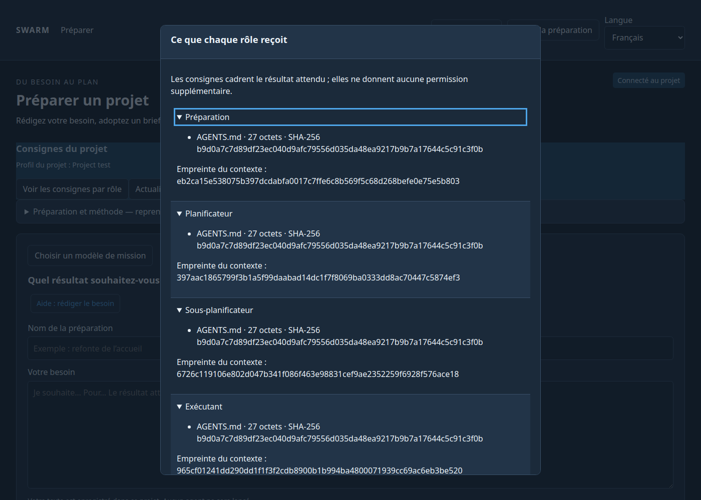
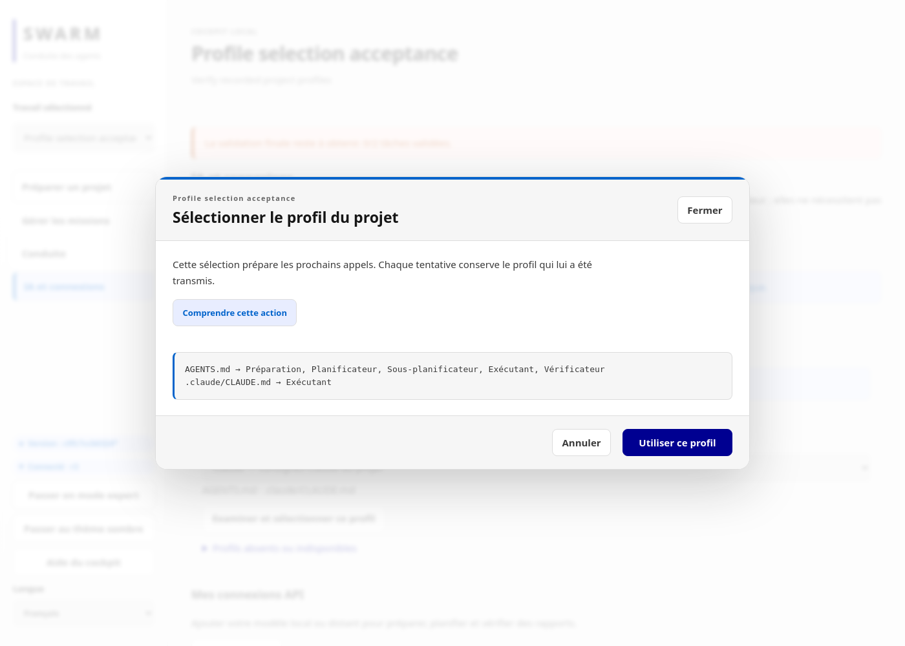
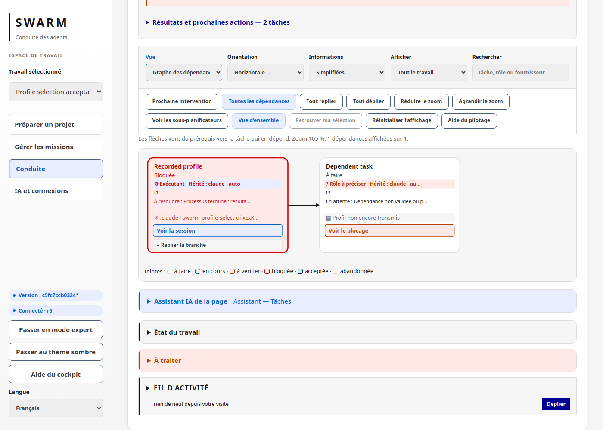

# Consignes du projet par rôle

[English](en/PROJECT-PROFILE.md)

Swarm peut transmettre les consignes du dépôt à la préparation, au planificateur,
aux sous-planificateurs, aux exécutants et au vérificateur. Cela permet de préparer
une mission depuis le web avec les règles du projet, sans demander à un assistant
extérieur de les recopier.

## Configurer un projet

Utilisez la racine du **projet cible** comme `--root`. La configuration se trouve
dans `swarm.project.json`, à cette racine. Elle est explicite et peut être versionnée.
Aucun profil n’est activé automatiquement.

Créez `profile-request.json` avec cette structure :

```json
{
  "profile": {
    "version": 1,
    "name": "Mon projet",
    "instructions": [
      {
        "path": "AGENTS.md",
        "roles": ["preparation", "planner", "subplanner", "worker", "reviewer"]
      },
      {
        "path": ".claude/CLAUDE.md",
        "roles": ["worker"]
      }
    ]
  },
  "expected_sha256": ""
}
```

```bash
swarm --root /chemin/du/projet project-profile apply --input profile-request.json
swarm --root /chemin/du/projet project-profile check
swarm --root /chemin/du/projet --json project-profile show
swarm --root /chemin/du/projet web 127.0.0.1:18789
```

Dans **Préparer**, cliquez sur **Voir les consignes par rôle**. La fenêtre affiche
les chemins, tailles et empreintes SHA-256, sans afficher le contenu des fichiers.
Elle se ferme avec Échap et restitue le focus au bouton. **Actualiser les consignes**
relit le profil sans lancer d’agent. La configuration personnalisée se fait par le CLI ;
vous pouvez aussi choisir un profil dans **IA et connexions → Profil de consignes du projet**.
Sélectionnez `.claude`, examinez les fichiers et les rôles puis confirmez **Utiliser ce profil**.
Les profils absents sont indiqués sans être proposés comme utilisables.
Les fichiers `.agents/AGENTS.md`, `GEMINI.md` et `.gemini/GEMINI.md` peuvent
aussi être sélectionnés lorsqu’ils existent. Cela importe leurs consignes, pas un adaptateur Gemini.

Pour modifier un profil existant, renseignez `expected_sha256` avec
`roles[0].profile_sha256` retourné par `--json project-profile show`. Une empreinte périmée refuse
l’écriture. `show` et `check` ne déclenchent aucun appel IA.

## Répartition conseillée

| Rôle | Sources utiles | Limite des sources et en-têtes |
| --- | --- | --- |
| Préparation | Objectif, règles communes, guide de terrain | 16 000 octets |
| Planificateur et sous-planificateur | Architecture, périmètre, règles communes | 16 000 octets par rôle |
| Exécutant | Règles communes et instructions techniques | 32 000 octets |
| Vérificateur | Critères et règles communes | 16 000 octets |

Chaque rôle doit recevoir au moins une source. Les fichiers doivent être `.md` ou
`.txt`, UTF-8, à l’intérieur du projet ; les liens vers l’extérieur sont refusés.
Un fichier absent, invalide ou trop volumineux bloque l’envoi : aucun contenu n’est
tronqué. Le reste du prompt conserve ses propres limites.

La préparation et les tentatives conservent les métadonnées du contexte transmis.
Le moteur vérifie ces empreintes avant le départ ; un changement demande une
nouvelle préparation du contexte. Une revue indépendante n’autorise pas une
acceptation courante si ses consignes ont changé. Les traces historiques restent
consultables. Ce contrôle ne démontre pas que le modèle a respecté les consignes :
il faut toujours des preuves et une vérification du résultat.

## Configuration Claude : une distinction essentielle

Les consignes transmises ne donnent **aucune permission supplémentaire**. Les
planificateurs et le vérificateur restent sans outils dans leurs sessions isolées.
Un exécutant Claude lancé dans le projet peut utiliser la configuration native
Claude applicable à son espace de travail ; cette configuration n’est pas copiée
aux autres rôles.

La fenêtre signale uniquement la présence de `.claude/settings.json`,
`.claude/settings.local.json` et `.claude/glm-settings.json`. Elle ne lit pas leurs
valeurs et ne prouve pas leur chargement. `glm-settings.json` exige une configuration
explicite du fournisseur ; sa simple présence ne sélectionne pas un modèle GLM.

Ne sélectionnez que des documents relus et sans secrets. Les fichiers JSON de
permissions ou d’authentification ne sont pas acceptés comme sources. Un détecteur
refuse certains secrets reconnaissables, mais il ne garantit pas l’absence de tout
secret. Ne mettez ni clés, ni jetons, ni mots de passe dans les consignes.

## Interface vérifiée

Exemple de recette isolée, sans appel IA :



## Identifier le profil reçu par un agent

Les cartes, le graphe, le détail d’une tentative et sa fenêtre de session affichent
un badge : **✳ Profil transmis : Wattson · .claude**, ou **✦** pour les consignes
Gemini, **▤** pour les consignes partagées. Le badge vient de l’instantané enregistré
par le moteur, pas d’une déclaration du modèle. Son détail indique les fichiers et
l’empreinte. Une ancienne tentative sans métadonnées affiche « Profil non enregistré
pour cette tentative ». Le fournisseur et le modèle restent des informations distinctes.

La sélection est aussi disponible en CLI :

```bash
swarm --root /chemin/du/projet --json project-profile list
# selection.json contient {"expected_sha256":"empreinte-active-du-catalogue"}
swarm --root /chemin/du/projet project-profile select claude-project --input selection.json
```




