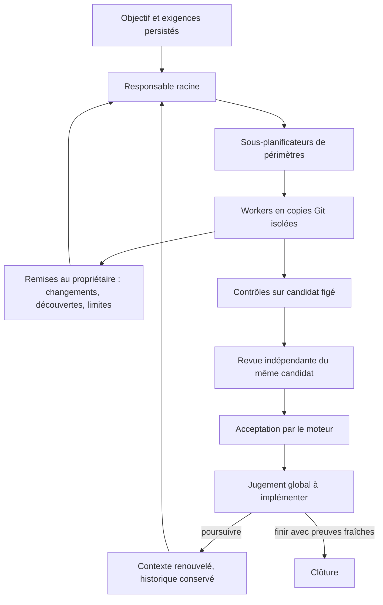

# Évolution du moteur Cursor — lancement APEX du 10 octobre 2026

## Statut et périmètre

Ce document accompagne le [plan d’évolution](../plans/engine-cursor-contract/evolution-20261010.json).
Il décrit une cible à décider et à implémenter, pas une conformité déjà acquise.
Le [contrat JAN/FEB](CURSOR-ENGINE-CONTRACT.md) conserve les deux publications
Cursor de janvier et février. Le corpus récent, Cursor prioritaire, se trouve
dans les [fiches de recherche](../publications/20261005-cursor-moteur/article-scientifique/fiches-lecture.md).

La préparation initiale `prep-a9d06c4844e9da0563731f85` est conservée. Son
rattachement à `w-fff7368010d114f6e2578985` était incompatible : cette mission
vise une finalisation ciblée depuis un ancien candidat, sans nouvelle exploration
globale. Elle reste intacte, avec ses tâches acceptées et ses compteurs. La présente
évolution constitue un objectif distinct ; elle ne remplace aucune tentative en échec.

## Décision à produire au lot T1

Comparer les cycles explicites et une hiérarchie continue avec points de jugement.
Évaluer correction, reprise, débit, coût, effort et compatibilité des migrations.
Les exigences Swarm de jugement global et de contexte renouvelé restent retenues.
Un juge de cycle et un reviewer de candidat ont des responsabilités différentes.
Les publications récentes constituent des hypothèses à éprouver sur Swarm.

Ce schéma est la cible fonctionnelle. T1 doit préciser les composants existants,
ceux à modifier et les transitions absentes ; les lots suivants actualisent le
schéma avec les opérations et états effectivement implémentés.

## Livrables d’architecture par lot

| Lot | Documentation obligatoire dans le même candidat |
| --- | --- |
| T1 | Matrice JAN/FEB, comparaison, décision, composants, risques et migration |
| T2 | États du juge, identités de cycle, renouvellement, persistance et rejeu |
| T3 | Exploration en lecture, périmètres, concurrence, réservations et budgets partagés |
| T4 | Remises, découvertes, publication, conflits et reprise après interruption |
| T5 | Réglages persistés, API/CLI/Admin FR/EN, provenance et routes de modèles |
| T6 | Scénarios, commandes et mesures, candidat exact, échecs et limites |
| T7 | Recette fournisseur réel, revue indépendante, couverture cumulative |

Chaque lot met à jour ce document et les contrats FR/EN pertinents. Décrire les
valeurs de politique dans la configuration persistée et l’Admin ; ne pas les
introduire en constantes Go. Distinguer limites techniques et choix réglables.

## Précondition de lancement corrigée

La reprise après les expirations du vérificateur et du responsable est décrite
dans [le contrat de surveillance d’activité](PROVIDER-LIVENESS.md). Les appels
actifs héritent d’une politique réglable dans Admin ; la durée totale est facultative,
le silence est surveillé et la réservation du responsable est renouvelable.

La conversion publique d’une préparation peut recevoir `organization.repository`
avec `path` et soit `committed_only`, soit `include_dirty` explicite. Elle utilise
le mécanisme Git géré existant : instantané figé et copie distincte par tentative.
Elle exige une validation automatique explicitement autorisée et conserve la
revue indépendante obligatoire. Elle ne committe ni ne modifie le HEAD du dépôt
source. Le plan, l’organisation et le démarrage restent des opérations distinctes.

Les contrôles automatisés assurent les vérifications mécaniques annoncées ;
la revue indépendante doit examiner la couverture sémantique des critères et
refuser les preuves insuffisantes. Un test de régression n’est pas une preuve
d’autonomie ni une recette fournisseur réel. Les échecs historiques de la suite
globale restent visibles ; leurs manifestes ne doivent pas être falsifiés.

## Extension demandée : observabilité eBPF

L’utilisateur demande d’étudier eBPF pendant le lancement. T1 compare son apport
à l’instrumentation Go existante : attentes d’ordonnancement, activité disque et
réseau, cycle de vie des processus agents. Relier les mesures noyau aux identités
mission/tâche/tentative via les PID, leurs descendants et, si disponibles, les
cgroups. Les décisions du planner, tokens et verdicts restent des événements du
moteur ; les métriques noyau ne permettent pas d’en déduire la réussite.

Cible proposée, à valider par T1 : collecteur Linux optionnel utilisant
[`cilium/ebpf`](https://ebpf-go.dev/), séparé du moteur et relié par un transport
local. Le moteur fonctionne sans collecteur. Documenter capabilities nécessaires,
détection des fonctionnalités, disponibilité BTF selon les sondes, pertes de
mesures, nettoyage des sondes et coût comparé avec/sans collecte. Activation,
sélection des sondes, échantillonnage et rétention sont des politiques persistées
exposées dans Admin FR/EN. Aucune activation privilégiée n’a été effectuée.

Observation locale au lancement : noyau `6.17.0-41-generic`, BTF lisible dans
`/sys/kernel/btf/vmlinux`, session utilisateur UID 1001. Cela ne prouve ni les
permissions de chargement ni la disponibilité de toutes les sondes.
Sources primaires consultées : [présentation eBPF](https://ebpf.io/what-is-ebpf/)
et [guide eBPF en Go](https://ebpf-go.dev/guides/getting-started/).
