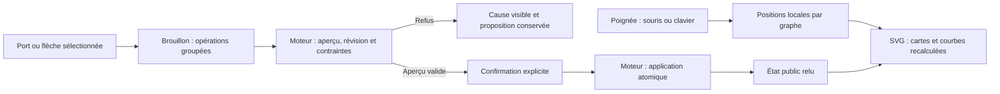

# Atelier du graphe

## Raccordement Rust

Le cockpit natif utilise `web/cockpit-native-graph.js` sur les vrais objets Work.
Le zoom (boutons ou Ctrl + molette), la vue d’ensemble, le déplacement du fond,
les poignées souris/clavier des cartes, l’orientation et le plein écran sont des
préférences de présentation. Les positions sont locales à l’origine HTTP, à la
mission et à l’orientation ; elles ne modifient ni révision ni budget. Échap
annule un déplacement en cours avant de fermer le plein écran. Ce dernier est
un dialogue modal natif : focus contenu et retour au bouton à la fermeture.

« Outils du graphe » regroupe rangement, undo/redo, repérage, orientation,
réinitialisation de navigation et export. Il est replié par défaut sur mobile,
déplié sur ordinateur ; passer le breakpoint existant réapplique ce défaut.
Sa fermeture et Échap rendent le focus à son titre. Zoom, recherche, ajout et plein
écran restent dans la barre principale. Le bouton 100 % conserve le centre de la
vue sous clamp ; +/− sont désactivés aux bornes de 15 % et 200 % existantes.

La vue d’ensemble utilise aussi l’étendue des cartes déplacées ; à la limite de
zoom minimale existante (15 %), un message demande de rapprocher les cartes.
« Annuler le placement » restaure le dernier déplacement terminé ou rangement,
une seule fois. « Rétablir le placement » récupère cette annulation, une fois ;
un nouveau placement terminé invalide ce témoin. Geste annulé ou sans mouvement
le conserve. Undo/redo disparaissent au nouveau rendu ; les coordonnées restaurées
sont mémorisées localement et ne modifient aucune tâche.
La mini-carte affiche la zone visible : cliquer centre la vue, les flèches
parcourent un demi-écran, Début revient à l’origine et Fin à l’extrémité.
Le bouton **ID** copie l’identifiant exact sans ouvrir le formulaire. Le succès
attend l’accord du presse-papiers ; un refus ou une API indisponible laisse
l’identifiant en lecture seule, sélectionné, sans annoncer de copie réussie.
« Aide des gestes » expose les commandes ; Fermer ou Échap referme l’aide et
rend le focus à son titre. Les titres et libellés de carte sont abrégés à 24 unités UTF-16
pour ménager les commandes ; leur texte complet reste dans l’infobulle.

La recherche par identifiant ou titre ignore la casse et les accents. Elle met
en évidence les correspondances sans masquer de carte ou de lien ; Entrée ou
« Suivant » centre la correspondance suivante et place le focus sur sa carte.
« Précédent » ou Maj+Entrée dans la recherche parcourt les résultats à rebours,
avec retour au dernier résultat depuis le premier.
« Effacer la recherche » ou Échap dans la saisie efface les repères. Le zoom et
les positions restent identiques ; la requête est locale, non enregistrée, et
repart vide lors d’un nouveau rendu. Une absence de résultat est explicite.

Le zoom Ctrl + molette conserve le point sous le curseur ; les bornes de zoom
et les limites natives du défilement continuent de s’appliquer. Les rerenders du
même travail conservent en mémoire orientation, zoom, positions, zone visible et
plein écran, y compris le défilement extérieur du studio sur écran bas. Un glisser inachevé reste provisoire, y compris pendant un zoom :
sa capture est exclue de la mémorisation et annulée lors du rerender. Le plein écran attend la fermeture de l’éditeur pour ne pas masquer
le formulaire pendant la relecture. Le focus de la tâche enregistrée ne décale
pas la zone restaurée. Orientation, zone du canevas/studio et ouverture des outils
sont mémorisées dans une préférence locale versionnée par travail et origine ;
zoom et positions gardent leur format existant par orientation. Après rechargement,
la vue est restaurée sous les clamps disponibles, sans ouvrir le plein écran.
Un autre travail retrouve sa propre préférence. JSON invalide ou stockage refusé
restent visibles ; un refus ne vaut pas mémorisation. « Réinitialiser la navigation »
efface cette préférence et revient à gauche→droite/origine ; zoom et placements
gardent leurs commandes dédiées.

« Repérer les dépendances » choisit une carte : contour plein pour la cible,
tirets pour ses prérequis directs, pointillés pour ses dépendants directs et
liens concernés renforcés. Le statut écrit les identifiants de chaque groupe ;
aucune carte ni flèche n’est masquée. « Effacer le repérage » retire ces repères.
Le repérage repart vide au nouveau rendu.
Le formulaire propose une recherche littérale titre/ID sans casse ni accents.
Les prérequis sélectionnés restent visibles hors filtre et sont récapitulés ;
un filtre sans correspondance est annoncé et ne supprime aucun choix. Échap
efface une recherche non vide ; Échap suivant ferme le formulaire. Entrée dans
ce filtre ne soumet pas le formulaire de tâche.

« Exporter le SVG » demande au navigateur un fichier `swarm-graph.svg` local.
Il conserve placement, liens, libellés et palette calculée, avec fond du thème,
sans poignées, ports, boutons ou ressource externe. Il peut être ouvert hors de
l’application ; la grille du canevas et la mini-carte ne font pas partie du SVG.
Le téléchargement n’effectue aucun POST et n’emporte pas la session. Le statut
annonce la demande de téléchargement, pas une confirmation d’écriture du fichier.
Un échec de génération reste visible et permet une nouvelle demande explicite.
Un caractère non représentable en XML est refusé sans modifier le travail.

« Ajouter une tâche » et l’activation d’une carte ouvrent le formulaire de tâche.
Titre, livrable, critères et prérequis sont enregistrés explicitement par
`/api/v1/action` (`task-add` → `task.add`, `task` → `task.update`). Le moteur garde
les contrôles de session/CSRF, Root lié, révision, activité, références et cycles.
La mini-carte reflète les cartes déplacées. Relier une sortie à une entrée
(souris ou clavier) prépare les prérequis de la destination dans le formulaire ;
activer un lien ou Suppr prépare son retrait. Ces gestes ne sauvegardent rien.
La sélection des prérequis ajoute ou retire des liens pour une seule tâche.
Les champs restent visibles après refus ; un résultat incertain interdit une
nouvelle soumission jusqu’à fermeture et actualisation. Le succès exige une
relecture protégée, puis attend que le cockpit ait rechargé ses observations
avant de fermer le formulaire. Le bouton et une zone de statut annoncent
« Enregistrement en cours… » jusqu’à la fin de cette relecture et de
l’actualisation. Après un refus ou une issue incertaine, cet état d’attente
disparaît et le diagnostic reste visible ; une issue incertaine garde le
renvoi désactivé. Aucun agent ne
démarre. Sur un plan géré, les refus du moteur restent applicables.

La recette native est `tests/rust_graph_navigation.py --binary bin/swarm
--output DOSSIER_NEUF --editing`. Sans `--editing`, elle vérifie que tous les
gestes de présentation laissent le Work identique. `--workspace-preview` est
réservé à l’itération : son overlay ne prouve pas les ressources embarquées.

**Limite de migration :** les brouillons atomiques par lots, leur aperçu moteur
et l’annulation/rétablissement historique ne sont
pas encore raccordés au cockpit Rust. Le contrat historique ci-dessous reste
la cible pour ces capacités ; il ne décrit pas leur disponibilité native.
Preuves et critères ouverts : [reprise APEX](../plans/migration-rust/GRAPH-REGRESSION-20261031.md).

## Atelier historique et cible restante

Le cockpit permet d'ouvrir le graphe en plein écran, de déplacer les cartes et de
préparer des modifications de liens. Le placement visuel et les dépendances ont
deux contrats distincts. `web/graph-studio.js` réutilise le rendu SVG/Dagre local,
les préférences du pilotage et le brouillon public existant ; aucune bibliothèque
externe ni opération privée de stockage n'est ajoutée.

## Utilisation

- **Plein écran** agrandit l'atelier. Échap revient au cockpit ; le bouton retrouve
  le focus. L'inspecteur de tâche reste accessible au-dessus du graphe.
- La poignée **Déplacer la carte** fonctionne au pointeur et avec les quatre
  flèches du clavier. Échap annule un geste en cours. **Ranger les cartes** efface
  les positions personnalisées pour retrouver le placement automatique.
- Les positions sont mémorisées dans ce navigateur par projet, mission et
  orientation. Elles survivent au rechargement mais ne sont pas partagées entre
  utilisateurs ; un échec de stockage est visible. Elles ne changent ni révision,
  ni tâche, ni réservation, ni lancement d'agent.
- Les ports indiquent entrée et sortie. Tirer un port vers une autre carte
  prépare une dépendance. Au clavier, activer une sortie puis une entrée offre
  le même parcours. Le brouillon reste modifiable avant application.
- Sélectionner une flèche montre ses deux tâches et les commandes de retrait ou
  de changement d'extrémité. **Suppr** prépare son retrait. Une reconnexion
  prépare un seul lot : retrait du lien original et ajout du nouveau.
- **Prévisualiser**, puis **Appliquer explicitement** passent par le moteur.
  Aucun déplacement, port ou raccourci ne confirme implicitement ce lot.

## Frontières et reprise

Le moteur reste la source de vérité pour les tâches et relations. Les endpoints
`/api/v1/graph-drafts`, `/preview` et `/apply` contrôlent identité, révision,
activité, dépendances et cycles. Un refus conserve le graphe confirmé et la
proposition ; les commandes d'application restent indisponibles sans aperçu
valide. Si l'enregistrement du brouillon échoue, une ancienne version enregistrée
ne peut pas être prévisualisée à la place de la proposition visible. La reprise
explicite relit la révision et recrée le brouillon ; elle n'applique rien.

```mermaid
flowchart LR
    P[Poignée : souris ou clavier] --> L[Positions locales par graphe]
    L --> V[SVG : cartes et courbes recalculées]
    U[Port ou flèche sélectionnée] --> B[Brouillon : opérations groupées]
    B --> M[Moteur : aperçu, révision et contraintes]
    M -->|Refus| R[Cause visible et proposition conservée]
    M -->|Aperçu valide| C[Confirmation explicite]
    C --> A[Moteur : application atomique]
    A --> S[État public relu]
    S --> V
```

Les flèches sont des courbes cubiques entre ports, adaptées à l'orientation.
L'utilisateur peut déplacer des cartes pour dégager une route. Ce tracé ne prétend
pas résoudre automatiquement toutes les intersections d'un placement arbitraire.
Le zoom, la recherche, les branches et le déplacement du canevas sont conservés.
Les couleurs de rôles et d'états utilisent les paires sémantiques partagées,
complétées par les libellés ; poignée, ports et sélection ont un focus visible.

## Recette et limites

`tests/graph_studio_ui.cjs` utilise le CLI, le serveur candidat et Chromium sur
racines isolées : plein écran/focus, clavier, pointeur et annulation, persistance,
création/retrait/reconnexion, cycle refusé sans mutation, inspecteur et mobile,
FR/EN et deux thèmes. Aucun fournisseur n'est appelé. Le garde
`tests/graph_studio_test.cjs` couvre notamment un enregistrement refusé suivi de
la récupération. Les vérifications de charge utilisent le harnais existant et
restent des mesures locales ; elles ne prouvent ni autonomie ni coût fournisseur.

Cette livraison de sources ne met pas à jour automatiquement le serveur natif.
Voir [le plan de livraison](../plans/engine-cursor-contract/graphe-ux-20261012.md)
pour les preuves liées au candidat et les critères encore non démontrés.
