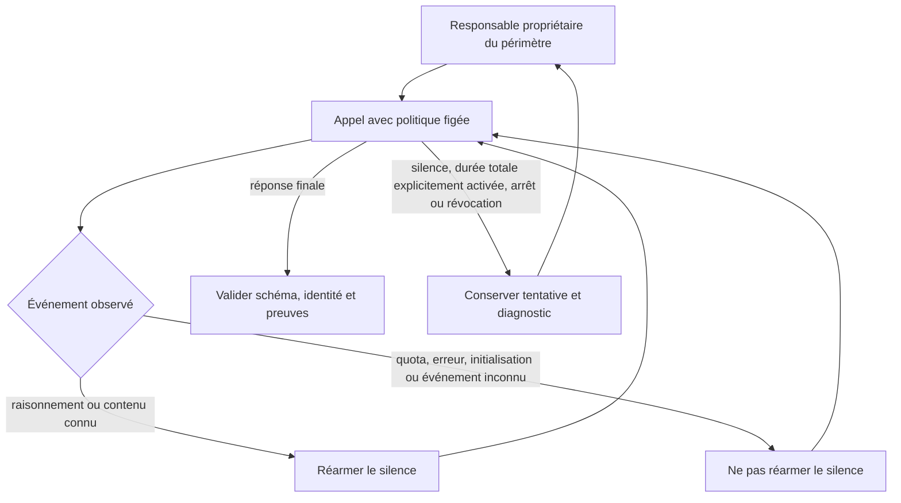

# Activité des responsables et vérificateurs

Correction du 10 octobre 2026, demandée après des interruptions répétées de la
mission d’évolution Cursor. Ce contrat concerne les appels des planificateurs,
sous-planificateurs et vérificateurs. Les limites d’outils des workers et le
dialogue de préparation disposent de leurs réglages distincts.

## Cause observée

Le vérificateur de T1 a été arrêté après 90 secondes malgré 70 événements
`thinking_tokens`. Le responsable racine a reçu les événements `independent_review`
et `integration_failed`, puis son appel de diagnostic a également atteint le
délai fixe de 90 secondes. Le routage au responsable existait ; les deux processus
étaient interrompus avant de rendre un verdict ou une décision. Les délais étaient
des valeurs de politique inscrites dans le code. Le bail de réservation du
planificateur, sans renouvellement, aurait aussi refusé une décision après expiration.

## Décision

Deux approches examinées : allonger le délai total fixe, ou surveiller le silence
réel en distinguant activité et durée totale. La seconde est retenue : allonger
le couperet ne résout pas les appels actifs plus longs et ne détecte pas précisément
un fournisseur silencieux. Les événements de raisonnement et de contenu connus
réarment la surveillance ; ils ne constituent ni un verdict ni une preuve de réussite.

## Configuration persistée et opérations publiques

Les valeurs initiales viennent de `config/provider-wait.json`. Les révisions
du projet sont enregistrées par l’API publique dans le stockage local, avec CAS,
événement idempotent, motif, auteur et historique. Aucune édition privée de la base
n’est nécessaire. L’Admin FR/EN présente la même politique que la CLI et le moteur.

| Champ | Effet |
| --- | --- |
| `silence_seconds` | Temps sans activité productive reconnue ; 0 désactive cette surveillance |
| `max_duration_seconds` | Durée totale facultative, indépendante de l’activité ; 0 désactive ce couperet |
| `planning_lease_seconds` | Bail de propriété renouvelé pendant un appel vivant ; bornes du contrat public de réservation |

CLI : `swarm run-limits provider-wait show|history|preview|apply`. API :
`GET /api/v1/provider-wait`, `POST /api/v1/provider-wait/preview|apply`.
La prévisualisation n’écrit pas ; restaurer les valeurs d’une révision crée une
nouvelle révision et conserve l’historique. Un appel déjà démarré garde ses valeurs.

Une ancienne durée de revue explicitement définie reste un plafond total explicite.
`planning review-timeout` à 0 rétablit l’héritage de la politique de projet ; il
n’y a plus de valeur de repli à 90 secondes. Les anciennes preuves conservent leur
durée enregistrée. La limite totale initiale est désactivée dans la configuration.

## Propriété, reprise et rôles

Le moteur renouvelle le bail courant sans nouvelle activation, décision ni dépense
de modèle. Il conserve le titulaire et la génération. Un bail expiré, remplacé,
suspendu ou révoqué ne peut pas être ressuscité. Une écriture concurrente fait
relire l’état ; elle ne relance pas l’inférence. Le temps de veille de l’hôte est
pris en compte. Le processus fournisseur et ses descendants sont arrêtés lorsqu’une
condition d’arrêt autorisée est atteinte.

Le sous-planificateur reçoit les incidents des tâches de son périmètre ; le
responsable racine traite les siens et les remontées des enfants. Dans T1, seul le
responsable racine est encore configuré. Déclarer plusieurs rôles dans un plan
ne crée pas de sous-planificateur actif. Les contrôles d’acceptation restent
indépendants de ces rôles : une activité observée n’autorise pas à accepter un lot.

La correction d’un défaut de surveillance permet une reprise publique explicite
de la revue sur le candidat conservé et une reprise du responsable. Les appels
déjà consommés, plafonds de dépenses, historique et verdicts refusés restent
inchangés. Il n’y a pas de boucle de relance identique après erreur ou quota.

## Vérification

Les tests de processus utilisent des fournisseurs doubles et prouvent la
surveillance, pas la qualité d’une décision IA : raisonnement actif au-delà de
la durée de silence, silence réel, sorties non productives, plafond total explicite,
arrêt manuel sans timers, persistance/preview/CAS/rejeu et bail renouvelé sans
double activation. Une décision est effectivement appliquée après plusieurs
renouvellements ; une génération erronée ou expirée est refusée.

La recette Admin couvre FR/EN, clair/sombre, mobile, refus des valeurs invalides,
prévisualisation sans écriture, sauvegarde/relecture, focus et Échap. Les résultats
du fournisseur réel et les échecs de la suite globale doivent être rapportés
séparément : un test double ou un build ne prouve pas la reprise de la mission.

L'[observation de terrain du 10 octobre 2026](../publications/20261005-cursor-moteur/dossier-recherche/revisions/20261010-vivacite-supervision.md)
documente la revue terminée au-delà de 90 secondes, la décision enregistrée du
responsable et le départ de la correction. Les traces sont distinctes des
campagnes de facturation et des garanties générales encore à éprouver.
