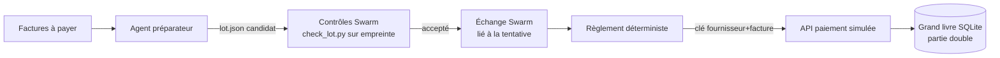

# Banc de facturation simulé — conception

> Document importé le 5 octobre 2026 depuis le dépôt Wattson, où le banc a été
> conçu (commit `53cf1b702`). Les chemins ont été adaptés à ce dépôt ; les règles
> d'exécution propres à Wattson (conteneur de développement, en-têtes, workflows)
> sont conservées comme historique et ne s'appliquent pas ici.

Date : 2026-10-05. Statut : conception validée par l'opérateur, non implémentée.
Usage : section « Transposition » (C5) et évaluation QR1/QR2 de l'article
scientifique sur le moteur déterministe Swarm
(`docs/publications/20261005-cursor-moteur/article-scientifique/PLAN.md`).

## Objectif

Mesurer, sur un processus à effet irréversible (paiement de factures
fournisseurs), ce qu'empêchent une clé d'idempotence seule, un contrôle par
appel, et le moteur Swarm complet, sous huit fautes injectées de façon
reproductible.

## Décisions prises

| Décision | Choix |
|----------|-------|
| Agents | Fournisseurs scriptés déterministes (`providers.json`), puis campagne réduite avec agents réels (Claude/Codex) |
| Passage de l'effet | L'agent propose un lot (`lot.json`, le candidat) ; Swarm le valide ; un règlement déterministe l'exécute après acceptation. L'agent ne touche jamais l'argent |
| Clé d'idempotence métier | `(fournisseur, n° de facture)`. Jamais l'identifiant de tentative : une tentative 2 reproduisant le lot paierait deux fois |
| Moteur Swarm | Inchangé a priori. Toute faute non reproductible sans modification du moteur est signalée, pas contournée |
| Emplacement | `benchmarks/billing/`, Python standard uniquement, hors application Wattson, exécuté sur l'hôte comme les tests Swarm ; pas d'entrée orchestrateur de recette |

## Architecture

Composants :

1. **Grand livre** (SQLite) : comptes fournisseurs + trésorerie, écritures en
   partie double. Invariants : écriture équilibrée, solde de trésorerie ≥ 0,
   facture payée au plus une fois, paiement ≤ plafond.
2. **API de paiement** (processus séparé) : déduplication par clé selon le mode
   (aucune / par tentative / métier) ; capacité « payer puis perdre la réponse ».
3. **Préparateur** : lit les factures, écrit `lot.json`. Scripté ou agent réel.
4. **Contrôles** : politique de validation automatique Swarm
   (`python3 check_lot.py`) : doublons, plafond, facture inconnue, montant
   négatif, bénéficiaire différent de la facture, solde suffisant.
5. **Règlement** : fournisseur déterministe (non LLM), tâche dépendante du
   préparateur ; consomme le lot par `exchange consume` (rejet des remises
   d'une tentative obsolète) ; appelle l'API avec la clé du mode courant.
6. **Harnais** : crée le travail, injecte la faute, relit grand livre et état
   Swarm, écrit une ligne JSONL par exécution.

## Facteurs expérimentaux

- **Condition** : B0 (harnais règle le lot directement, sans moteur) ;
  B1 (proxy devant l'API : plafond + liste blanche de factures, sans notion de
  tentative ni de fraîcheur) ; S (chemin Swarm complet).
- **Clé** : aucune ; par tentative ; métier.

Raison du croisement : éviter l'homme de paille. La clé seule protège contre
la répétition à l'identique, pas contre un paiement faux, périmé ou non validé.

## Fautes injectées

| # | Faute | Injection | Attendu en S (hypothèse) | Mécanisme |
|---|-------|-----------|--------------------------|-----------|
| F1 | Réponse perdue + rejeu | API paie puis coupe ; règlement réessaie | 1 paiement | clé métier, `event_id` |
| F2 | Deux lanceurs concurrents | deux conducteurs (scénario `dual` existant) | 1 préparateur, 1 règlement | lancement atomique, réservation |
| F3 | Crash autour du paiement | `kill -9` règlement entre appel API et enregistrement, redémarrage (scénario `restart`) | reprise sans second paiement | coordinateur durable |
| F4 | Lot modifié après validation | réécriture de `lot.json` après contrôles | règlement refusé, revalidation | empreinte du candidat |
| F5 | Environnement indisponible | grand livre inaccessible pendant le contrôle | pas de régénération du lot ; revalidation après rétablissement | diagnostic d'environnement |
| F6 | Budget épuisé | `max_tool_calls` bas + préparateur qui boucle | bloqué, jamais réussi, rien réglé | budgets fail-closed |
| F7 | Propriétaire expiré | conducteur figé (SIGSTOP) au-delà du bail, reprise par un second, puis réveil | l'ancien ne lance ni ne règle | mise à l'écart du propriétaire expiré |
| F8 | Rapport ancien relayé | lot de la tentative 1 présenté après la tentative 2 | remise refusée, obsolète | `exchange consume` lié à la tentative |

Point ouvert : F7 dépend de la possibilité de provoquer l'expiration du bail de
l'extérieur ; à vérifier avant implémentation.

## Mesures

Relevées dans le grand livre et l'état Swarm, jamais dans le discours des agents :

- Sûreté : paiements doublés ; paiements faux (montant ou bénéficiaire ≠
  facture) ; paiements issus d'un lot non validé ou périmé ; violations
  d'invariants.
- Honnêteté : tâche déclarée réussie alors que le règlement est absent ou partiel.
- Coût : durée, appels d'outils, reprises, réexécutions inutiles.
- Blocages à tort : lot correct refusé.

Volume : factices, 100 exécutions par case faute × condition × clé, graine
enregistrée ; réels, sous-ensemble, k = 5 par scénario (pass^k), modèle et
version figés, plafond d'appels fixé avant lancement.

## Gestion des erreurs du harnais

- Isolation complète par exécution (racine, grand livre, port, `.swarm/`).
- Marqueur d'injection horodaté ; faute non survenue → `INVALIDE`, exclue des
  taux, comptée et publiée par case.
- Délai par exécution → `DÉLAI`, ni succès ni échec.
- Chaque ligne JSONL : commit Swarm, version Python, graine, condition, clé,
  faute ; pour les agents réels : fournisseur, modèle, version CLI,
  consommation rapportée (absente = inconnue).

## Tests du banc

1. Unitaires : grand livre, API, `check_lot.py` avec lots piégés.
2. Canaris : chaque faute en B0 sans clé produit le défaut attendu au moins une
   fois sur N ; sinon l'injection est cassée et la case S ne prouve rien.
3. Contrôle négatif : sans faute, les trois conditions règlent correctement ; S
   ne bloque rien à tort.

## Livrables

- `benchmarks/billing/` : code + `README.md` (scénario, invariants,
  reproduction, limites).
- `docs/publications/20261005-cursor-moteur/banc/` : JSONL bruts + script de
  tableaux.

## Garde-fous et hors périmètre

- Données entièrement synthétiques générées par graine ; aucun secret
  fournisseur dans les journaux.
- Hors périmètre : TVA, devises, interface web, API bancaire réelle.
