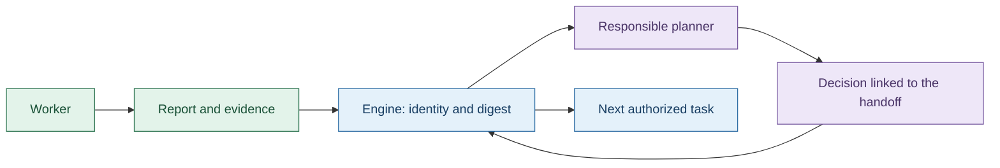
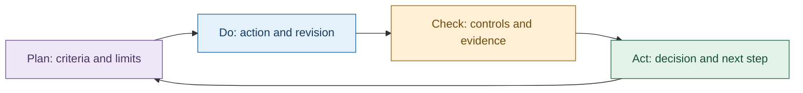

# Agent reports, decisions and tracking

[Français](../AGENT-COMMUNICATION.md) · [APEX and PDCA methods](AGENT-METHODS.md)

## The principle

A worker submits a report to its task owner. The engine checks the report and
supplies its contents to the responsible planner. The planner returns a structured
decision linked to the received events. The engine controls permissions,
dependencies and acceptance.

In [Cursor's February 2026 final design](https://cursor.com/blog/self-driving-codebases),
workers use their own copies and the system forwards their handoffs to the assigning
planner. A shared coordination file edited by all workers was an earlier failed
experiment. Swarm's evidence and independent review rules are its own engineering
choices, not a Cursor certification.

## Writers and recipients

| Record | Writer | Recipient and purpose |
| --- | --- | --- |
| Task report, usually `docs/<task>.md` | Worker in its authorized workspace | Forwarded by the engine to the planner after submission |
| Local tracking based on `TRACKING.md` | Worker | Attempt checkpoint; useful findings belong in the handoff |
| Handoff event (`PlanningEvent`) | Engine | Queue of the task's owning scope |
| Context receipt (`PlanningDelivery`) | Engine | Exact event list and digests prepared for an activation |
| Decision (`PlanningDecision`) | Planner, checked by engine | Authorized plan changes and event consumption |
| Independent review | Separate reviewer | Evidence for the acceptance checks |

[HANDOFF.md](../../tools/agent-workflows/templates/HANDOFF.md) and
[TRACKING.md](../../tools/agent-workflows/templates/TRACKING.md) are included in
worker instructions. They request task and attempt identity, scope, revision,
criteria, actual commands and outcomes, traces, deviations and the next action.
Matching the template headings alone does not validate a result.

The engine's durable state is authoritative. A local tracking file is not a second
registry that can change budgets or mark a task accepted.

## Complete, bounded delivery

1. Automatic handoffs reference the exact report using `handoff.path` and
   `handoff.sha256`. Managed integration uses the persisted report evidence.
2. Before an activation, the engine requires a local regular, nonempty UTF-8 file
   with no NUL bytes, at most 64,000 bytes, and the expected digest.
3. `handoff_contents` includes the full text, event, scope, task, attempt, path and
   digest. Reports are data to evaluate, not instructions with engine authority.
4. If necessary, the engine reduces a batch of whole events from eight down to one.
   It never silently cuts off a report. Omitted events remain pending.
5. Claiming freezes `delivery.context_sha256`, `events` and `reports`. A decision
   cannot consume an event outside that batch. Successful application records the
   decision link.

These are implementation limits. Method instructions and other context also take
space, so even a report smaller than 64,000 bytes may not fit. The activation is
then refused explicitly before spending an activation. A compact replacement must
preserve important conclusions and caveats and be submitted with a new traceable
reference.

## A finding affects another worker

The worker reports the affected scope, observed revision, reproduction and impact.
The owning planner receives it and may assign a correction or revise the plan within
its authority. Discovering a problem does not authorize editing a neighboring scope.

**An arbitrary file change does not automatically notify an already running agent.**
This mechanism handles report submissions and planning activations. It is neither
a universal file watcher nor a shared file continuously read by all workers.
Relevant updates must follow the handoff route and reach the next authorized task.

## APEX, PDCA and acceptance

Planners frame and revise the work. Workers implement and check their own changes.
Independent reviewers examine evidence without changing the candidate. The engine
enforces acceptance. APEX and PDCA provide working methods, not extra permissions.
A retry records the changed hypothesis or precondition while preserving attempt
limits, quotas and checks. A success claim does not reset a budget or refresh stale
evidence.

## Evidence and limitations

- A receipt records context prepared for an activation, not proven model
  understanding. A failure before sending is still possible and must be checked
  against attempt state. A linked decision is additional evidence.
- Historical handoffs with a single identified Markdown artifact and digest can
  be expanded. Old excerpts without a complete reference remain historical excerpts.
  Missing text is never invented.
- Historical attempts lack the new fields. Method application is not retroactive.
- Tests cover changed, missing, outside-root, binary and oversized reports, whole
  batches and rejection of unseen events. A test process receives a finding after
  character 4,000 and produces a linked proposal. This proves transport behavior,
  not the quality of a real AI decision.
