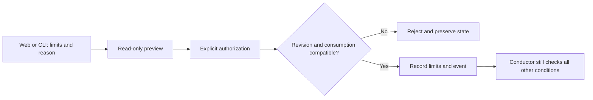

# AI budgets and costs

In **AI budgets and costs**, choose **Set budget**, enter a USD ceiling, an
estimated reservation per launch, its source and reference date. Preview the
change before saving it. Editing a field invalidates the preview. A stale form
is rejected: close it, refresh and review the current settings again.

A zero ceiling disables the estimated financial limit. Lowering the ceiling
neither stops active agents nor refunds existing estimates or reservations.
Other launch conditions still apply.

## CLI

```sh
swarm budget show WORK --json
swarm budget preview WORK --input budget.json --json
swarm budget apply WORK --input budget.json --json
```

Example request (illustrative amounts, not provider prices):

```json
{
  "schema_version": 1,
  "event_id": "budget-authorization-001",
  "expected_revision": 12,
  "budget": {
    "limit_usd": 10,
    "reserve_per_launch_usd": 2,
    "estimate_source": "Documented local estimate",
    "reference_date": "2026-09-23"
  }
}
```

Use the revision returned by `show`. Preview is advisory and does not write.
Apply checks the revision inside the transaction that records the authorization.
Concurrent edits cannot silently replace each other. Replaying the same event
with the same request does not consume another revision. The engine records
the operator and timestamp; submitted identity fields do not override them.

## Coverage and limitations

The estimate envelope covers execution, planning, page assistance and preparation.
**Independent reviews have a separate call limit; their monetary costs are not
included in this envelope.** Provider-reported costs remain separate from estimates.
Missing cost is unknown, not zero. This is not a guaranteed external billing cap.

Defaults for future missions are not included yet. Installation does not change
existing authorizations.

## Versioned model pricing

Choose **Model pricing** in **AI budgets and costs**. Add a provider, model,
three-letter currency, source, reference date and prices per million tokens.
The catalogue is project-wide. Blank means unknown; explicit zero means free.
No prices are prefilled or fetched automatically.

**Create a new version** retains previous prices. Concurrent edits are rejected.
**Estimate with this price** requires non-cached input, output, cache-read and
cache-write volumes separately. Missing prices for used categories yield an
unknown amount, not a partial total presented as complete. Do not include cached
input in the non-cached input count.

```sh
swarm pricing list --json
swarm pricing save --input price.json --json
swarm pricing estimate --input volumes.json --json
```

Example price (illustrative values):

```json
{"schema_version":1,"expected_digest":"DIGEST_FROM_LIST","rate":{"provider":"my-provider","model":"my-model","currency":"USD","input_per_million":2,"output_per_million":5,"cache_read_per_million":null,"cache_write_per_million":null,"source":"Documented local estimate","reference_date":"2026-09-23"}}
```

Example volumes:

```json
{"rate_version":"VERSION_FROM_SAVE","non_cached_input_tokens":1000000,"output_tokens":1000000,"cache_read_tokens":0,"cache_write_tokens":0}
```

This yields an estimated USD 7. The JSON includes the exact price version and
volumes, so later catalogue updates cannot change its meaning. Save the output
when needed as evidence; simulations are not recorded as mission expenditure.
No currency conversion is performed.

This catalogue does not automatically price historical provider events or alter
per-launch reservations. Verify the rates you enter. Subscriptions, tiers, cache
retention durations and discounts require appropriately selected rates; they are
not inferred. Prior versions cannot be deleted through this interface; further
writes are refused after 1,000 versions.

## Planning and review limits

In **AI budgets and costs**, open the planning and review limits form. Inspect
consumption and local allocations, enter new limits and a reason, preview, then
authorize. Editing invalidates the preview; stale revisions are rejected.
Consumption, history, failures and pauses are preserved.

Global ranges: 1–200 planning activations, 1–100 decisions, 1–100 review calls.
Limits cannot fall below consumption. Subplanner allocations remain unchanged
and continue to apply. Wait until planner sessions are released and running
reviews finish before changing these limits.

```sh
swarm quotas show WORK --json
swarm quotas preview WORK --input quotas.json --json
swarm quotas apply WORK --input quotas.json --json
```

Example request; use the revision and consumption returned by `show`:

```json
{"schema_version":1,"event_id":"quota-authorization-001","expected_revision":12,"limits":{"planning_activations":30,"planning_decisions":20,"review_calls":10},"reason":"Explicit authorization after reviewing remaining work"}
```

Without a configured reviewer, `review_calls` must be `null`. This operation does
not create a reviewer. The engine records the operator and time. Exact event
replays are idempotent; concurrent stale changes are rejected.

Saving does not directly launch an agent. An active mission may use the new
allowance on its next conductor pass. Failures remain failures and pauses remain
in effect. Production retries still require task-level reauthorization with
corrective instructions; this form does not bypass that protection.


