# Install Swarm

[Français](../../INSTALL.md) · [User guide](USER-GUIDE.md)

The supported installation path is Linux. Choose Docker for a dedicated runtime,
or a native binary to use tools already installed on your machine. The installer
does not request sudo, modify shell profiles or install Docker for you.

## Docker

Requirements: Git, Bash, a local accessible Docker Engine and Compose v2 with
`up --wait`. Building downloads images and dependencies.

```sh
git clone https://github.com/mo0ogly/swarm.git
cd swarm
mkdir -p "$HOME/projects/my-project"
./install.sh --project "$HOME/projects/my-project"
```

Open the session URL printed after startup. Retrieve it again with:

```sh
docker compose --env-file deploy/install.env logs --tail 20 swarm
```

The image contains the compiled Swarm binary with embedded web assets, Node.js,
Python, Git, curl and TLS certificates. It runs with your UID/GID. The project is
mounted at `/workspace`; `/home/swarm` persists agent tools and authentication.
**No agent program, model weights or AI key is bundled.**

Options:

```sh
./install.sh --project "$HOME/projects/my-project" --port 18788 \
  --agent-home "$HOME/.local/share/swarm/agents-demo"
./install.sh --project "$HOME/projects/my-project" --no-start
docker compose --env-file deploy/install.env up -d --wait
```

`deploy/install.env` is private and ignored by Git. The installer refuses to
replace an active Compose service. Stop missions and agents deliberately before
reinstallation.

### Network access

Swarm listens on loopback only. Compose uses `network_mode: host`, without a
published `ports:` mapping. This recipe targets a local Docker Engine on Linux;
Docker Desktop, Windows and remote Docker engines are not qualified here.
Do not change the listener to `0.0.0.0`: Swarm refuses it.

For a remote Linux server, run this from your workstation:

```sh
ssh -L 18787:127.0.0.1:18787 user@server
```

Then open the session link at `127.0.0.1:18787` locally. Keep session links private.

## Configure AI providers

For text APIs, open **AI and connections → Add an AI connection**, enter a compatible
`/chat/completions` service URL, exact model ID and any required key. Test and save.
These connections can prepare, plan and review; they do not automatically gain
file editing tools.

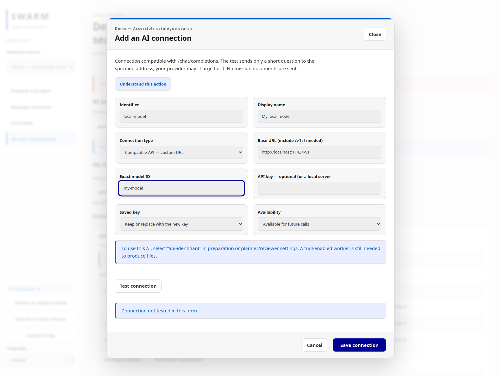

*Actual capture of the completed form (example local provider, empty key field): neither tested nor saved; "Connection not tested in this form" is shown. No key is visible. Select **Test connection** then **Save connection**; saving does not prove the service responds.*

For implementation, install a tool-enabled agent inside the container and
follow its publisher's authentication instructions:

```sh
docker compose --env-file deploy/install.env exec swarm bash
```

For npm-distributed tools, install the official package and a chosen version with
`npm install -g PACKAGE@VERSION`. The npm prefix `/home/swarm/.local` persists and
its `bin` directory is on PATH. Additional system dependencies belong in a derived
image; installation only in a container's writable layer does not survive recreation.

Host-installed commands are not automatically available in the container.
`providers init` discovers known commands only when it creates the configuration;
it does not overwrite an existing file. After adding a provider, review and update
`/workspace/.swarm/providers.json`. The `skynet_harness` model adapter recognizes
that executable when installed and configured; recognition is not installation
or a full qualification test.

```sh
docker compose --env-file deploy/install.env exec swarm swarm --root /workspace providers show
docker compose --env-file deploy/install.env exec swarm swarm --lang en --root /workspace work list
```

## Native installation

Requirements: Linux and a suitable Go toolchain; see `go.mod` for the declared
version. From the checkout:

```sh
./install.sh --mode native --bin-dir "$HOME/.local/bin"
"$HOME/.local/bin/swarm" --root /path/to/project init
"$HOME/.local/bin/swarm" --root /path/to/project providers init
"$HOME/.local/bin/swarm" --root /path/to/project web 127.0.0.1:18787
```

The native installer builds and installs the binary; it does not start the server.
Agent programs must be installed and authenticated separately. Web assets are
embedded; Node.js is needed to rebuild frontend bundles, not simply to run Swarm.

## Persistence, shutdown and upgrades

Before shutdown or upgrade, inspect active missions and agents. Pausing prevents
new starts but does not stop agents already running. Confirm process termination
before backing up or replacing the environment.

Back up the entire project state, referenced reports/evidence and the persistent
agent home. Exports of individual missions are not a replacement for a full backup
of configuration and authentication. Avoid copying a live SQLite database without
its associated transactional state; use a stopped environment for a filesystem backup.

After stopping mission activity:

```sh
docker compose --env-file deploy/install.env stop swarm
docker compose --env-file deploy/install.env down
```

The bind-mounted project and agent-home directories remain. Do not delete them
as part of a routine restart. To upgrade, back up first, update the checkout and
run the installer again. Storage migrations can prevent older binaries from
opening upgraded state; restore a matching backup rather than forcing a downgrade.

## Troubleshooting and verification

- Docker unavailable: check `docker version` and access to the local engine.
- Port occupied: use another `--port`; do not stop an unrelated service.
- Session refused: reopen the link from this server's logs.
- Agent unavailable: check inside the runtime, not only on the host.
- Permission failure: check actual project ownership and the agent's permissions.
- Empty connection list: add your API or install/configure your agent.

```sh
make build test smoke
make test-install
make test-process
```

The installer recipe requires Docker and a checkout without an existing
`deploy/install.env`. It uses isolated test projects. Process recipes use
simulated deterministic agents without paid model calls. They do not validate
your real provider or your project.

### SQLite initialization and migrations

No database is shipped in Git or the Docker image. `swarm init` creates
`PROJECT/.swarm/state.db` with permissions `0600`. The server applies supported
migrations at startup; inspection commands refuse to silently migrate an older
database. For CLI-only use, after stopping old processes and taking a backup:

```sh
docker compose --env-file deploy/install.env run --rm --no-deps swarm init
# Native installation:
swarm --root /path/to/project init
```

Never change `PRAGMA user_version` to force a database to open. Back up all of
`.swarm/`, not only `state.db`: reports, workspaces and configuration also matter.
Automatic backups from some migrations do not replace a complete backup.

### Verifiable backup and rollback

Take the backup after stopping missions and agents, then stop the server or
container. A mission export does not replace the complete backup: it omits part
of the configuration, authentication and workspaces. This native example keeps
all of `.swarm/` without copying a live SQLite database:

```sh
install -d -m 700 /srv/backups/swarm-before-upgrade
tar -C /path/to/project -cpf \
  /srv/backups/swarm-before-upgrade/project-swarm.tar .swarm
tar -C "$HOME/.local/share/swarm" -cpf \
  /srv/backups/swarm-before-upgrade/agents.tar agents
sha256sum /srv/backups/swarm-before-upgrade/*.tar > \
  /srv/backups/swarm-before-upgrade/SHA256SUMS
```

Adapt the second path to `SWARM_AGENT_HOME` in `deploy/install.env`. Run
`sha256sum -c`, keep the archives outside the project, and only then upgrade.
After installing the new binary, with no old server still active:

```sh
swarm --root /path/to/project init
swarm --root /path/to/project --json work list
swarm --root /path/to/project --json automation list
swarm --root /path/to/project --json version
```

A v26 to v27 migration also creates a private
`.swarm/state-pre-v27-*.db` copy. That automatic file excludes the rest of the
project state and does not replace the complete archive above. An inspection
command rejects old storage with `storage_upgrade_required` instead of silently
migrating it.

For rollback, stop the new server and all its agents. Preserve the failed state
under another name, restore the complete archive, agent home and binary that
belong to the same snapshot, then verify hashes before restart. Never change
`PRAGMA user_version`, and never run an old binary against already migrated data.

### Compatible mission archives

These commands use the public archive format; they are not a full backup:

```sh
swarm --root /path/to/project export WORK_ID --output mission.zip
swarm --root /other/project import --input mission.zip
swarm --root /other/project --json automation list
```

Import refuses to overwrite an existing mission and keeps evidence under
`.swarm/imports/`. Imported programs remain disabled: review their target,
schedule, limits and provider before explicitly enabling them. Archive format 1
(mission without automation state) and format 2 (automation included) are
accepted by this candidate; unknown, altered or unsafe-path archives are rejected.

### Documented-candidate screenshots

D01 screenshots of the graph, conflicts/journal and programs are
[listed with hashes in the D02 dossier](../D02-dossier.md#reused-captures).
They cover French/English and State/dark themes on the October 6, 2026 candidate.
D02 reuses them by hash: it does not claim a new browser run or a qualified real
provider.

## First mission: from requirements to launch

1. Open the link printed by the server, then choose **Prepare a project**.
2. Save your requirements and choose an AI configured under **AI and connections**.
3. Review and adopt the proposed brief, then request a plan. Answer open decisions before checking the plan.
4. Review the planner, workers and independent reviewer, including their project directory, models and limits.
5. Choose how results are accepted. Human review requires acceptance after examining evidence; automatic acceptance requires commands that actually prove each criterion.
6. Run the pre-launch checks and authorize the team. Open the mission dashboard, select the launch action, review its summary and confirm.
7. Confirm that an attempt is active. Saved tasks do not mean an agent is running.

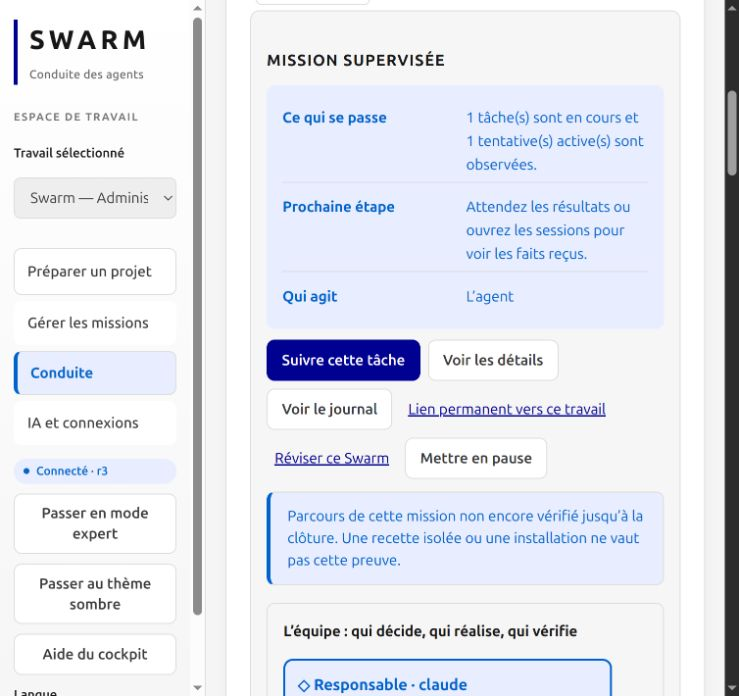

Actual French-interface capture, September 29, 2026: the Administration mission was launched through the web screens. This demonstrates launch, not completion of all eight tasks. Results still require review.

### Four states not to confuse

| State | What you see | What it proves | Capture |
| --- | --- | --- | --- |
| Completed form | Entered values and a "current values" preview before confirmation | Nothing is written: the revision is unchanged | `admin-en-etat.png`, `admin-en-sombre.png` |
| Saved configuration | Revision 1 in the scope and in the history, with author and reason | Values apply to **future starts** | `admin-saved-en-etat.png`, `admin-saved-en-sombre.png` |
| Actual launch | Task in progress, active attempt on the dashboard | An agent started; no result, no acceptance | `mission-lancee-fr.png` (French UI) |
| Closed mission | All results validated against current evidence, root responsibility closed | Required results were accepted; this is more than process termination | [October 1 capture](../screenshots/en/mission-complete-en.png) |

**Current workflow:** team authorization and dashboard launch are separate steps. If nothing starts, read the reported cause before retrying.


## Configure limits before starting agents

Open **Administration** in the cockpit (switch to expert mode if it is hidden), then select the project, mission, role or task scope. Inherited values differ from explicit scope values: **0 means inherited**, not unlimited.

1. Select **Configure this scope** or **Edit this scope**.
2. Enter delays in seconds, tool-call counts and repetition/error limits. Provide a reason.
3. Review the proposed effect and confirm the save. A filled form is not a saved configuration.
4. Check the new revision in the history. Restoring a previous revision creates a new configuration entry; it does not erase consumed operations.
5. Check effective limits for the task before its next launch. An attempt already running keeps the settings assigned when it started.

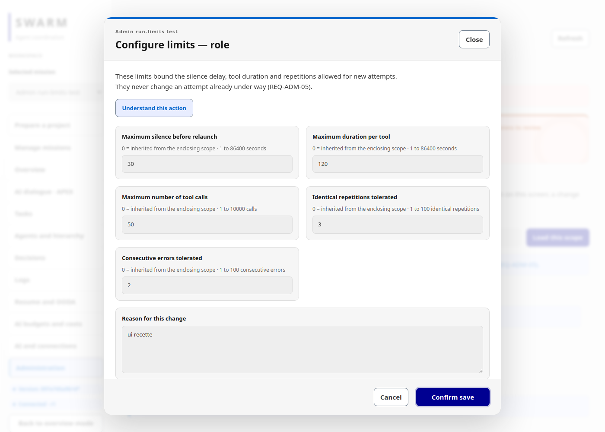

*Actual screenshot from an isolated local test: a completed form before confirmation, not proof of persistence or launch.*

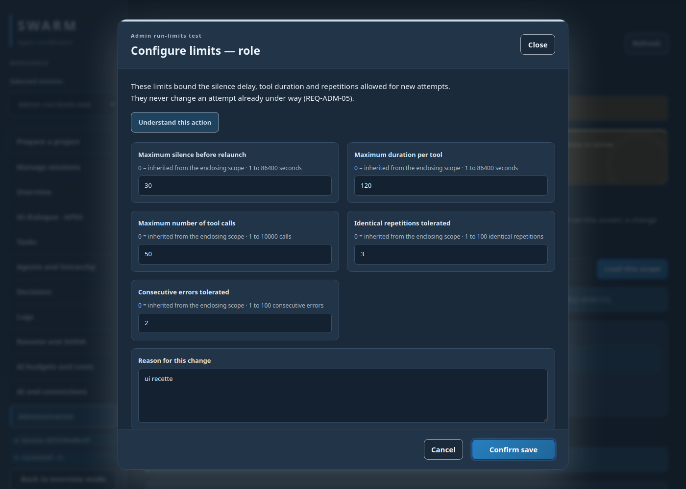

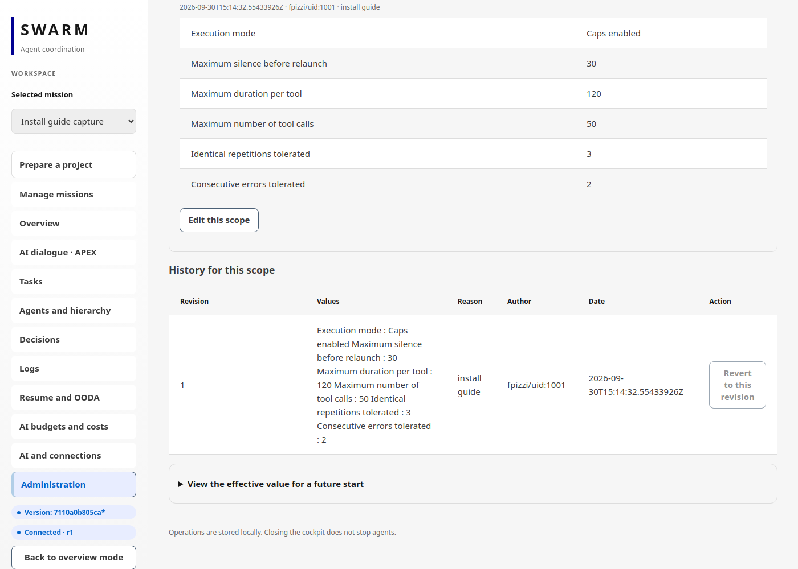

*Actual capture, isolated temporary root, September 30, 2026: after confirmation, revision 1 is read back by the CLI (`run-limits show`) and listed in the history. This is a saved configuration, not a launch. The server version badge is visible in the left rail.*

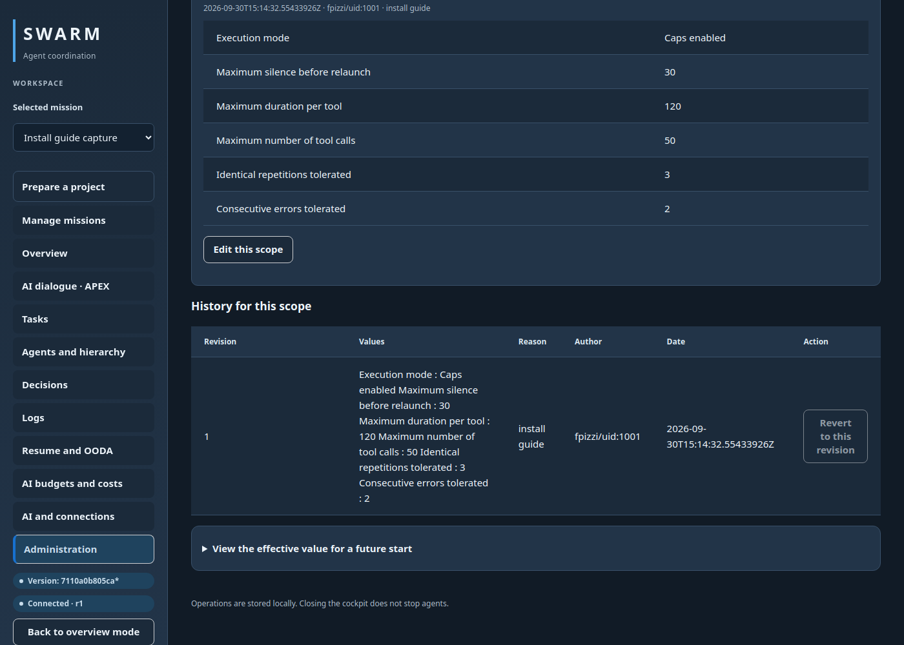

When explicitly authorized for a mission, **observation mode** retains counters while removing the execution cutoffs covered by that mode. It does not remove provider quotas, review requirements or acceptance conditions. It cannot bypass a provider 429 response. **AI budgets and costs** distinguishes reported costs from unknown costs; unknown does not mean zero.

### Read the same settings from the CLI

Read-only examples; replace the project path and identifiers with your own:

```sh
swarm --root /path/to/project run-limits show project - -
swarm --root /path/to/project run-limits history project - -
swarm --root /path/to/project run-limits effective MISSION_ID worker TASK_ID
```

A dash represents an empty value. `apply` and `rollback` use a JSON file, an expected revision and an event identifier. See the [user guide](USER-GUIDE.md) for the general workflow. The CLI and web use the same engine rules.

## Server version and links to deleted missions

First inspect the binary without initializing a project or opening SQLite:

```sh
swarm version
swarm --version
swarm --json version
```

The two text commands are aliases. Stable JSON places identity under `binary`:
`version`, full `commit` SHA, `modified`, UTC `build_date` and `provenance`.
`devel` is the truthful value when no verified release tag was injected;
`unknown` in text and `null` in JSON mean unavailable data. Do not turn either
value into an assumed release.

`make build`, `./install.sh --mode native` and the Dockerfile all call
`build.sh`. Check each build path after construction:

```sh
make build
./bin/swarm --json version

./install.sh --mode native --bin-dir "$HOME/.local/bin"
"$HOME/.local/bin/swarm" --json version

./install.sh --project "$HOME/projects/my-project" --no-start
docker compose --env-file deploy/install.env run --rm --no-deps swarm --json version
```

An explicit release requires a SemVer version, a 40-character SHA, a known
modified state and a UTC date; `SOURCE_DATE_EPOCH` supports reproducible builds.
The Docker build accepts `SWARM_VERSION`, `SWARM_COMMIT`, `SWARM_MODIFIED` and
`SWARM_BUILD_DATE` arguments. Do not advertise a release until its tag and
metadata have been checked.

**Version and what's new** is available in both cockpit and preparation. The
dialog keeps the **running binary** separate from **local sources**: `*` in the
summary describes the binary at build time, while local checkout dirtiness is a
separate source fact. Comparison makes no network request. The embedded release
list is currently empty because no release is declared; the UI says so and links
to the complete GitHub commit history. Escape closes the dialog and restores
focus to its trigger.

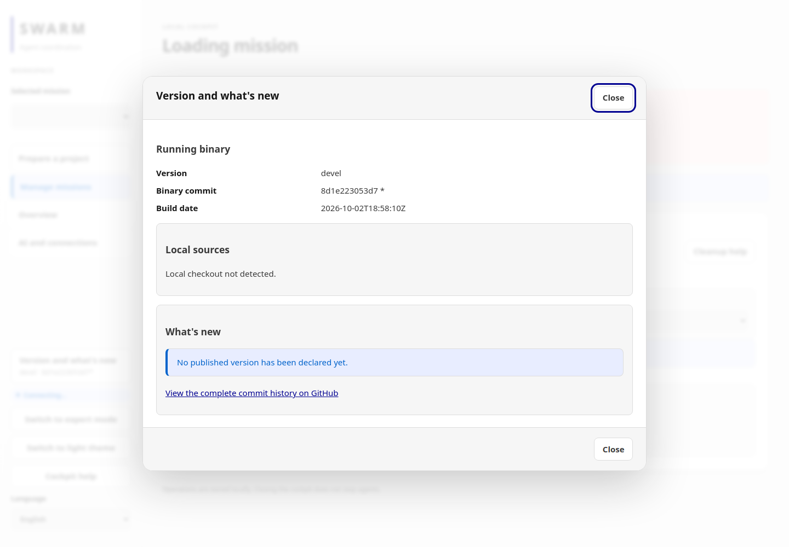

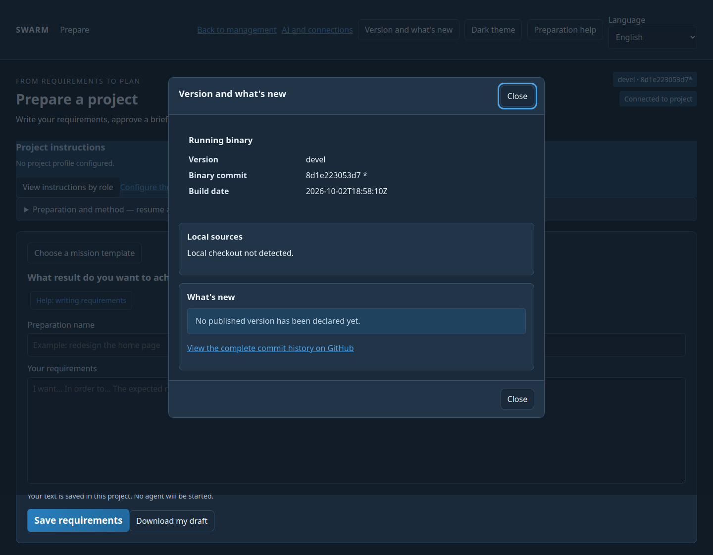

The [ten-capture fingerprint manifest](../screenshots/version-history/manifest.json)
covers cockpit/preparation, FR/EN, State/dark, loading and unavailable states.
These are isolated local-journey captures, not proof of a real mission.

After `make build`, installation or a Docker rebuild, restart the server/container
and inspect `version` again. A `git pull` or build does not replace the binary of
an already running process.

A link to a deleted mission shows a clear message and the **Choose a mission**
action, which opens mission management.

## Read the summary and share a diagnostic

Before authorization, the summary shows the owner, workers, reviewer and their resolved models. Plan and planning/review-role caps are separate from execution settings in Administration. Missing prerequisites explain what you need to complete.

**Check before launch** starts no agent. **View check details** opens technical information after the check; Escape or **Close details** returns to the form. Only the subsequent authorization permits eligible launches.

For an interrupted attempt, **Copy diagnostic** prepares a summary with its cause, attempt identifier, version and available action. Technical traces and session links are excluded from the prepared text. If clipboard access is denied, an explicit message tells you to select and copy the displayed text. Review anything you share.

### When a task stops progressing

| Visible state | Next action |
| --- | --- |
| Provider unavailable or quota 429 | Wait until the reported time or configure another authorized provider; raising Swarm limits does not restore provider quota. |
| Report exists but task is not validated | Examine criteria, executed checks and review; a file alone is not acceptance. |
| Configuration changed after checking | Run launch checks again against the new settings before authorization. |
| Active agent without a final result | Open its session and inspect activity; distinguish activity, a result and validation. |

Administration screenshots come from `tests/run_limits_admin_ui.cjs`. Summary and diagnostic checks are reproducible with `tools/verification/t7_prelaunch.py`. They demonstrate controlled local workflows, not autonomous completion by a real provider.


### Summary and diagnostic screenshots

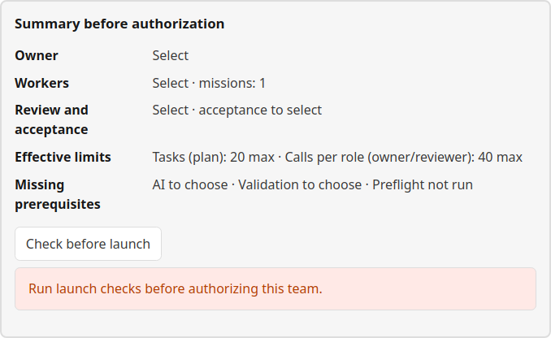

*Isolated local test: configuration still incomplete. This is neither a saved team nor an active agent.*

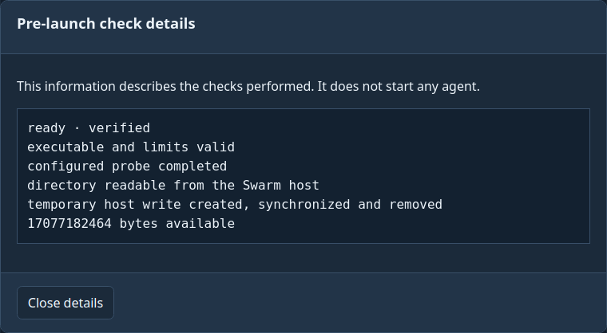

*Technical details are available on demand; closing the dialog returns to the summary.*

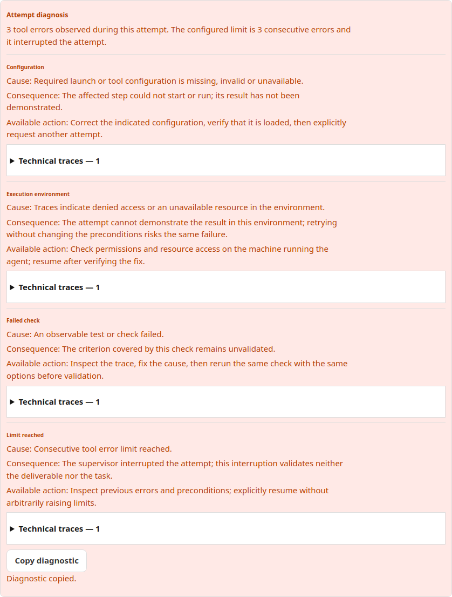

*Errors are deliberately generated by the test fixture. “Diagnostic copied” uses a mocked OS clipboard in this test; this is not evidence of an external share.*

## Errors encountered and how they were resolved

Actual observations from September 29, 2026 (Administration mission driven from the screens). Details: [RETEX](../RETEX-ADMIN-PREPARATION.md) (French).

| Error or friction | Resolution |
| --- | --- |
| Team authorization does not start agents | Then select **Launch mission** on the dashboard and confirm an attempt is active. |
| Automatic validation refuses the plan | It needs one check command per criterion, documentation criteria included: add real commands or choose human review. No placeholder check. |
| A task reports requirements as "undefined" | The context supplied was incomplete: revise the plan to include the definitions, then resume. Consumed attempts remain counted. |
| Independent review interrupted (quote not found) | This is not a validation. Resume the review from the cockpit on the same report; do not force acceptance. |
| Owner gave no final answer before its deadline | Inspect the session activity; resuming does not silently raise limits. |
| "Submit report" button blocked the review | Engine defect, fixed; repair goes through the same button, without editing the database by hand. |

Never edit `.swarm/state.db` directly to work around an error.

## Choose a method after installation

In **Prepare with AI**, use the methods by their user-facing purpose:

- **Analysis and planning**: clarify requirements and propose a plan.
- **Guided workflow — prepare an improvement**: define a change, its criteria and tasks.
- **Examine and improve — prepare the assessment**: prepare the examination scope, risks and checks.
- **Diagnose and fix a problem**: prepare a diagnosis from known facts.

Preparation performs no correction and launches no agent. **Build the
specification** and **Examine the specification** support requirements writing
and gap analysis in native sessions; they are not two extra preparation buttons.

Check the catalogue in the same project root used by your server:

```sh
swarm --root /path/to/project --json prepare methods
```

Each method reports its availability. Execution-role guidance is embedded in the
binary; **preparation** methods are read from the controlled project. In Docker,
that root is `/workspace`. Installing an AI provider, making a method available
and authorizing a plan are distinct steps. Installing the binary alone does not
copy preparation resources to another project. See the [method catalogue](AGENT-METHODS.md).

## Recognize the result after launch

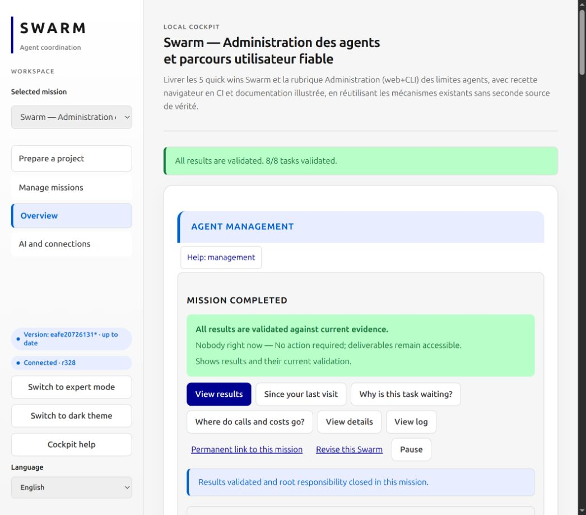

*October 1, 2026 capture after closing the Administration mission with human
interventions. It supplements the historical September 29 launch capture; it
is not a new Docker installation test. User-authored mission names remain in French.*

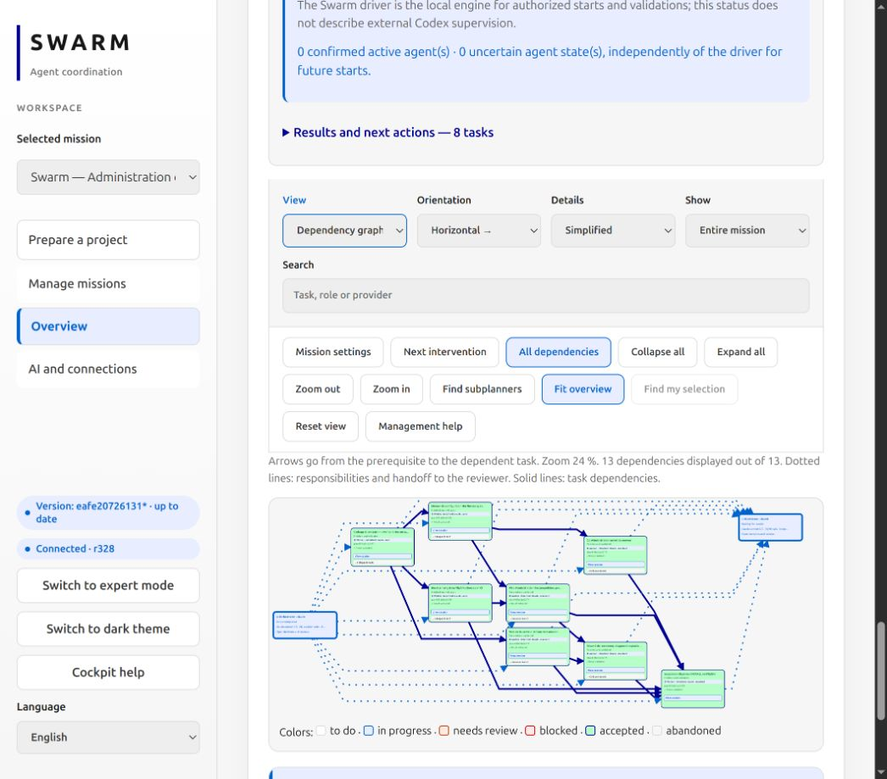

*Orchestrator on the left, tasks in the middle and reviewer on the right. Solid
arrows show dependencies; dotted arrows show responsibilities and reviewer
handoffs. The overview reduces zoom to show the whole graph.*

The dated September 30 Administration form captures remain isolated tests of
the states described in their captions. The new completion captures show a
later workflow stage; they do not qualify every provider's operation.

For recovery or revision conflicts, see the [engine recovery conditions](ENGINE-RECOVERY.md).

## Target project instructions

After installation, configure instructions from the target project root: [role-specific project profile](PROJECT-PROFILE.md). Configuration does not start a mission.

## Agent Go cache — fix being delivered

An agent may be able to read the global Go cache but not write to it inside its
sandbox. A `read-only file system` error targeting that cache does not prove a
code or test failure: compilation may not have started.

The updated engine prepares a reusable cache at
`<workspace>/.swarm/cache/go-build`, checks write access before starting the
worker and passes `GOCACHE` to the provider. For Codex, it also explicitly sets
this value in the command environment. The agent journal records the prepared
path. This covers execution, terminal and dialogue sessions; planners and
reviewers do not receive this setting.

The global cache is preserved. Symbolic links and files replacing cache
directories are rejected. The local cache survives attempts: allow disk space;
there is no automatic purge.

This fix does not grant additional sandbox permissions or resolve socket,
network or Docker daemon access failures. After updating, restart the Swarm
server and check a new attempt's journal and `go env GOCACHE` in its environment.
A `git pull` or a build alone does not update an already running server.

As of October 2, 2026, the full Go suite and targeted race tests pass in the fix
checkout. The mission server now runs this fix. A real Codex worker confirmed the path
with `go env GOCACHE` and built the candidate without manually adding this
setting. The fix has not been published yet.

### D02 candidate screenshots

The fresh October 6 recipe binds the product candidate to [light graph](../screenshots/graph-delivery-d02/en-etat-graph.png), [dark graph](../screenshots/graph-delivery-d02/en-sombre-graph.png), [light programs](../screenshots/graph-delivery-d02/en-etat-programs.png) and [dark programs](../screenshots/graph-delivery-d02/en-sombre-programs.png). These are isolated journeys with no real provider, following migration and rollback checks. See the [D02 dossier](../D02-dossier.md#captures-d02-fraîches--6-octobre-2026).
