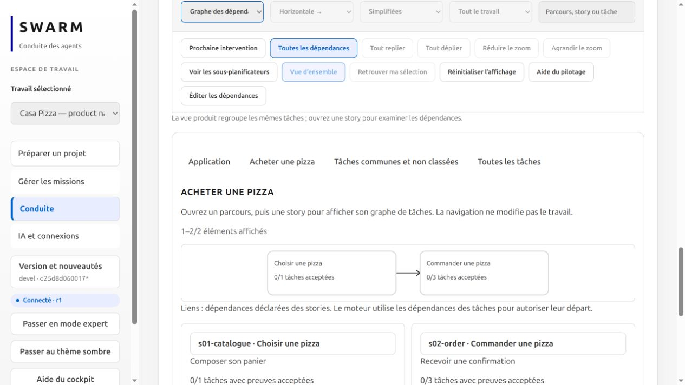
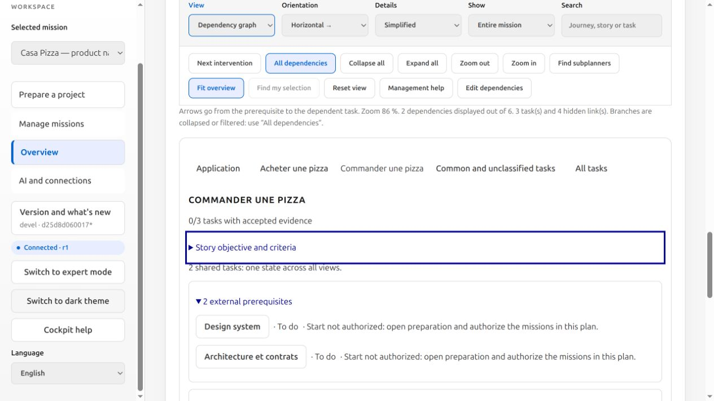
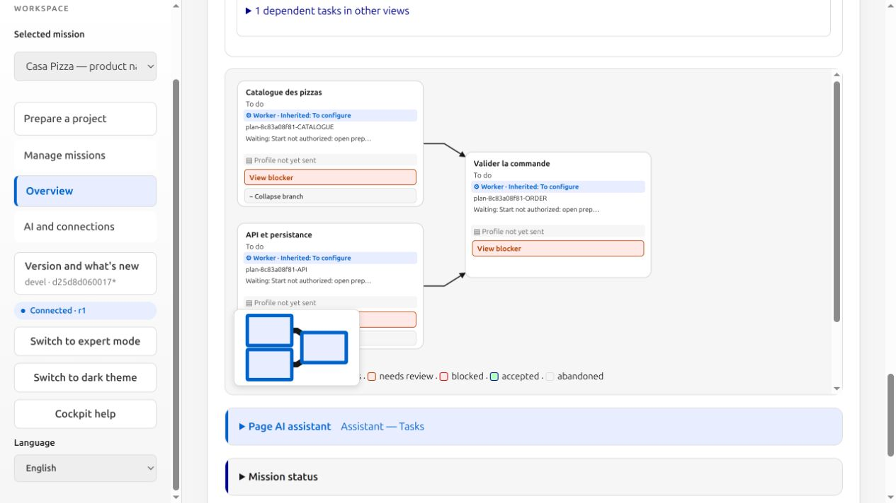

# KS product methods and journey graphs

Swarm ships three role-specific methods: `product-planning`, `product-delivery`
and `product-review`. Application, interface and new-product templates select
`ks-product`. Canonical sources and generic document templates are versioned and
embedded; a new project does not need its own `.claude` directory.

## Migrated logic

The `ks-*` commands are compatibility entry points to the adapted methods:

| Stage | Preserved logic |
| --- | --- |
| PRD | Existing/greenfield/replacement mode, users, problem, operating context, value loop, scope/exclusions, measurable success; verified optional external reference |
| Journeys/stories | End-to-end user value, stable IDs, observable criteria, dependencies, complexity; split a 5, document a 4's risk |
| Story review | PRD coverage, scope leaks, overlaps, criteria and executable order, distinct review context and retained findings |
| Architecture | Inspect existing architecture first; smallest justified delta; explicit greenfield choice and ADR before scaffolding |
| Design system/screen | Existing or explicit direction, tokens/components, four states, accessibility; required system and story; external brief waits for its returned result |
| Research | Current code, exact symbols/signatures, callers, persistence, impact, checks and open questions |
| Plan | Bounded owned tasks, dependencies, evidence, gates, rollback, explicit adoption and return to Plan on drift |
| Implementation | Authorised slice, meaningful failing check where relevant, actual components, scope checks and handoff |
| Review | Same candidate and test evidence, verified APIs, design compliance, regressions, severity and missing evidence |
| Delivery | Explicit authority, fresh checks/review, existing PR handling, branch protections and proven merge/deployment |
| Status/help/orchestration | Inspect real state, preserve IDs/history, report unresolved gates without inventing results |

Sources: [canonical skills](../../.claude/skills) and
[generic document structures](../../tools/agent-workflows/templates/ks).
No private application instructions, provider configuration or credentials are copied.

### Role adaptations

Swarm planners have no execution tools: actual repository research and document
production belong to authorised worker tasks. Its independent reviewer inspects
supplied evidence without tools and must not claim to rerun tests. Executable
checks and integration belong to the engine. An authorised native review session
can run its own checks.

Markdown `validated: yes`, `Stories ready` or `Ship allowed` cannot replace engine
adoption, fresh evidence, review policies or dispatch authority. The pack supplies
methods; it is not a new scheduler automatically running eleven KS commands.
All three methods reach product preparation; launched roles receive their complete
assigned method with a workflow fingerprint. This proves framing delivery, not
model obedience or autonomous delivery of a whole application.

## Frontend, backend and shared work

A story delivers user value, such as placing an order. Frontend, API, persistence
and tests are tasks within that slice rather than separate technical-layer stories.
Architecture, design system and contracts can be common tasks. Screen design covers
exact fields/actions, empty/loading/error/success, keyboard, responsive layouts and
feedback; implementation uses actual application components instead of copied mockups.
A replacement explicitly defines existing behaviour, parity scope, preserved data,
migration checks and rollback. Never claim a complete replacement from framing alone.

## One graph at a time

1. **Application:** aggregate map and searchable journey list, 20 items per page.
2. **Journey:** its stories and declared story dependencies.
3. **Story:** the existing task graph filtered by explicit mappings, with objective,
   criteria, shared-task notice, external prerequisites and dependent tasks elsewhere.

Shared tasks keep one ID and one state. Counts use current engine validation;
they do not independently certify story or product completion. A story without
tasks is explicitly unplanned. Unassigned tasks are shown under **Common and
unclassified tasks**; a foundation role is never inferred from a title.
**All tasks**, **All dependencies** and **Find my selection** restore access to work
outside the current view. Navigation does not mutate a mission or create agents.

Journey links aggregate actual task dependencies and can be bidirectional without
a task cycle. Story links describe the roadmap; executable prerequisites must also
appear in task `depends`. A visual link never authorises dispatch.

## Plan structure and compatibility

Action-plan JSON version 1 accepts optional `product`, containing `mode`
(`existing`, `greenfield`, `replacement`), `journeys` and `stories`. Each journey has
`id`, `title`, `goal`, `story_ids`. Each story has `id` (`sN-slug`), `title`, `user`,
`value`, `criteria`, `complexity`, `depends`, `task_ids`; a complexity of 4 also needs
`risk`. Task IDs reference local IDs in the same plan. A task or story may be shared.

The engine rejects missing/duplicate references, story cycles, invalid IDs, absent
criteria, complexity 5 and a 4 without a risk. Adoption stores canonical task mappings.
Contract changes invalidate linked tasks and dependents through existing revision
rules; renaming a journey label does not alter execution evidence.

Optional task `phase`: `frame`, `requirements`, `stories`, `story-review`,
`architecture`, `design-system`, `research`, `design`, `plan`, `implement`, `review`,
`deliver`. Existing plans remain compatible. The limits of eight tasks per action
plan and 16,000 bytes per document remain unchanged. Use bounded increments; future
stories can remain unplanned. Legacy task titles never fabricate stories.

See the [French guide's JSON example](../PRODUCT-WORKFLOW.md#ajouter-la-structure-au-plan).

## Reproduce the isolated recipe

```sh
sh build.sh /tmp/swarm-product
python3 tests/product_recipe.py /tmp/swarm-product /tmp/swarm-product-empty-project
/tmp/swarm-product --root /tmp/swarm-product-empty-project web 127.0.0.1:18844
```

Use a free port and an empty root. Open the local session link, then Application →
Acheter une pizza → Commander une pizza. The explicit fixture creates 25 journeys,
26 stories and six launch-held tasks through public CLI operations. No AI call,
agent execution, publishing or acceptance is performed; this recipe does not
demonstrate autonomous full-application delivery by a real provider.

With `ks-product`, the `product` structure is required before plan validation and adoption. Missing structure preserves the draft without marking it ready. It remains optional for legacy methods.

## Verified views

Isolated UI recipe screenshots: no model call or task execution; pizza data only exercise the views.






