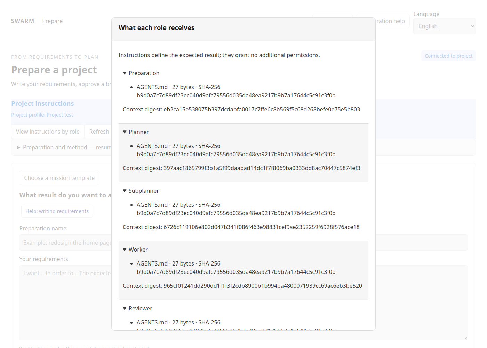
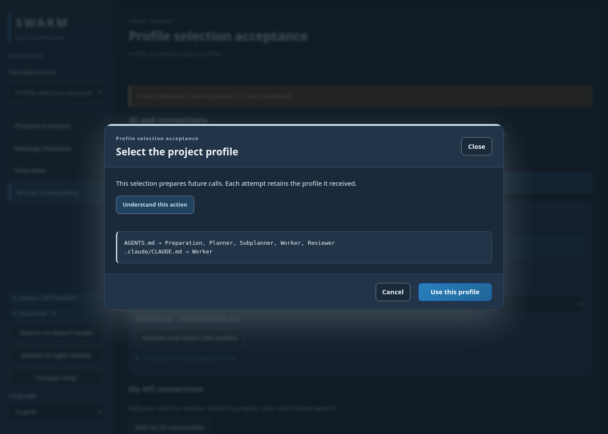
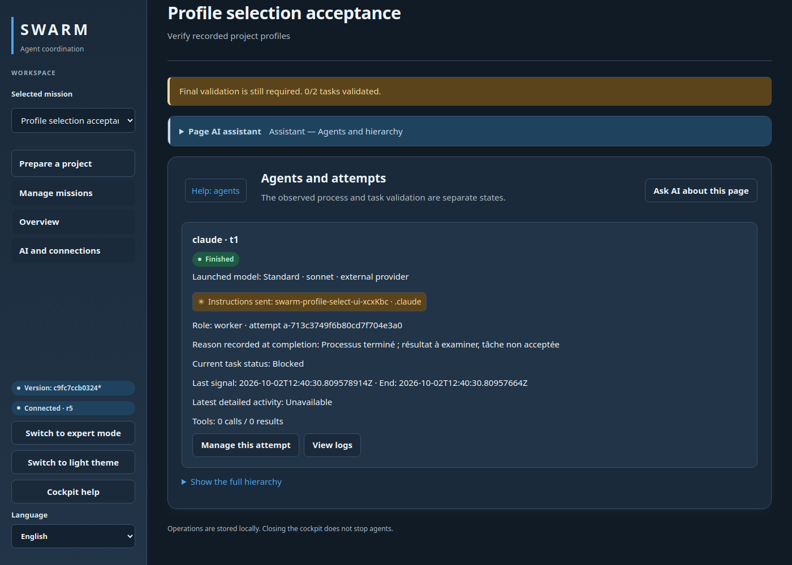

# Project instructions by role

[Français](../PROJECT-PROFILE.md)

Swarm can pass repository instructions to preparation, planners, subplanners,
workers and independent reviewers. This lets you prepare a mission in the web UI
with your project rules, without asking an external assistant to copy them.

## Configure a project

Use the **target project** as `--root`. The explicit, versionable configuration
lives in `swarm.project.json` at that root. No profile is enabled automatically.
Create `profile-request.json`:

```json
{
  "profile": {
    "version": 1,
    "name": "My project",
    "instructions": [
      {
        "path": "AGENTS.md",
        "roles": ["preparation", "planner", "subplanner", "worker", "reviewer"]
      },
      {
        "path": ".claude/CLAUDE.md",
        "roles": ["worker"]
      }
    ]
  },
  "expected_sha256": ""
}
```

```bash
swarm --root /path/to/project project-profile apply --input profile-request.json
swarm --root /path/to/project project-profile check
swarm --root /path/to/project --json project-profile show
swarm --root /path/to/project web 127.0.0.1:18789
```

In **Prepare**, open **View instructions by role**. The dialog shows file paths,
sizes and SHA-256 hashes, without exposing file contents. Escape closes it and
restores focus. **Refresh instructions** reloads the profile without starting an
agent. For custom profiles, use the CLI. To select detected project instructions, open
**AI and connections → Project instruction profile**, select `.claude`, review the
files and role allocation, then confirm **Use this profile**. Missing profiles cannot
be selected. `.agents/AGENTS.md`, `GEMINI.md` and `.gemini/GEMINI.md` can also be
selected when present. This imports instructions, not a Gemini runtime adapter.

To update an existing profile, set `expected_sha256` to
`roles[0].profile_sha256` from JSON output. A stale hash refuses the write.
`show` and `check` do not call an AI provider.

## Suggested allocation

| Role | Useful sources | Sources and headers limit |
| --- | --- | --- |
| Preparation | Goal, shared rules, field guide | 16,000 bytes |
| Planner and subplanner | Architecture, scope, shared rules | 16,000 bytes per role |
| Worker | Shared rules and technical instructions | 32,000 bytes |
| Reviewer | Acceptance criteria and shared rules | 16,000 bytes |

Every role needs at least one source. Sources must be UTF-8 `.md` or `.txt` files
inside the project. Links outside the root are refused. Missing, invalid or
oversized files block submission with no truncation. Other prompt limits still
apply.

Preparation turns and attempts retain metadata for the transmitted context.
Before starting, the engine checks those hashes; changed instructions require a
fresh context. A passed independent review cannot authorize current acceptance
if its instructions have changed. Historical records remain readable. This check
does not prove model compliance: evidence and result verification remain necessary.

## Claude configuration is separate

Instructions grant **no additional permissions**. Planners and reviewers keep
their isolated, tool-free sessions. A Claude worker launched in the project may
use the native Claude configuration applicable to its workspace; that configuration
is not copied to other roles.

The dialog only reports the presence of `.claude/settings.json`,
`.claude/settings.local.json` and `.claude/glm-settings.json`. It neither reads their
values nor proves they were loaded. A GLM settings file requires explicit provider
configuration; its presence does not select a GLM model.

Select reviewed, secret-free documents. JSON permission and authentication files
cannot be instruction sources. A detector refuses some recognizable credentials,
but cannot guarantee that all secrets are detected. Never include keys, tokens or
passwords in instructions.

## Verified interface

Isolated test example, without AI calls:



## See the profile an agent received

Cards, the graph, attempt details and session dialogs show a badge with the recorded
profile: **✳ Instructions sent: Wattson · .claude**, **✦** for Gemini instructions,
or **▤** for shared instructions. Its tooltip lists source files and the context hash.
The badge comes from the engine’s frozen metadata, not a model’s self-report.
Older attempts without metadata display “Profile not recorded for this attempt”.
The provider and model are separate information.

```bash
swarm --root /path/to/project --json project-profile list
# selection.json contains {"expected_sha256":"active-hash-from-the-catalog"}
swarm --root /path/to/project project-profile select claude-project --input selection.json
```




