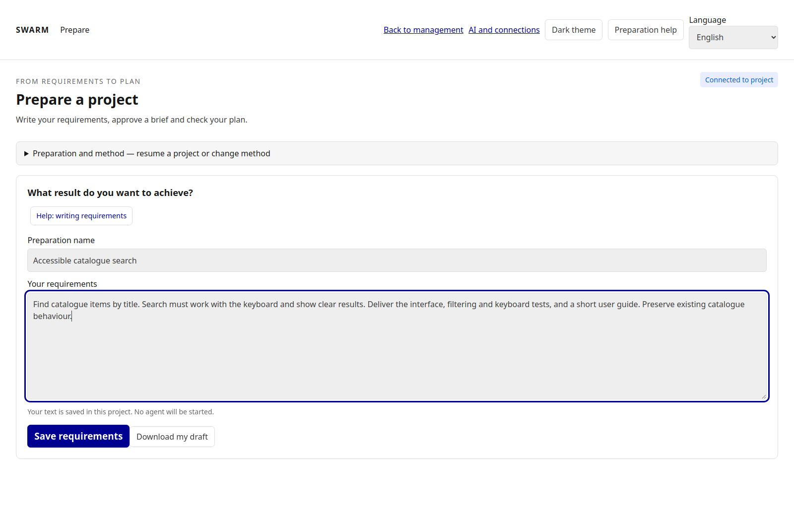
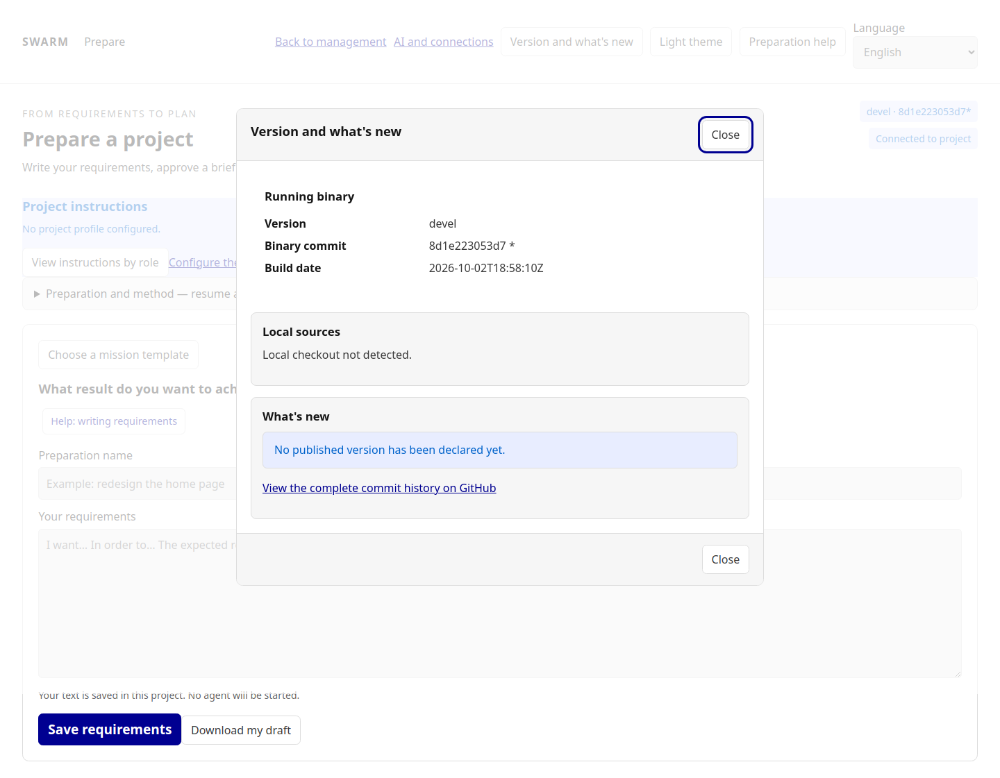
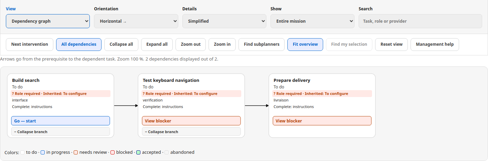
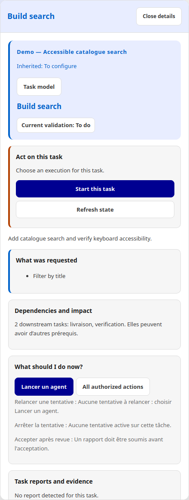
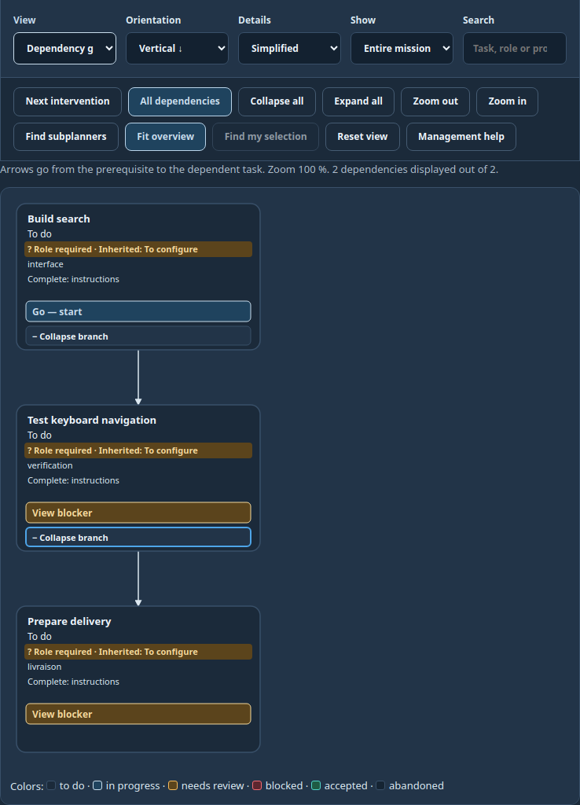

# Using Swarm: from requirements to validated results

[Français](../../GUIDE-UTILISATEUR.md) · [Installation](INSTALL.md) · [Project overview](../../README.en.md)

Swarm lets you prepare, organize and follow an agent team without using an
external Codex conversation to manage it. Agent programs must still be installed,
authenticated and configured in the environment where Swarm runs them.

For a prepared copy or incomplete delivery: [engine recovery and completeness checks](ENGINE-RECOVERY.md).

## Language

Choose **English** in the **Language** selector in the cockpit, preparation page
or agent session. The preference is stored in your browser. A `?lang=en` URL
selects English explicitly; `?lang=fr` selects French. French is the default.
Changing language reloads the view. Save preparation drafts first: the page
blocks language navigation while edits or requests are pending.

For the CLI, use `swarm --lang en …`, or set `SWARM_LANG=en` for the command.
`--lang` overrides the environment. Machine command names, JSON keys, state codes,
paths and preparation slash commands do not change. User documents, task titles,
reports and raw provider output stay in their original language.

If a provider refuses calls: [understand and handle an AI quota hold](PROVIDER-QUOTAS.md).

For guarantees and their limits: [engine contract and Cursor's design](CURSOR-ENGINE-CONTRACT.md).

## Visual quick start

| Goal | Where to go | What to check |
|---|---|---|
| Choose AI | AI and connections | Model, access and execution environment |
| Describe the work | Prepare with AI | Objective, constraints and acceptance criteria |
| Start | Agent cockpit, launch mission | Roles, workspaces, limits and authorization |
| Understand a blocker | Task details and diagnosis | Cause, next action and who should act |
| Read activity | Watch the agent work | Signal timestamp and actual output |
| Confirm completion | Results and validation | Evidence, checks and review |

Screenshots captured on 29 September 2026 using an isolated demonstration project. No agents were launched. The three manual tasks still need role configuration; their warnings are intentional.



## 1. Open the cockpit

Follow the [installation instructions](INSTALL.md). Select the directory of the
project the agents will inspect or modify. It may differ from the Swarm source
repository. Each project stores its own state under `.swarm/`.

From a compiled Swarm checkout:

```sh
./bin/swarm --root /path/to/project init
./bin/swarm --root /path/to/project providers init
./bin/swarm --root /path/to/project web 127.0.0.1:18787
```

Open the **session link printed by the server**. With Docker, retrieve it using:

```sh
docker compose --env-file deploy/install.env logs --tail 20 swarm
```

The link grants access to your cockpit. Keep it out of public screenshots.
Use the mission selector to consult different missions in the same browser tab.
If the server runs on another machine, `127.0.0.1` in your browser refers to your
own computer: use the SSH tunnel described in the installation guide.

### Read version and release history

**Version and what's new** appears in the cockpit rail and preparation header.
The dialog keeps the actual running binary separate from local sources, then
shows embedded releases and commits. Until a verified release is declared, it
shows an empty history rather than fabricating a version. `devel`, `unknown` and
`null` are explicit states, not hidden failures or release numbers.

```sh
swarm version
swarm --version
swarm --json version
```

These commands work without a project database. To compare them with the web UI,
run them from the same binary as the server. Restart the server after rebuilding
or upgrading before diagnosing a mismatch. Escape closes the dialog and restores
focus to the button that opened it.



[Bilingual captures and loading/unavailable states](../screenshots/version-history/manifest.json).

## 2. Connect AI providers

Open **AI and connections**. Two types of connection have different capabilities:

| Type | Purpose | Requirements |
|---|---|---|
| API compatible with `/chat/completions` | Preparation, planning and report review | Base URL, exact model ID, API key if required |
| Tool-enabled agent program | Read/edit files and run commands | Installed program, authentication and provider configuration |

Swarm does not include Claude Code, Codex, Skynet or model weights. Programs
installed on the host are not automatically installed inside Docker.

To add an API:

1. Select **Add an AI connection**.
2. Enter a local ID, readable name, service base URL and exact model ID.
3. Use **Test connection**. This sends a short question without mission documents;
   the provider may charge for it.
4. Save separately: testing does not save the connection.
5. Select `api-<id>` in preparation or planning.

A successful text response does not prove file-tool capabilities or compliance
with every structured planning contract. A text-only API cannot be selected as
an implementation worker.

Model levels follow the saved provider policy. Inspect the resolved model before
launch. Swarm does not silently upgrade to a more powerful model. A custom API
connection uses its saved model for all three levels.

When creating missions, select **AI for the planner and reviewer** separately
from **Tool-enabled agent for workers**. The same installed provider can serve
both purposes when its capabilities allow it.


## 3. Prepare a mission

Choose **Prepare a project**. Describe the result, target directory, boundaries
and success criteria. For example:

> Add search to the document list. Preserve existing filters and both themes.
> Check empty results and accented characters. Deliver the code, tests and a
> report explaining the results.

1. Select the preparation provider and level.
2. Discuss the requirements, then review and approve the brief.
3. Request a plan and answer its open decisions.
4. Use **Edit missions** to refine titles, scopes, deliverables, success criteria
   and dependencies.
5. **Check plan** and address reported issues.
6. Choose **Review proposed team**, verify owner, workers, actual review, AI,
   workspace, limits and validation mode, run preflight, then give the single
   summarized authorization.

Checking a plan proves structural consistency, not completion of its work.
Creating missions does not start agents.

### Who validates results?

- **Me — human review of each result:** agents can progress to review, then wait
  for your acceptance.
- **The engine — explicitly authorized checks:** authorize the exact commands
  proving the criteria. Missing coverage or failed checks prevent acceptance.

New preparations configure an independent AI reviewer in a separate session.
Its opinion does not replace required tests or your chosen human acceptance.
For qualitative criteria without objective checks, retain human review.

## 4. Check the team and launch

| Responsibility | What it does |
|---|---|
| Planner / orchestrator | Organizes work, receives handoffs and decides what comes next |
| Branch planner, when configured | Organizes a delegated scope |
| Worker | Performs a task and produces its deliverable |
| Independent reviewer | Reviews criteria and the report in a separate session |
| Engine validator | Runs authorized checks and records validation decisions |

A visible planner card does not mean an AI call is running continuously. Naming
a task “review” does not configure an independent reviewer. Legacy missions may
have missing roles; inspect the organization instead of bypassing launch refusal.

After the single team authorization, open management. Only eligible missions may
start; dependency, budget, pause and workspace checks still apply. Review the
provider, directory, concurrency and limits before any manual start.

Slots set an upper bound on concurrent attempts. Unvalidated dependencies or an
occupied directory can reduce actual concurrency. **Start all** starts tasks ready
now; use the mission with an observed driver for ongoing automatic progression.

### Read the summary before confirming

The launch preview shows the common configuration and each possible start:
role, provider, requested level, model resolved by configuration, project profile
and selected skills. Task-specific profiles take precedence. The same summary is
available through `swarm mission preview`.

The **model reported by the provider** remains **unknown before execution**.
A configured model is not evidence of the model actually used. An executable
without a model policy also shows an **unknown** resolved model. Scope, budgets,
retries and validation conditions remain visible before confirmation.

## 5. Follow work

Start with the **Agent management** summary: what is happening, the next step and
who acts. Then use the graph or list.

When you select a task, the panel keeps the displayed attempt identity stable while
the snapshot updates. It separates declared role, process state, received activity,
and task validation: a finished process or log entry is never acceptance. Requested
and provider-reported models remain separate. If the provider reports no usage
amount, cost remains **unknown**; it is neither replaced with zero nor confused with
tool calls or tokens.

A dependency, task contract, validation policy, or tested-candidate change makes
the affected evidence stale while preserving its historical receipts. A display or
administrative change may reuse evidence only when the relevant-input digest is
unchanged. Zoom, orientation, filters, and selection do not change business state.

- Dependency arrows go from prerequisite to dependent task. Their verdict includes
  the freshness of evidence.
- Responsibility links connect roles to scopes. Read their legend; do not rely on
  color or line style alone.
- **Horizontal / Vertical** changes layout. **Simplified / Detailed** changes the
  information displayed. Neither changes task ordering.
- **+ / −** collapses or expands branches without deleting tasks.
- Filters and **Fit overview** help locate off-screen branches.
- Click a card for details. **Watch agent work** opens its session. Double-clicking
  a task opens its session when available.

In the session, read timestamps, event types and messages. Received output shows
observable activity, not the model's private reasoning. Detailed capture is
optional; without it, not all raw provider output is retained.

### Read the graph and inspect a task

Arrows point from the prerequisite to the dependent task. These tasks have not started; they do not demonstrate accepted results.

Use **Edit dependencies** to open the draft inside the product graph. Choose
add or remove, then activate the prerequisite and dependent task with the mouse,
Enter, or Space. **Undo** and **Redo** change only the draft. **Preview** asks
the engine for its verdict; **Apply explicitly** is the only action that changes
the mission. Undoing every change disables the preview. Previously saved
proposals remain in the history; redoing a change saves a new proposal that
requires a new preview. The minimap and hidden task/link counts preserve context across
filters, collapsed branches, and zoom. After a conflict, keep the proposed
operations, reload and recreate the draft on the current revision, then preview
it again.





<details>
<summary>Vertical layout in the dark theme</summary>



</details>

## 6. Understand states and validate

| State | Meaning | Next step |
|---|---|---|
| To do | Task has not started | Read start conditions |
| In progress | An attempt is tracked as running | Also inspect process state and last signal |
| Needs review | A result was submitted | Read report, review and checks |
| Blocked | An obstacle prevents progress | Inspect the reason and proposed recovery |
| Completed and validated | Result accepted | Dependencies can be satisfied while evidence stays current |
| Accepted — revalidation needed | Evidence changed after acceptance | Repeat relevant checks |
| Waiver / Abandoned | Explicit decision, different from success | Read its justification |

**A completed process is not a validated task.** Recent output does not prove the
process is still working. Swarm separates execution, received activity and validation.

For human review, open the result, read its report and criteria, then use the
review and acceptance actions. A gate is a passage check: if delivery is refused,
inspect missing or stale evidence. Acknowledging a notification means only that
you read it.

Automatic validation waits for recorded conditions. Do not relaunch simply because
a review is pending. A hierarchical mission finishes when results are handled
and planners have closed their scopes.

## 7. Resolve blockers

When bound evidence of an accepted result has genuinely changed, **Revalidate evidence** opens confirmation for a fresh review of the existing result. The engine retains the producer attempt and spent calls, archives the previous review and requires fresh checks and acceptance. This uses the reviewer’s remaining budget without restarting production. A missing file or an acceptance that remains current does not authorize this operation.

A planner failure concerns new planning decisions. Tasks already ready, running, awaiting review or needing recovery keep their actual state and authorized action in the main guidance. The planning diagnostic remains visible in Decisions; it does not prove that all agents have stopped.

Open the flagged task and diagnosis. **Explain with AI** can clarify context and
propose an action. Review its effect before applying it; advice is not validation.

| Symptom | Useful action |
|---|---|
| Provider unavailable | Install/authenticate it in the actual execution environment and check configuration |
| Only workers visible | Inspect missing organization roles; do not bypass launch refusal |
| Workspace occupied | Identify the reserving attempt; wait for completion or review stopping it |
| Dependency unvalidated/stale | Open the prerequisite and handle review or evidence |
| Attempt completed without report | Inspect output, expected deliverable and location before retrying |
| Repeated tool errors | Fix permissions, resource or failed check; raising the limit does not fix the cause |
| Signal lost/process unconfirmed | Inspect session and host before starting a duplicate |
| Driver absent | Check that web or mission watch runs for the same project |
| Context too large | Reduce documents/excerpts or restart from a shorter brief; no silent truncation |
| Cost not reported | Missing provider measurement, not free usage |
| Refusal after confirmation | Reread state: the mission may have changed since preview |

Fix the cause, then use the proposed recovery. An identical retry under unchanged
conditions is likely to fail again.

## 8. Revise a mission

**Revise this Swarm** returns to its source preparation. Edit the draft, check the
new plan, then **Compare and apply revision**. Review additions, changes and results
that require revalidation.

Editing the draft alone does not change the mission. Applying a revision retains
history, may reopen results, pauses the mission and locks new starts. Review and
authorize the plan again before resuming. Active attempts or some delegations may
prevent application; resolve the refusal before requesting another comparison.

To change arrows, edit the plan's dependencies and check it. Moving the view or
changing graph orientation does not change scheduling.

## 9. Pause, stop and clean up

**Pause** suspends new starts; running agents continue. To stop an attempt, use
its stop action and verify confirmed process termination. Closing the browser
is not stopping agents. Stopping the server does not guarantee stopping agent
processes; stopping a container interrupts its environment.

In **Manage missions**:

| Action | Effect |
|---|---|
| Archive | Files away the mission and creates a ZIP; retains data |
| Restore | Reactivates an archive or recovers a trashed mission |
| Purge history | Removes old logs/output under retention, excluding evidence and receipts |
| Delete | Moves internal data to recoverable trash; does not delete project files |

The preview changes nothing. Read volumes and exclusions before confirmation.
Deletion requires the exact name. Active work can block cleanup; resolve it and
request a fresh preview. See installation for backups and upgrades.

## 10. CLI equivalents

Web and CLI share state only when using the same project root. From the compiled
Swarm checkout, replace paths and IDs:

```sh
./bin/swarm --lang en --root /path/to/project work list
./bin/swarm --lang en --root /path/to/project work show WORK_ID
./bin/swarm --lang en --root /path/to/project mission status WORK_ID
./bin/swarm --lang en --root /path/to/project planning show WORK_ID
./bin/swarm --lang en --root /path/to/project agent list WORK_ID
./bin/swarm --lang en --root /path/to/project agent logs AGENT_ID
./bin/swarm --lang en --root /path/to/project console WORK_ID
./bin/swarm --lang en --root /path/to/project mission pause WORK_ID
./bin/swarm --lang en --root /path/to/project mission resume WORK_ID
```

In Docker:

```sh
docker compose --env-file deploy/install.env exec swarm swarm --lang en --root /workspace work list
```

Use `--json` for scripts. `swarm --lang en help` lists help topics. English aliases
include `management`, `planning`, `tasks`, `validation`, `lifecycle`, `logs`,
`context` and `parity`; existing French topic names still work.

Creation and revision use versioned JSON documents. See the [technical reference](REFERENCE.md)
for schemas. Mutations require the current revision and an operation ID; do not
blindly replace a refused revision. The CLI does not reproduce every web form;
the interactive API connection test is available in the web.

## 11. Data and limitations

State, connections and logs are stored locally under `.swarm/`. API keys are kept
in a file restricted to the process account, without application-level encryption.
Do not publish this directory or session links. Captured output may contain
sensitive project content.

This repository supplies nine [working methods](AGENT-METHODS.md). For another
controlled project, check its method resources. Standard preparation does not implicitly create isolated Git
copies. The advanced managed Git workflow is separate.

The standalone installation recipe used deterministic agent processes. It does
not qualify your real AI provider, authentication or project.

### Estimate a managed review before retrying

Use `planning review-cost WORK --input request.json`, where the request contains
`{"task_id":"TASK"}`. The same read-only estimate is available through
`GET /api/v1/planning?work=WORK&task=TASK&action=review-cost`.

The result separates new inspections, historical observations and two final review
calls. Check both `fits_budget` and `transport_ready`; `transport_blocker` explains
an oversized message. An estimate neither spends calls nor approves a result.

After a corrective submission, Swarm may retain local observations only when all
inputs seen together remain identical and the task contract, provider, model and
method still match. Original replies keep their original candidate and provenance.
Every unresolved question remains open. A new independent decision must explicitly
examine the current changes and their effects on every historical group before
acceptance. Changed groups are inspected again; no calls are refunded.

This is not a complete static dependency analysis or a guarantee that an AI review
will detect every defect. Reuse from a previous protocol-3 reuse plan is currently
unsupported and falls back to a full review. Oversized evidence is rejected before
calls, never silently truncated.

## Understand and resume a mission

The cockpit starts with a short summary: what is happening, followed by who acts
and what happens next. The primary button targets the task holding up the most
dependents before tasks that only need configuration. Storage incidents, missing
organisation and planning incidents retain priority. Its effect is displayed:
opening a diagnosis does not restart an agent or accept a result.

`swarm mission status ID` displays the same summary, action and effect. `--json`
exposes `guidance` and `tasks[].primary_action` for tools presenting this status.
Existing recovery commands retain their confirmations, checks and limits.

For a new attempt of the same task, Swarm supplies recent operations, the next
action, current criteria and review references attributed to the previous attempt.
Verdicts are historical: evidence must be checked again against the current
candidate. Raw reports, sibling task results and secrets are not copied into this
memory. The context is bounded and marks incomplete excerpts.

### Understand waiting, consumption and recovery

In **Overview**, three buttons open read-only dialogs:

- **Since your last visit** groups results, blockages and decisions. Events are
  historical; current validation remains authoritative. The first visit and
  excerpts limited to 200 events are explicitly identified.
- **Why is this task waiting?** lists prerequisites without current validation
  and opens their actual task details. For waits without a dependency, it shows
  the engine reason, such as an occupied workspace. Opening details starts nothing.
- **Where do calls and costs go?** separates workers by task, planners and the
  independent reviewer. Recorded checks and worker retries are separate engine
  measurements. Missing tokens and dollars remain unreported. Internal provider
  network requests are not all observable. The breakdown also appears in **AI budgets and costs**.

The **Per-attempt breakdown**, in this dialog and in `swarm mission spending WORK`,
keeps one row per agent and attempt: process state, recorded task acceptance,
tools, reads, writes, unclassified operations, cumulative errors, repeats and
provider-reported usage/cost. An accepted task can retain an interrupted attempt;
recorded acceptance does not guarantee current evidence freshness. Success does
not erase earlier errors from the cumulative total.

Legacy attempts without detailed counters remain **unknown**, not zero. Lost
visibility makes measurements **partial**. Mixed commands are not automatically
classified as tests: their count remains unknown without a reliable signal.
A repeat means the same operation and inputs under a new identifier; a
retransmitted message is not another call. A recorded launch is not a model call.

**Before retrying**, in task details and retry/corrective-attempt forms, shows
what is kept, what must be checked again, unchanged criteria and the expected
correction. It follows the selected attempt and entered instructions. This is
not launch authorization and does not promise a successful outcome.

CLI equivalents support `--lang en` and `--json`:

```bash
swarm mission changes WORK
swarm mission seen WORK                # explicitly mark this revision as seen
swarm mission spending WORK
swarm mission recovery WORK TASK       # latest attempt for this task
swarm mission recovery WORK TASK AGENT
swarm mission status WORK              # includes blocking prerequisites
```

Reading does not move the visit checkpoint. The web preserves the existing
checkpoint behavior on leaving a work or explicitly marking it seen. The CLI
uses the same local operator and checkpoint via `mission seen`.

### Explicit restart after attempt exhaustion

`swarm planning restart-task WORK --input restart.json` prepares exactly one new
production following an explicit operator decision. Previous attempts, costs
and reviews remain recorded; authorization alone does not launch an agent.
The request contains `schema_version`, `event_id`, `expected_revision`,
`task_id`, `attempt_id`, `confirm_recovery: true`, `reason`,
`recovery_instruction` and `expected_candidate`. For isolated Git missions,
the latter is the current Git candidate. For shared-workspace missions, it is
the SHA-256 digest of the examined declared deliverable (maximum 48 KB).
The latest attempt must have ended, with no active agent or review. A changed
instruction is required. Controls, independent review and acceptance must be
renewed afterwards. Historical overruns remain visible and are never refunded.

### Read counters and recognize completion

- **Tool calls**: observed provider actions during an attempt, not a count of model requests.
- **Recorded decisions**: planning decisions saved by the engine.
- **Planning activations**: planner claims, including native supervisor claims. They do not demonstrate the same number of paid AI calls.
- **Handoffs to process**: events without a decision; receiving an event does not validate a task.

A stopped agent or a favorable review is insufficient. **Finished and validated**
means current evidence satisfies the task checks. A mission is closed when all
required results are validated and its root planner has closed its scope.
Changing evidence may make a validation stale.


*Actual capture, October 1, 2026: validated results and closed root responsibility. “View results” retains access to deliverables and reviews. The user-authored mission title remains in French. This recipe includes human decisions; it does not demonstrate unattended autonomy.*

A previously recorded operator stop is not removed by restart authorization
alone: use an explicit launch after checking conditions. See the
[engine recovery guide](ENGINE-RECOVERY.md) for revision conflicts and reports
that exceed the available context.

### Review corrected evidence again

A rejected review retains its verdict and spent calls. Correct the declared deliverable or reviewed report; changing an unrelated file is insufficient. If the production attempt completed and bound evidence actually changed, **Resume verification** submits the same result to a new review without restarting production. A deleted or inaccessible file does not authorize recovery. Existing budgets still apply; this action creates neither a favorable verdict nor acceptance.

Instructions added when launching a task remain local to that task. They do not replace previously saved common mission instructions; configure common instructions explicitly in the work profile. At launch, the engine combines common mission instructions and task instructions in the prompt sent to the agent. It avoids duplicating the same common instruction. Local instructions do not automatically become rules for other tasks.

### Requested and reported models

Attempt details separate the configured request from the model declared by the provider. JSON CLI `agent show` preserves the declaration source and timestamp in `reported_model`. Without a structured provider event the observation remains unknown, even after execution. A provider declaration is not independent proof of the physical model that ran. Old attempts are not backfilled.

### Prepare a targeted recovery

Use “Before restarting” on a task to compare evidence bound to its latest review and inspect changes since its refusal. Unchanged evidence can be reused as input; it does not establish acceptance. Changed or unknown evidence and remaining criteria require verification. The same preview is available through `swarm --lang en mission recovery WORK TASK`. The preview performs no action and raises no limit.

### Sharing executed control output with a reviewer

In “Configure validations”, each control can explicitly share its output with the reviewer. Sharing is off by default. Enable it only for commands whose output is suitable for sharing. The engine includes up to 8 KiB, the total byte count and a truncation flag. Partial observations are not a complete log. Output remains evidence to assess, never reviewer instructions.

The CLI uses the same policy: set `review_output: true` in a control passed to `swarm validation preview` and then `apply`. Changing the policy invalidates the previous receipt: checks must run again before review, without a new production attempt or a budget reset.

### What independent review does

The reviewer uses a separate session to assess criteria, the report, executed controls and attached evidence. In a tool-free review, it does not rerun tests: it assesses coverage and consistency of the supplied evidence. Producer and supervisor observations retain their attribution. An earlier testing limitation can be supplemented by later dated observations; it is not erased. Exit code 0 is insufficient when a control does not cover the criterion. Missing evidence stays unknown, with a specific explanation. A favorable review and task acceptance are separate steps.

### Final validation and recovery

See [Engine acceptance](ENGINE-ACCEPTANCE.md#rechecking-a-completed-result-after-a-correction) for complete-suite coverage, explicit rechecking of an existing result, and the proposed validation supervisor. A control timeout does not justify a new worker by itself.

### Prepare dependencies without launching a task

The engine stores a durable graph draft separately from graph presentation. An
authenticated client records `add_dependency` or `remove_dependency` operations
with `POST /api/v1/graph-drafts`, then analyzes them with
`POST /api/v1/graph-drafts/preview`. Preview changes neither the mission nor its
attempts or evidence, and explicitly reports that `apply_plan` is still required.

Explicit application uses `POST /api/v1/graph-drafts/apply` with the
`preview_token`, `content_digest`, expected business revision, and a stable
`event_id`. Replaying the same event and content returns the original result;
different content, a concurrent revision, revoked permission, an active task, a
cycle, or an unknown endpoint is rejected without a partial effect. Read a draft
with `GET /api/v1/graph-drafts?work=WORK&draft=DRAFT`. Applying a draft never
launches an agent. These routes are product integration points, not a way around
web session controls.

In the cockpit, open **Agent coordination**, then **Edit dependencies**. The
properties panel calls these routes directly, reports affected tasks and states
that no start is implicit. Closing it restores focus to its trigger. Orientation,
detail level, colored roles, groups, folding, and existing coordination actions
remain available while preparing the draft.

The CLI uses the same business service and storage:

```bash
swarm plan draft import WORK --input proposal.json --json
swarm plan draft show WORK DRAFT --json
swarm plan draft export WORK DRAFT --output draft.json --json
swarm plan draft compare WORK DRAFT --json
swarm plan draft preview WORK --input preview.json --json
swarm plan draft apply WORK --input apply.json --json
swarm plan draft undo WORK DRAFT --input previous-edit.json --json
swarm plan draft redo WORK DRAFT --input next-edit.json --json
```

Import and export files are limited to 64 KiB and strictly validated. `compare`
shows dependencies before and after, affected tasks, and the preview token.
`undo` and `redo` save a new draft edit: they never remove an applied revision or
change an attempt. To reverse an applied effect, create a new inverse proposal,
then preview and apply it under current guards. Detailed help is available with
`swarm --lang en help drafts` or `swarm aide brouillons`.
# Programs and automation

The cockpit provides a **Programs** view separate from the coordination graph. A program always targets an existing, pre-authorized mission: it requests a resume, does not create a new mission, and a processed occurrence never means that the mission is validated.

In the web UI, enter the name, target, IANA timezone and schedule, then choose **Preview without effect**. Creation is only available with that current preview and always produces a disabled program. Enable it explicitly afterwards; the engine then revalidates authorization, budgets and limits. **Pause** prevents future occurrences, **Archive** is final, and an occurrence can only be cancelled while it is still pending with no claim or effect.

The CLI uses the same business service:

```text
swarm automation list
swarm automation show PROGRAM
swarm automation preview --input program.json
swarm automation create --input creation.json
swarm automation enable|pause|archive PROGRAM --input revision.json
swarm automation cancel OCCURRENCE --input revision.json
swarm automation params show|apply [--input settings.json]
```

`create` receives `{ "schedule": <previewed document>, "preview_token": "..." }`. Transitions and cancellations receive `expected_revision` and reject conflicts without overwriting. The view separately shows program state, occurrence, request, mission validation, authorization, profile, limits and actually reported costs. A missing provider value remains **unknown**, never zero. Operational settings are versioned in the local root; changing them raises no budget and changes no already-started attempt.
