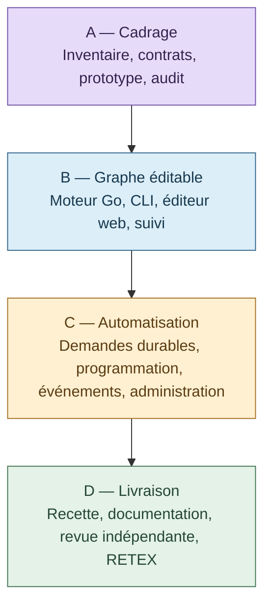

# Swarm — édition du graphe et automatisation

Plan du 5 octobre 2026 : **16 lots, 18 exigences et 27 scénarios de recette**. Statut : spécification proposée ; aucune mission lancée ni fonctionnalité livrée par ce document.

## Lire le dossier

1. [Plan détaillé](PLAN.md) : objectif, existant, responsabilités, parcours web/CLI, étapes, critères et retours arrière.
2. [Contrats proposés](CONTRACTS.md) : brouillons, prévisualisation, erreurs, droits, déclencheurs et reprise.
3. [Recette](RECETTE.md) : scénarios, niveaux de preuve et contrôles de non-régression.
4. [Audit de la spécification](AUDIT.md) : corrections apportées et décisions à fermer avant réalisation.
5. [Traçabilité](SOURCES.md) : références techniques et licences, séparées des commentaires et textes d’interface.

## Enchaînement

Sources Mermaid éditables : [architecture](architecture.mmd) et [16 lots](etapes.mmd).

## Première étape

**A01 : inventorier l’existant et établir une référence observable sur un stockage isolé.** A02 fixe ensuite les contrats ; A03 vérifie les interactions graphiques. A04 conditionne la réalisation du graphe à la fermeture des ambiguïtés bloquantes.

Le moteur conserve les décisions métier. Les gestes graphiques préparent des propositions ; les déclencheurs soumettent des demandes soumises aux mêmes conditions. Les preuves, historiques, coûts inconnus et limites déjà autorisées restent conservés.
