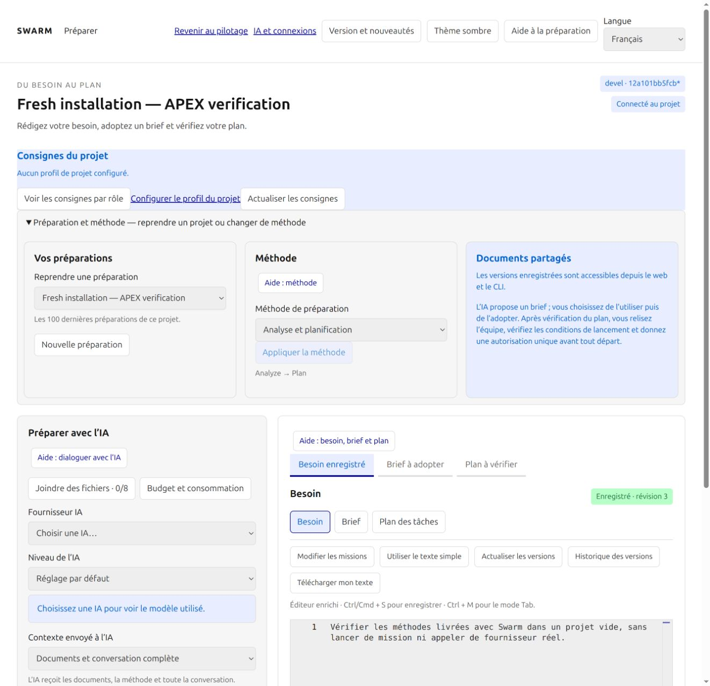
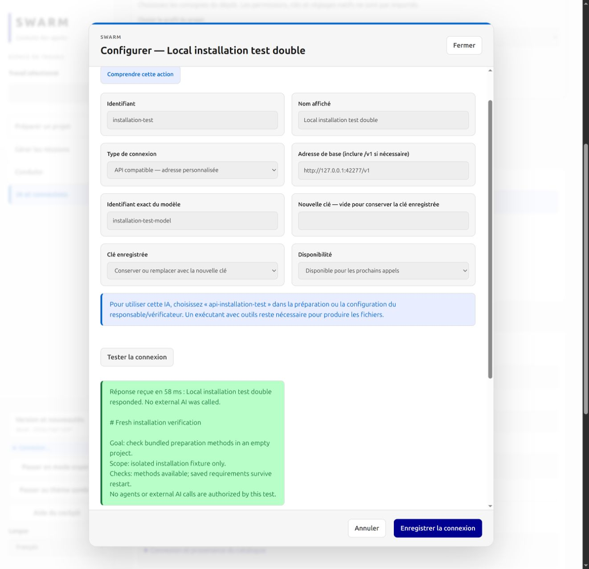
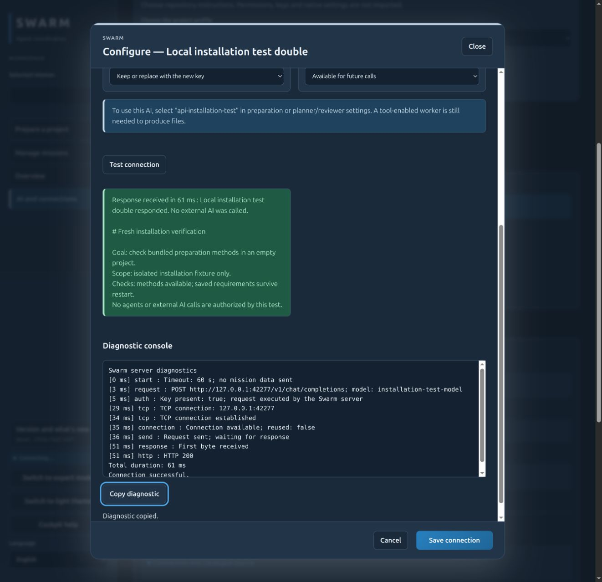
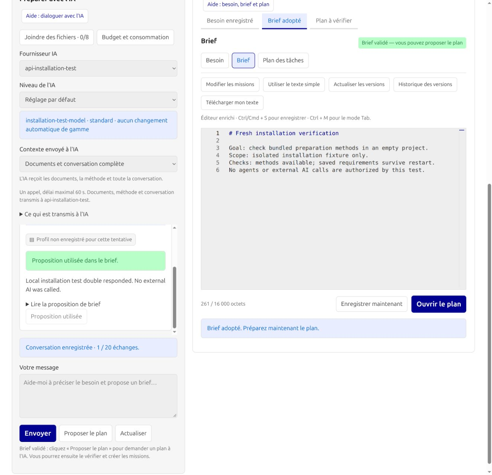

# Recette d’installation neuve et méthodes embarquées

## Défaut reproduit et correction

Une installation native neuve du commit distant `7cbec49` dans un projet vide
rendait les quatre méthodes de préparation indisponibles. APEX affichait
« Méthode hors périmètre : .claude/skills/apex/SKILL.md ». Le catalogue et le
contexte IA cherchaient les fichiers dans le projet piloté, alors que les sources
étaient déjà présentes dans le dépôt de Swarm.

Le lecteur commun utilise désormais les ressources embarquées lorsqu'un fichier
local est absent. Une personnalisation locale reste prioritaire. Un lien
symbolique, un fichier non régulier, binaire, vide, trop grand ou inaccessible
est refusé explicitement ; aucun repli ne cache une personnalisation dangereuse.
La méthode et le contrat complets sont transmis au fournisseur de préparation.

Le lanceur conserve également le binaire indiqué dans `configure` : `start` et
`restart` sans argument reprennent bien le binaire installé. La vérification de
disponibilité utilise la session privée du projet. Les profils de consignes du
projet restent distincts des méthodes livrées avec Swarm.

## Vérification du candidat

| Contrôle | Résultat | Observation et limite |
| --- | --- | --- |
| Test absent/présent, override et fraîcheur | PASS | Régression reproduite avant correction ; les quatre méthodes transmettent leurs sources canoniques |
| Fichiers dangereux | PASS | Liens au niveau fichier et parent, lien pendant, dossier, FIFO, taille et contenu invalides refusés |
| Cycle du lanceur natif | PASS | Huit tests, dont binaire explicite conservé, redémarrage et processus étranger |
| Installation native et Compose | PASS | Installation, HTTP authentifié, quatre méthodes, recréation, persistance, propriété des fichiers et intégrité SQLite |
| Navigateur sur projet vide | PASS | Besoin enregistré, méthodes sélectionnables au clavier, échange puis adoption explicite du brief |
| Contexte réellement envoyé | PASS | Sources APEX et contrat complets retrouvés dans la requête reçue par le serveur simulé local |
| Clé après redémarrage | PASS | Nouveau test réussi sans ressaisie ; clé non affichée et absente du diagnostic copié |
| Cadre vert avec réponse JSON | PASS | Défaut reproduit ; JSON décodé, vrais retours à la ligne ; texte ordinaire préservé |
| Langues, thèmes, clavier et copie | PASS | Français clair et anglais sombre, focus au clavier, copie égale au diagnostic, aucune erreur JS observée |
| Suite Go exhaustive | EN COURS | Inventaire de 1 071 cas ; résultats finaux consignés dans le rapport de réorganisation |

La recette navigateur utilise un **fournisseur simulé HTTP local**, nommé
« Local installation test double ». Aucun appel IA externe ni départ d'agent
n'est réalisé. Elle vérifie le transport, les fichiers embarqués, la persistance
et l'adoption ; elle ne démontre pas la qualité d'un modèle, l'authentification
d'un fournisseur réel ou l'exécution autonome d'une application.

L'installation initiale vient du Git distant. La recette de correction ci-dessus
utilise ensuite le binaire du candidat local ; la requalification du clone après
publication est à consigner séparément avant de déclarer la livraison achevée.

## Captures de la recette

Projet vide : méthodes de préparation disponibles sans dossier `.claude` local.

Test simulé local : réponse lisible et clé conservée, en français.

Même contrôle en anglais et thème sombre, avec diagnostic copié.

Brief relu puis adopté explicitement ; aucun agent lancé.

## Répéter l'installation

Suivre [la recette française](../FRESH-INSTALL.md) ou
[the English checklist](../en/FRESH-INSTALL.md). Les méthodes canoniques sont
versionnées dans [`.claude/skills`](../../.claude/skills), les commandes dans
[`.claude/commands`](../../.claude/commands). Les documents privés sur site,
certificats, overrides, clés et bases locales restent exclus du dépôt.

Auto-revue dans la session de l'auteur : ce rapport n'est pas une revue
indépendante ni une acceptation enregistrée par le moteur.
