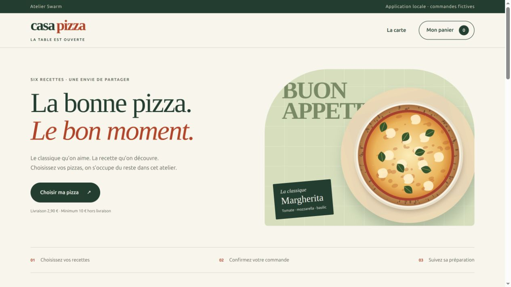

# Formation Swarm Casa Pizza

Un atelier pour débutants : comprendre à quoi sert Swarm, préparer un besoin,
lancer une tâche limitée, lire le graphe et vérifier une application locale.
Chaque guide comprend 38 pages, des captures réelles du cockpit et du site,
des étapes à suivre, des résultats attendus et des exercices.

| Langue | Guide Word | Kit avec code et captures | Première lecture |
| --- | --- | --- | --- |
| Français | [Guide](Formation_Swarm_Casa_Pizza.docx) | [Télécharger le kit](Kit_Formation_Swarm_Casa_Pizza.zip) | [Commencer ici](COMMENCER_ICI.txt) |
| English | [Guide](Swarm_Casa_Pizza_Training_EN.docx) | [Download the kit](Swarm_Casa_Pizza_Training_Kit_EN.zip) | [Start here](START_HERE_EN.txt) |

Sur GitHub, utilisez le bouton de téléchargement du fichier Word ou ZIP,
puis ouvrez le guide localement. Le kit contient tout le matériel de l'atelier,
mais n'installe ni Swarm ni Codex. La génération demande Codex déjà installé
et authentifié. Python 3.10 ou plus suffit pour essayer la référence.



## Essayer la référence locale

Après extraction du kit, ouvrez un terminal dans son dossier :

```sh
cd projet-pizza
python3 app.py
```

Gardez ce terminal ouvert. Client : <http://127.0.0.1:18841/>.
Restaurant : <http://127.0.0.1:18841/restaurant>. Le mot de passe de démonstration
est `atelier` si la variable de configuration n'est pas définie.
Arrêt : Ctrl+C. Les coordonnées et les commandes doivent rester fictives.

Dans un second terminal, depuis `projet-pizza` :

```sh
python3 -W error::ResourceWarning -m unittest -v
```

Résultat attendu pour cette référence : onze tests réussis, dont des tests HTTP
avec un vrai serveur local et un redémarrage sur la même base SQLite.

## Apprendre le cockpit

Le guide explique la différence entre préparation, adoption, lancement,
fin du processus et acceptation. Il montre les dépendances, le détail d'une
tâche, l'édition du graphe, les commandes de contrôle, la fraîcheur des preuves,
la revue indépendante et les décisions qui restent humaines.

`atelier_swarm.py` crée un projet neuf avec un besoin et une mission à une tâche.
`creer_plan_pedagogique.py` ajoute, sur demande, une autre mission avec six tâches
pour apprendre à lire le graphe. Les deux scripts utilisent les opérations CLI
publiques de Swarm. Ils ne lancent aucun agent et ne copient aucune clé.
Les chemins et options à adapter sont expliqués dans les guides.

## English workshop

The English guide explains each beginner step, the purpose of Swarm, task
dependencies, checks, evidence freshness and human decisions. Download and
extract the English kit, read `START_HERE_EN.txt`, then follow the guide.
The reference application, helper messages and historical reports remain French;
the guide explains their labels. New cockpit captures follow the guide language.

## Portée et preuves

Les captures sont datées du 8 octobre 2026. La mission originale utilise un
exécutant et une recette du formateur. Le plan à six tâches sert à apprendre
le graphe : ses tâches n'ont pas été exécutées. Les captures de politiques sont
des formulaires et prévisualisations dont les effets n'ont pas été confirmés.
Ce matériel ne démontre pas une mission hiérarchique autonome ni une revue
indépendante exécutée.

La refonte visuelle a été réalisée ensuite dans la session du formateur.
[REFONTE.md](projet-pizza/docs/REFONTE.md) décrit ses vérifications.
[FORMATEUR.md](projet-pizza/docs/FORMATEUR.md) conserve la recette historique.
Une ancienne acceptation Swarm n'est pas une gate pour les nouveaux fichiers.

Le parcours client et restaurant a été testé sur ordinateur et à 390 pixels.
Le restaurant avance les statuts manuellement. Le kit ne couvre ni paiement
réel, ni livraison réelle, ni publication du site, ni exploitation en production,
ni audit complet d'accessibilité. Les images sont des illustrations SVG locales.

Les kits excluent les clés, sessions privées, bases de commandes et historique
Git. Ils n'installent aucun service extérieur. Les fichiers sources de la référence
et les captures sont aussi consultables dans ce dossier.

## Reconstruire les kits

Depuis ce dossier :

```sh
python3 build_kits.py
```

Le script utilise une liste explicite des fichiers autorisés. Il n'inclut pas
automatiquement les fichiers présents dans un dossier de travail.
Pour mettre à jour les guides, modifier les Word, vérifier leur rendu et aligner
les captures avec la version réellement testée avant de reconstruire les kits.

## Tutoriels animés et accès dans le cockpit

Dans la nouvelle version : **Aide du cockpit → Formation Casa Pizza — tutoriels, guides Word et kits**. Les ressources sont embarquées et conservent l’authentification du cockpit. Un ancien binaire doit être mis à jour pour obtenir cette entrée.

Le [lecteur hors ligne](tutoriels/index.html) complète les guides : quatre modules, vidéos courtes de 24 à 42 secondes, aperçus GIF, explications FR/EN, mode pas à pas, transcriptions et exercices corrigés. Les chapitres 37 et 38 des Word expliquent ce parcours. Les 36 chapitres et les illustrations antérieures sont conservés. Extraire complètement le ZIP avant d’ouvrir `tutoriels/index.html`. Les liens de téléchargement des ZIP sont réservés à la version servie ; le lecteur hors ligne dispose déjà de tous les médias.

Ces vidéos sont des captures successives de vraies interactions, montées avec légendes, sans audio ni déformation. Elles ne sont pas des screencasts continus. La commande fictive a réellement été jouée ; le plan pédagogique n’a pas été exécuté et les politiques ont été prévisualisées puis annulées. Aucun appel fournisseur IA pendant cette capture. Voir [méthode et limites](tutoriels/README.md).

PDF : Formation_Swarm_Casa_Pizza.pdf (FR), Swarm_Casa_Pizza_Training_EN.pdf (EN). Guides de 38 pages accessibles depuis le lecteur et inclus dans les kits ; Word conservés comme sources éditables.
